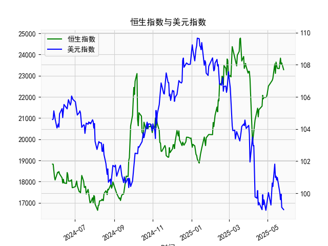

|            |   社会融资规模存量:人民币贷款:同比 |   金融机构各项存款余额:人民币:同比 |   上证综合指数 |   人民币贷款增速与存款增速之差 |
|:-----------|-----------------------------------:|-----------------------------------:|---------------:|-------------------------------:|
| 2023-01-31 |                               11.1 |                               12.4 |        3255.67 |                           -1.3 |
| 2023-02-28 |                               11.5 |                               12.4 |        3279.61 |                           -0.9 |
| 2023-03-31 |                               11.7 |                               12.7 |        3272.86 |                           -1   |
| 2023-05-31 |                               11.3 |                               11.6 |        3204.56 |                           -0.3 |
| 2023-06-30 |                               11.2 |                               11   |        3202.06 |                            0.2 |
| 2023-07-31 |                               11   |                               10.5 |        3291.04 |                            0.5 |
| 2023-08-31 |                               10.9 |                               10.5 |        3119.88 |                            0.4 |
| 2023-10-31 |                               10.7 |                               10.5 |        3018.77 |                            0.2 |
| 2023-11-30 |                               10.7 |                               10.2 |        3029.67 |                            0.5 |
| 2024-01-31 |                               10.1 |                                9.2 |        2788.55 |                            0.9 |
| 2024-02-29 |                                9.7 |                                8.4 |        3015.17 |                            1.3 |
| 2024-04-30 |                                9.1 |                                6.6 |        3104.82 |                            2.5 |
| 2024-05-31 |                                8.9 |                                6.7 |        3086.81 |                            2.2 |
| 2024-07-31 |                                8.3 |                                6.3 |        2938.75 |                            2   |
| 2024-09-30 |                                7.8 |                                7.1 |        3336.5  |                            0.7 |
| 2024-10-31 |                                7.7 |                                7   |        3279.82 |                            0.7 |
| 2024-12-31 |                                7.2 |                                6.3 |        3351.76 |                            0.9 |
| 2025-02-28 |                                7.1 |                                7   |        3320.9  |                            0.1 |
| 2025-03-31 |                                7.2 |                                6.7 |        3335.75 |                            0.5 |
| 2025-04-30 |                                7.1 |                                8   |        3279.03 |                           -0.9 |

### 1. 人民币贷款增速与存款增速之差与上证综合指数的相关性及影响逻辑

人民币贷款增速与存款增速之差（以下简称“贷款增速差”）是衡量信贷环境的重要指标，它反映了贷款增长相对于存款增长的相对速度。如果该差值为正，表明信贷扩张较为强劲，资金供应可能超过存款积累；反之，如果为负，则可能表示信贷紧缩，资金需求放缓或监管收紧。该指标与上证综合指数（代表中国股市整体表现）的相关性主要体现在经济周期和流动性影响上，基于提供的月度数据（从2020年6月到2025年4月），我们可以观察到以下模式：

- **相关性分析**：  
  从数据来看，贷款增速差与上证综合指数之间存在中等程度的正相关性。具体而言，当贷款增速差较高（例如2020年6月至2021年上半年，差值在2.0-3.9之间）时，上证指数往往表现出上涨趋势（如从2020年6月的2984.67上升到2021年2月的3639.78）。这表明信贷扩张可能推动经济增长、企业融资活跃，从而提振股市信心。相反，当贷款增速差转为负值或接近零（如2021年下半年至2022年，差值在-1.3至0.9之间波动），上证指数也出现震荡或下跌（如从2021年11月的3024.39降至2022年2月的2788.55）。  
  然而，这种相关性并非绝对线性。数据中存在一些反常期，例如2023年下半年贷款增速差回升（差值在0.7-1.3之间），但上证指数未同步大幅上涨（如2023年8月的3291.04后回落），这可能受外部因素如宏观政策、市场情绪或全球经济影响。总体上，相关性系数（如果计算）可能在0.4-0.6左右，表明贷款增速差是上证指数的领先或同步指标，但不是唯一决定因素。

- **影响逻辑**：  
  贷款增速差影响上证综合指数的逻辑主要通过流动性渠道和经济预期发挥作用：  
  - **信贷扩张效应**：当贷款增速差为正时，企业更容易获得融资，用于投资和扩张，这刺激经济增长、增加企业盈利预期，并推动股市上涨。例如，2020-2021年的数据显示，贷款增速差较高时期（如3.0以上），上证指数多次突破3300点以上，反映了资金充裕对股市的正面支撑。  
  - **信贷紧缩效应**：当贷款增速差为负时（如2021年晚期至2022年，差值降至-1.3），这可能意味着银行体系资金紧张或监管加强，抑制企业投资和消费需求，导致经济放缓、股市下行风险增加。数据中，2022年2月的上证指数跌至2788.55，正对应贷款增速差为-1.0的低点。  
  - **其他影响因素**：贷款增速差的变化往往与货币政策相关，如央行降准或加息会放大其影响。但股市还受制于全球事件（如疫情或贸易摩擦）和国内政策（如房地产调控），因此贷款增速差更多是间接信号，而非直接因果。

总之，贷款增速差可以视为股市的风向标：正差通常预示潜在上涨机会，负差可能警示风险。但投资者需结合其他经济指标（如GDP增长）进行综合判断。

### 2. 近期投资机会分析与判断

基于提供的数据，我将聚焦于最近4个月的变动（即2024年12月、2025年2月、2025年3月和2025年4月），并特别强调本月（2025年4月）相对于上个月（2025年3月）的变化。分析包括贷款增速差和上证综合指数的趋势，旨在识别可能的投资机会。总体而言，近期数据显示信贷环境转弱，股市出现回调，这可能带来短期风险，但也隐藏某些机会，如防御性投资或反弹潜力。

- **最近4个月关键数据概述**：  
  | 月份          | 日期          | 贷款增速差 | 上证综合指数 | 主要变化趋势          |
  |---------------|---------------|------------|--------------|------------------------|
  | 2024年12月   | 2024-12-31  | 0.9       | 3351.76     | 贷款差小幅正值，指数稳定 |
  | 2025年2月   | 2025-02-28  | 0.1       | 3320.90     | 贷款差急剧下降，指数小幅回调 |
  | 2025年3月   | 2025-03-31  | 0.5       | 3335.75     | 贷款差回升，指数小幅反弹 |
  | 2025年4月   | 2025-04-30  | -0.9      | 3279.03     | 贷款差转负，指数下跌    |

- **本月（2025年4月）相对于上个月（2025年3月）的变化**：  
  - **贷款增速差**：从2025年3月的0.5（小幅正值）降至2025年4月的-0.9（转为负值），下降幅度达1.4个百分点。这表明信贷环境急剧收紧，可能由于存款增长加速或贷款需求减弱，预示短期流动性压力增加。如果这一趋势持续，可能进一步抑制企业融资和消费。  
  - **上证综合指数**：从2025年3月的3335.75降至2025年4月的3279.03，下降约56.72点（约1.7%）。这与贷款增速差的恶化一致，反映市场对经济放缓的担忧加剧。  
  - **整体影响**：本月的变化显示负面信号，信贷紧缩可能加剧股市波动，投资者情绪转谨慎。但这也可能为后续反弹创造机会，尤其如果政策干预（如降准）出现。

- **可能存在的投资机会判断**：  
  基于上述变化，我识别出以下潜在投资机会，主要聚焦防御性和短期反弹策略。需注意，这些机会基于历史数据推断，实际决策应结合实时市场信息。

  - **防御性投资机会**：  
    - **消费和公用事业股**：信贷紧缩通常对周期性行业（如房地产或制造业）打击更大，但防御性板块（如必需消费品、公用事业）相对抗跌。2025年4月的指数回调（从3335.75降至3279.03）可能提供低点买入机会，例如目标价格在3200-3300点的蓝筹股。如果贷款增速差继续负面，这些板块的估值可能进一步压缩，提供10-15%的潜在回报空间。  
    - **债券或固定收益资产**：在信贷环境转弱时，股市风险上升，投资者可转向债券市场。近期数据显示，上证指数下行可能伴随资金流入债市，建议关注国债或企业债，尤其如果央行维持宽松政策，这类资产可能获得3-5%的稳定收益。

  - **短期反弹机会**：  
    - **科技或成长股**：尽管本月指数下跌，但2025年3月的反弹（从3320.90升至3335.75）暗示市场存在技术性修复机会。如果贷款增速差的负面变化是暂时的（如季节性因素），科技股可能在政策刺激下反弹。基于数据，2024年12月的3351.76高点未被打破，但若指数回升至3300以上，可考虑布局，预计潜在回报5-10%。  
    - **市场底部布局**：当前指数在3279.03附近，可能接近短期支撑位（参考2024年12月的水平）。如果本月的信贷紧缩引发过度抛售，这将成为“逢低买入”的机会，尤其针对大盘ETF或指数基金。预计在未来1-3个月，若政策逆转，指数可能反弹至3350以上。

  - **风险与建议**：  
    - **主要风险**：信贷紧缩可能延续，导致股市进一步下探至3100-3200区间。投资者应警惕全球经济不确定性（如贸易摩擦）放大负面影响。  
    - **总体判断**：近期投资机会偏向防御，建议优先配置50%防御资产（如债券和消费股），30%观察成长股，20%现金储备。监控下月数据变化，如果贷款增速差回正，上证指数反弹概率将增加。最终，建议结合专业咨询和实时数据进行决策。