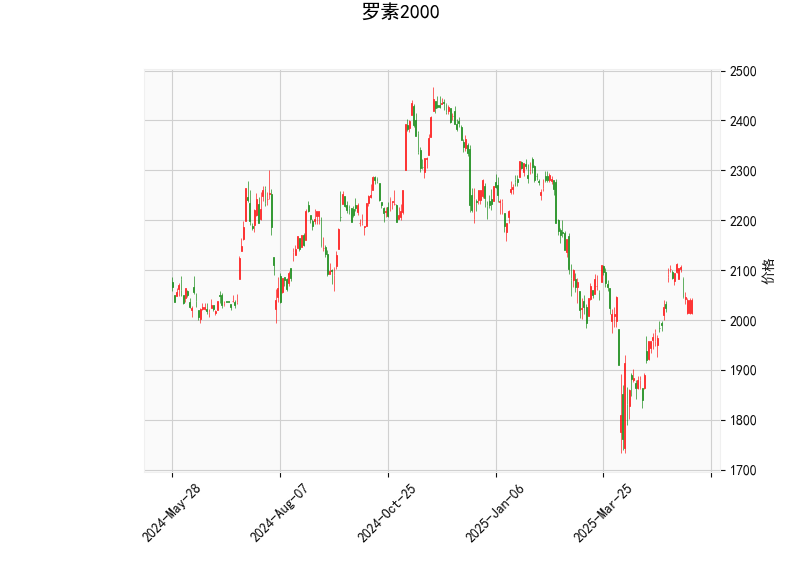

# 罗素2000指数的技术分析结果分析

## 1. 技术指标详细分析
基于提供的罗素2000指数数据，我们对关键技术指标进行逐一解读，以评估当前市场态势。罗素2000指数代表美国小型股表现，其当前价格为2039.85，显示出相对稳定的盘整特征。

- **RSI (相对强弱指数)**: 当前RSI值为52.53。这是一个中性水平（位于30-70区间的中部），表明指数既非超买（RSI>70）也非超卖（RSI<30）。RSI略高于50，暗示近期有轻微的看涨势头，可能反映出市场参与者对小型股的温和乐观情绪。但整体而言，RSI未显示出强烈的趋势信号，指数可能处于盘整阶段。

- **MACD (移动平均收敛散度)**: MACD线值为21.83，信号线值为25.37，MACD柱状图（Hist）为-3.54。这是一个看跌信号，因为MACD线低于信号线，且柱状图为负。这表明短期内卖方力量可能占优，价格可能面临下行压力。MACD的负向差异（Hist值为负）通常预示潜在的趋势逆转或修正，尤其是在之前上涨后的回调期。如果MACD线继续下行，可能进一步确认弱势。

- **Bollinger Bands (布林带)**: 
  - 上带（Upper Band）：2175.24
  - 中带（Middle Band）：1997.97
  - 下带（Lower Band）：1820.69
  当前价格（2039.85）位于中带和上带之间，接近中带。这表明指数处于一个相对稳定的波动范围内，没有出现极端过热（接近上带）或过冷（接近下带）的状况。Bollinger带宽度适中，暗示市场波动性不高，可能处于盘整期。如果价格突破上带，可能触发看涨信号；反之，若跌破下带，则可能出现看跌机会。

- **K线形态**: 数据显示K线形态为空（[]），意味着近期未出现明显的蜡烛图模式（如吞没形态、锤头线等）。这进一步支持指数处于无趋势或弱势盘整的状态，缺乏强有力的买入或卖出信号。

### 整体评估
综合以上指标，罗素2000指数当前呈现出中性偏弱的态势。RSI显示轻微看涨，但MACD的负向信号和价格在中Bollinger带的定位暗示短期内可能存在下行风险。整体市场可能在等待更明确的催化剂，如经济数据或美联储政策变化。指数的波动性较低，适合观望或低风险策略。

## 2. 近期可能存在的投资或套利机会和策略
基于上述分析，我们评估罗素2000指数的潜在投资机会。考虑到当前的技术面特征，机会主要集中在短期盘整和潜在趋势逆转上。以下分析聚焦于风险控制和实用策略，建议结合宏观经济因素（如通胀数据或利率变动）进行决策。

### 可能的投资机会
- **短期下行机会**: MACD的负向信号（线低于信号线）暗示可能出现回调。如果指数跌向Bollinger下带（约1820.69），这可能是一个做空或卖出小型股的机会，尤其是在经济增长放缓的背景下。Russell 2000作为小型股指数，通常对经济周期敏感，近期若有负面经济新闻（如就业数据疲软），可能放大这一机会。
  
- **均值回归机会**: 当前价格在中Bollinger带附近，表明指数可能回归均值。如果市场波动性增加，价格向上下带移动，这为套利策略提供空间。例如，在价格接近下带时买入，在接近上带时卖出，利用波动性差异获利。

- **潜在看涨反弹**: RSI在52.53的水平显示轻微看涨，如果RSI升至60以上并伴随MACD向上交叉信号线，指数可能反弹至2150-2175区间。这适合多头投资者，尤其是在小型股复苏的背景下（如科技或消费股回暖）。

- **套利相关机会**: Russell 2000与大盘指数（如S&P 500）存在相关性。如果S&P 500强势上涨而Russell 2000滞后，这可能形成配对交易机会（如做多Russell 2000、做空S&P 500期货）。此外，ETF套利（如IWM ETF）可能在价格偏离时出现机会。

### 推荐策略
- **短期策略**:
  - **观望并设止损**: 鉴于MACD看跌信号，建议短期内采取观望立场。如果价格跌破中Bollinger带（1997.97），可考虑轻仓做空，目标设在下带（1820.69）附近，并设置止损在上带（2175.24）以上以控制风险。
  - **RSI导向交易**: 监控RSI变化。如果RSI跌至40以下，视为超卖信号，可小额买入以捕捉反弹；反之，如果RSI升至60以上，再结合MACD交叉作为确认信号。

- **中长期策略**:
  - **均值回归套利**: 利用Bollinger带的波动性，构建跨期或跨资产套利。例如，通过期权策略（如买入看涨期权、卖出看跌期权）在价格波动范围内获利。预计波动率较低，因此风险较低。
  - **多元化组合**: 由于Russell 2000代表小型股，建议将其与大盘指数结合使用。例如，构建一个多资产组合（如50% Russell 2000 ETF + 50% S&P 500 ETF），并在MACD信号转正时加仓，以捕捉经济复苏机会。
  - **风险管理建议**: 所有策略应结合资金管理原则，如仓位控制在总资金的20%以内，并使用技术止损（如基于Bollinger带）。避免在K线无明显形态时盲目入场。

总体而言，近期投资机会以短期套利为主，但需警惕宏观风险（如利率上升）。如果经济数据向好，Russell 2000可能迎来反弹；反之，下行压力将加大。建议投资者结合实时数据和专业咨询制定计划。