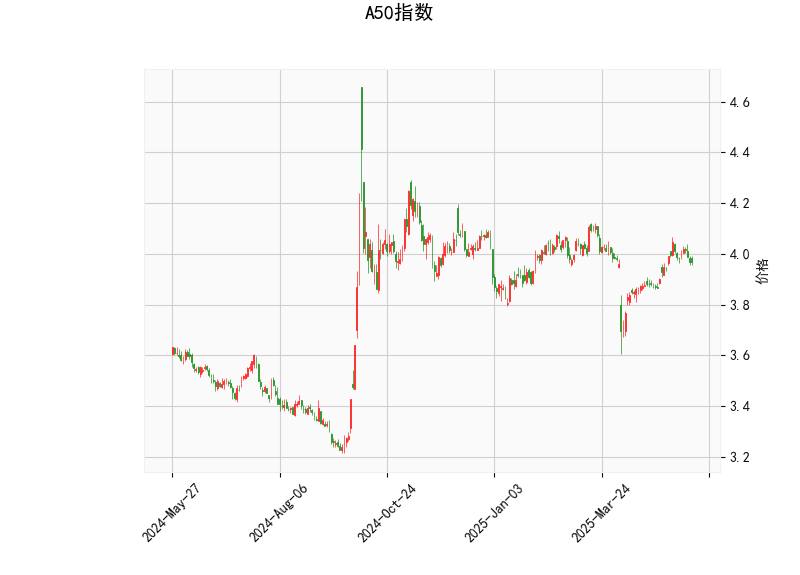

### A50指数技术分析结果分析

#### 1. 对技术分析结果的详细解读
A50指数的当前技术指标显示出混合信号，结合多个指标，我们可以对市场趋势进行初步评估。以下是对关键指标的逐一分析：

- **当前价格（Current Price）**：指数当前价格为3.967，位于布林带的中轨（Middle Band）附近（3.955）。这表明价格处于相对稳定的区间，并未显著偏离均值，暗示短期内市场可能维持震荡格局。

- **RSI（Relative Strength Index）**：RSI值为51.67，略高于50的阈值，显示市场处于中性偏强势状态。RSI在50以上通常表示买入压力大于卖出压力，但尚未达到超买区域（70以上），因此短期内可能没有强烈的反转信号，但也非强势上行。

- **MACD（Moving Average Convergence Divergence）**：MACD线值为0.0199，信号线值为0.0201，MACD直方图（Hist）为负值-0.00023。这是一个看跌信号，因为MACD线低于信号线，表明短期动量减弱，卖方力量可能占优。如果直方图继续负值，可能预示进一步下行风险。

- **布林带（Bollinger Bands）**：上轨（Upper Band）为4.141，中轨（Middle Band）为3.955，下轨（Lower Band）为3.769。当前价格接近中轨，处于上轨和下轨之间，这反映出价格波动性较低，市场可能在窄幅震荡。突破上轨（4.141以上）可能信号上行趋势；反之，跌破下轨（3.769以下）可能触发下行。

- **K线形态**：检测到“CDLMATCHINGLOW”模式，这是一种经典的K线反转形态，通常出现在价格底部，暗示潜在的见底信号。具体表现为连续的低点匹配，表明卖方力量可能耗尽，买入机会可能出现。但这需要后续K线确认，否则可能只是短期反弹。

总体而言，技术指标呈现出矛盾：RSI和K线形态暗示潜在支撑和反转，而MACD和布林带位置则显示短期下行压力。市场可能处于关键转折点，需关注后续价格行为。

#### 2. 近期可能存在的投资或套利机会和策略判断
基于上述分析，A50指数短期内可能存在有限的投资机会，但需谨慎操作。以下是对潜在机会和策略的评估：

- **投资机会分析**：
  - **潜在多头机会**：K线形态的“Matching Low”暗示底部反转，如果价格企稳并突破布林带中轨（3.955以上），可能迎来反弹。结合RSI的轻微强势，这适合保守投资者在支撑位（如3.769附近）布局多头头寸，目标上看轨（4.141）。然而，MACD的负直方图增加了不确定性，建议等待RSI升至60以上或MACD转正再入场。
  - **潜在空头风险**：如果MACD直方图继续恶化并跌破布林带下轨，价格可能进一步下探至3.700-3.800区间，这对空头投资者有利。当前RSI未超卖（低于30），因此空头机会较弱，但若RSI跌破50，则可考虑短期卖出。
  - **整体市场展望**：近期市场可能维持震荡（3.769-4.141区间），适合观望。长期来看，如果全球经济信号转好（如中国经济复苏），A50指数可能迎来上行趋势。

- **套利策略建议**：
  - **跨期套利**：A50指数若涉及期货合约（如A50期货），可利用当前震荡期进行跨期套利。例如，如果近期合约价格低于远期合约（正向市场），买入近期合约并卖出远期合约锁定价差。需监控MACD信号，若转正则及时平仓。
  - **多空组合策略**：采用“布林带突破策略”——在价格触及下轨（3.769）时买入看涨期权或多头头寸，在触及上轨（4.141）时卖出，实现波动率套利。风险控制方面，设置止损在布林带外10%（例如下轨以下），并结合RSI超买/超卖信号调整仓位。
  - **风险管理建议**：鉴于指标分歧，优先选择低风险策略，如小仓位测试或使用衍生品（如期权）进行保护性套利。短期内，RSI和MACD的动态变化将是关键触发器；若K线形态得到确认，可增加多头暴露。

总之，近期投资机会以观望为主，套利策略应聚焦于波动率和价差机会。但所有决策需结合宏观因素（如经济数据、地缘政治）进行验证，避免单凭技术指标操作。建议定期复盘指标变化，以优化策略。