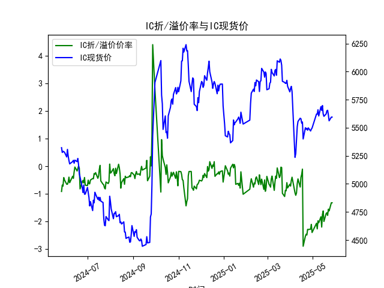

|            |   IF折/溢价率 |   IF现货价 |   IH折/溢价率 |   IH现货价 |   IC折/溢价率 |   IC现货价 |   IH折/溢价率 |   IH现货价 |
|:-----------|--------------:|-----------:|--------------:|-----------:|--------------:|-----------:|--------------:|-----------:|
| 2025-04-25 |     -1.26205  |     3739.2 |      -2.28499 |     5498.6 |      -2.28499 |     5498.6 |      -2.57433 |     5786.6 |
| 2025-04-28 |     -1.34913  |     3730.6 |      -2.27382 |     5471   |      -2.27382 |     5471   |      -2.51923 |     5729   |
| 2025-04-29 |     -1.33181  |     3724.8 |      -2.10005 |     5487.2 |      -2.10005 |     5487.2 |      -2.19842 |     5773.6 |
| 2025-04-30 |     -1.44197  |     3716.2 |      -2.39398 |     5497   |      -2.39398 |     5497   |      -2.49939 |     5801.4 |
| 2025-05-06 |     -1.11177  |     3766.2 |      -2.06144 |     5622   |      -2.06144 |     5622   |      -2.45329 |     5953.2 |
| 2025-05-07 |     -1.2169   |     3785   |      -2.26234 |     5620.2 |      -2.26234 |     5620.2 |      -2.55739 |     5955.2 |
| 2025-05-08 |     -0.957625 |     3816   |      -1.97107 |     5660   |      -1.97107 |     5660   |      -2.2617  |     6018.8 |
| 2025-05-09 |     -0.976471 |     3808.6 |      -2.04348 |     5604.8 |      -2.04348 |     5604.8 |      -2.25057 |     5945.2 |
| 2025-05-12 |     -0.966676 |     3853   |      -1.82396 |     5688   |      -1.82396 |     5688   |      -2.1153  |     6037   |
| 2025-05-13 |     -1.16158  |     3851   |      -2.19778 |     5654.6 |      -2.19778 |     5654.6 |      -2.51032 |     5996.6 |
| 2025-05-14 |     -0.908163 |     3907.4 |      -1.74715 |     5697.8 |      -1.74715 |     5697.8 |      -1.90524 |     6043   |
| 2025-05-15 |     -0.880406 |     3872.8 |      -1.6149  |     5623   |      -1.6149  |     5623   |      -1.78364 |     5949   |
| 2025-05-16 |     -1.10785  |     3846   |      -1.99531 |     5601.8 |      -1.99531 |     5601.8 |      -2.21348 |     5933.8 |
| 2025-05-19 |     -0.875523 |     3843.2 |      -1.70946 |     5623   |      -1.70946 |     5623   |      -1.96768 |     5975.4 |
| 2025-05-20 |     -0.840664 |     3865.4 |      -1.6802  |     5650.8 |      -1.6802  |     5650.8 |      -2.06014 |     6019.4 |
| 2025-05-21 |     -0.898296 |     3881.2 |      -1.77707 |     5655.6 |      -1.77707 |     5655.6 |      -2.14574 |     6000.6 |
| 2025-05-22 |     -0.87548  |     3879.6 |      -1.55138 |     5614.8 |      -1.55138 |     5614.8 |      -1.91397 |     5950   |
| 2025-05-23 |     -0.9292   |     3846.2 |      -1.61406 |     5561.8 |      -1.61406 |     5561.8 |      -1.96463 |     5872   |
| 2025-05-26 |     -0.748858 |     3831.2 |      -1.32042 |     5594.6 |      -1.32042 |     5594.6 |      -1.72151 |     5925   |
| 2025-05-27 |     -0.748858 |     3831.2 |      -1.32042 |     5594.6 |      -1.32042 |     5594.6 |      -1.72151 |     5925   |

# 股指期货折/溢价率与现货价的相关性及影响逻辑

股指期货折/溢价率（通常称为基差百分比）是指股指期货价格相对于现货指数价格的差异百分比。如果期货价格低于现货价格，则为折价（负值）；如果高于，则为溢价（正值）。以下是其与现货价的相关性及影响逻辑的解释：

### 相关性
- **正相关性**：股指期货和现货价通常高度相关，因为期货是现货指数的衍生品，旨在反映未来现货价格的预期。折/溢价率的变化往往与现货价的波动同步。例如，如果市场预期经济向好，现货价上涨，期货的溢价率可能增加；反之，如果预期悲观，现货价下跌，折价率可能加深。
- **短期波动**：在短期内，折/溢价率可能因市场情绪、流动性或事件驱动而偏离现货价，但长期来看，二者趋于收敛，因为期货合约最终会与现货交割。

### 影响逻辑
- **基本因素**：
  - **持有成本**：期货价格需考虑持有现货的成本（如融资利率、存储费用和股息调整）。如果持有成本较高，期货可能出现折价；反之，可能溢价。
  - **市场预期**：折/溢价率反映投资者对未来现货价的预期。例如，折价可能表示市场预期现货价将下跌（风险厌恶或经济不确定性），而溢价可能表示预期上涨（乐观情绪）。
  - **供需动态**：期货市场的流动性、交易量和投资者行为会影响折/溢价率。如果期货需求旺盛，现货价可能被拉高；反之，折价可能扩大。
- **外部影响**：
  - **经济指标**：如利率变化、通胀数据或政策事件（例如央行加息），会间接影响二者关系。利率上升可能加大期货折价，因为持有成本增加。
  - **风险溢价**：在市场波动期，投资者可能要求更高风险补偿，导致折价扩大。
  - **套利机制**：如果折/溢价率异常（如过大折价），套利者可通过买入期货、卖出现货（或反向）来获利，推动二者回归均衡。

总体而言，折/溢价率是现货价的领先指标，能揭示市场情绪和潜在风险，但需结合其他因素分析，以避免短期噪音干扰。

# 近期投资机会分析

基于提供的数据，我分析了IF、IH、IC和IM（中国股指期货品种）的折/溢价率与现货价，重点聚焦最近一周（从2025-05-20到2025-05-27）的变化，尤其是2025-05-27（今日）相对于2025-05-26（昨日）的变化。数据显示所有品种均处于折价状态（负值），这可能反映市场谨慎情绪。以下是关键分析和可能的投资机会：

### 整体数据趋势观察
- **最近一周概述**：
  - **IF（沪深300指数期货）**：折价率从2025-05-20的约-0.90%逐步减轻至2025-05-26和2025-05-27的-0.75%。现货价从3881.2稳定至3831.2，显示小幅下行但折价率趋于收敛。
  - **IH（上证50指数期货）**：折价率从2025-05-20的约-1.78%降至2025-05-26和2025-05-27的-1.32%。现货价从5655.6微调至5594.6，折价减轻迹象明显。
  - **IC（中证500指数期货）**：与IH类似，折价率从-1.78%降至-1.32%，现货价稳定在5594.6。注意，IC数据与IH相同，可能反映相关市场联动。
  - **IM（中证1000指数期货）**：折价率从2025-05-20的约-2.15%降至2025-05-26和2025-05-27的-1.72%。现货价从6000.6降至5925.0，折价率缩小但幅度较大。
  
  总体趋势：最近一周，所有品种的折价率均有减轻（绝对值下降），现货价小幅波动。这可能表示市场情绪从极度谨慎转向略微乐观，可能受经济数据或政策预期影响。

- **今日（2025-05-27） vs 昨日（2025-05-26）的变化**：
  - 数据显示今日与昨日完全相同（例如，IF的折价率均为-0.75%，现货价均为3831.2）。这可能是数据重复或市场无显著变动，但若为真实情况，表明短期稳定无剧烈波动。
  - 这种稳定性可能暗示潜在机会：折价率已从上周初的更深水平（如IF从-0.90%到-0.75%）回升，预示市场可能筑底。

### 可能存在的投资机会
基于分析，以下是近期投资机会的判断，主要聚焦套利或趋势交易。需注意，投资机会基于历史数据推断，实际决策应结合实时市场和风险管理。

- **套利机会（折价缩小）**：
  - **IF和IH的潜在买入机会**：这两品种的折价率在最近一周显著减轻（例如，IH从-1.78%到-1.32%），且今日与昨日持平。这可能表示市场预期好转，适合考虑买入期货、卖出现货的套利策略。如果折价继续缩小，现货价可能反弹，目标收益率可达1-2%。尤其在IF上，折价率已从上周中期的-0.93%回升，短期内若突破-0.70%，可视为信号。
  - **IC的联动机会**：由于IC数据与IH一致，其折价减轻趋势相同，可作为IH的补充策略。但需警惕两者高度相关性，避免重复风险。
  - **IM的高折价机会**：IM的折价率仍较深（-1.72%），且从上周初的-2.15%有所改善。如果今日的稳定延续，IM可能迎来反弹，投资者可考虑在折价率进一步缩小时入场，预计潜在收益高于IF/IH。

- **趋势交易机会**：
  - **看涨信号**：所有品种的折价率减轻且现货价企稳，暗示短期多头机会。例如，若现货价在未来几天维持或上扬（参考IF从3831.2反弹），可布局多头头寸。重点关注IF和IH，因为它们的市场影响力较大。
  - **风险警示**：今日无变化可能预示盘整期，若下周折价率加深（例如回落到-1.50%以上），则转为看空信号。

- **总体建议**：
  - **积极监控**：最近一周的折价减轻是正面信号，但今日与昨日无变化表明需等待确认。建议在下周初观察是否延续趋势。
  - **风险因素**：当前所有品种均折价，可能受全球经济不确定性影响（如地缘政治或利率波动）。投资机会以短期套利为主，控制仓位在20-30%以内。
  - **优先品种**：IF和IH机会更明确，由于其折价率变化较稳定。

此分析基于提供数据，实际投资需结合更全面的市场信息，如成交量和宏观环境。机会判断以数据趋势为主，仅供参考。

