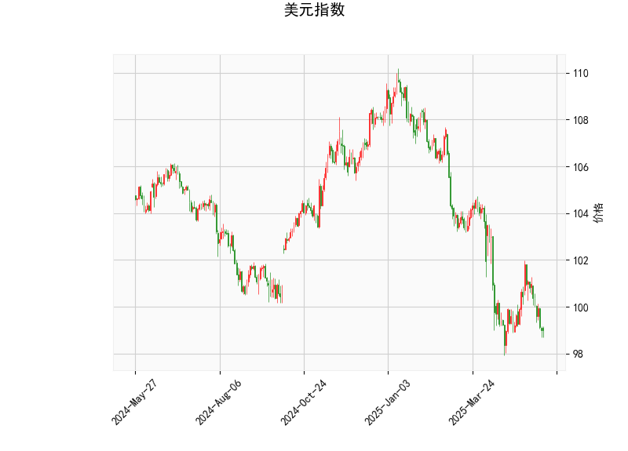

### 1. 美元指数的技术分析结果解读

美元指数当前价位为98.9787，处于相对较低水平，结合各项技术指标，我们可以观察到美元指数可能处于弱势整理阶段，以下是对关键指标的详细分析：

- **RSI（相对强弱指数）**：当前值为38.74，这是一个低于30的水平，表明美元指数已进入超卖区域。这通常暗示短期内可能出现反弹或修正，因为市场可能过度抛售。然而，RSI的低位也可能预示着进一步下跌的风险，如果没有外部催化剂（如美联储政策变化）推动反弹。
  
- **MACD（移动平均收敛散度）**：MACD线为-0.496，信号线为-0.438，直方图为-0.058。MACD线低于信号线，且直方图为负值，这是一个典型的看跌信号，表明短期内美元指数的动量偏向下行。投资者需警惕潜在的进一步下跌，除非MACD线向上交叉信号线，形成看涨信号。

- **布林带（Bollinger Bands）**：上轨为105.64，中轨为101.54，下轨为97.45。当前价98.98非常接近下轨，显示价格已触及超卖区域。这可能预示着短期反弹的可能，因为布林带下轨往往是支撑位。然而，如果价格持续在下轨附近徘徊而不反弹，则可能确认进一步下跌的趋势。

- **K线形态**：检测到“CDLMATCHINGLOW”模式，这是一个看跌形态，通常表示价格可能在低位形成双底或延续下跌。结合其他指标，这强化了美元指数短期内偏弱的观点，但如果后续K线出现逆转（如阳线吞没），则可能改变这一预期。

总体而言，美元指数的技术面显示出弱势信号：RSI超卖暗示潜在反弹，但MACD和K线形态的看跌特征可能主导短期走势。投资者应密切关注关键水平，如布林带中轨（101.54）作为潜在阻力位。如果美元指数跌破下轨（97.45），可能进一步测试更低支撑；反之，如果反弹至中轨以上，则可能转为中性。

### 2. 基于美元指数分析，对近期A股和港股的投资或套利机会和策略判断

美元指数的弱势（当前价位接近超卖区域，并伴随看跌信号）可能预示美元短期内进一步贬值，这对新兴市场股票如A股和港股通常有利。美元贬值往往会推动资金从美元资产流向高增长市场，提振风险资产需求，尤其是在全球流动性宽松的环境下。A股（主要指上海和深圳交易所）和港股（香港交易所）作为中国市场的代表，可能受益于以下因素：人民币相对升值、出口竞争力增强，以及外资流入增加。以下是针对近期可能的机会和策略分析：

#### 投资机会分析
- **A股机会**：
  - **正面影响**：美元弱势可能刺激中国出口导向型经济复苏，推动A股上涨。重点行业包括消费、科技和制造板块，例如消费升级股（如家电、食品饮料）和科技股（如半导体、电动车）。当前A股整体估值相对合理，如果美元继续走弱，市场情绪可能进一步升温。
  - **潜在风险**：若美元指数意外反弹（如美联储加息预期加强），可能导致资金回流美国市场，拖累A股。近期A股可能在2900-3100点（上证指数参考）附近震荡，超卖信号可能带来短期反弹机会。
  
- **港股机会**：
  - **正面影响**：港股更易受国际资金影响，美元贬值可能吸引外资流入中概股（如阿里、腾讯等）。此外，港股的估值较A股更低（例如恒生指数当前PE约10-12倍），提供更好的入场点。重点关注互联互通机制下的股票，以及受益于全球供应链复苏的行业，如科技和消费。
  - **潜在风险**：港股对全球风险偏好更敏感，如果地缘政治事件（如中美贸易摩擦）加剧，可能导致波动。短期内，港股可能在18000-20000点（恒生指数参考）附近形成支撑。

- **套利机会**：
  - **跨境套利**：美元弱势可能放大中概股在港股和美股之间的价差。例如，如果中概股在港股的估值低于美股（由于美元贬值导致的资金流动），投资者可通过“南下”资金或QDII机制进行套利（如买入港股版阿里，卖出美股版）。预计短期内，这种价差可能扩大1-5%，提供无风险或低风险套利空间。
  - **人民币升值套利**：美元贬值可能推动人民币升值，投资者可关注A股中的出口股与港股中的相关资产间的价差。例如，在A股买入消费股，在港股卖出对应ADR，实现汇率和估值套利。

#### 投资策略建议
- **买入策略**：
  - **A股**：建议在中短期内增持低估值蓝筹股和主题股，如通过ETF（如沪深300ETF）布局，目标仓位20-30%。等待美元指数反弹信号（如RSI回升至50以上）后加仓。
  - **港股**：采用“逢低买入”策略，关注恒生科技指数成分股。建议通过港股通或相关基金入场，初始仓位15-25%，并设置止损（如指数跌破关键支撑）。

- **套利策略**：
  - **统计套利**：利用美元指数弱势期监控中港股价差，例如通过量化模型跟踪阿里（BABA在美股 vs. 9988在港股）的价差变化。一旦价差扩大到历史均值以上，进行反向操作（e.g., 买入低估资产，卖出高估资产），预计年化回报5-10%。
  - **风险对冲策略**：结合期权或期货对冲汇率风险，例如在买入A股的同时，卖出美元/人民币期货，以锁定收益。

- **整体风险管理**：
  - 监控全球宏观因素，如美联储会议和中美经济数据，因为这些可能逆转美元趋势。
  - 建议控制总仓位在50%以下，优先选择流动性强的资产，并设定退出点（如美元指数反弹至中轨以上）。
  - 长期来看，如果美元弱势持续，A股和港股的投资回报可能优于美国市场，但需警惕短期波动。

总之，美元指数的弱势为A股和港股提供了潜在上行机会，但投资者应结合基本面（如中国经济复苏）和技术面（如K线反转）进行决策，避免过度追涨。建议采用多元化策略，以最大化潜在收益并最小化风险。