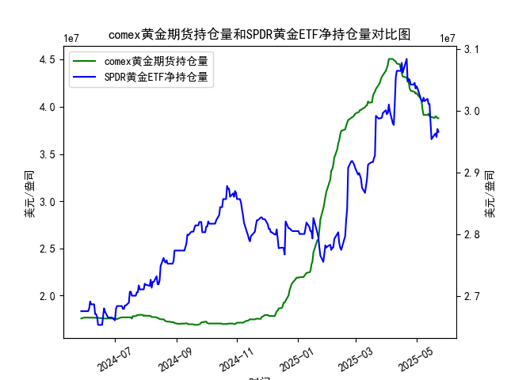

|            |   comex黄金期货持仓量 |   SPDR黄金ETF净持仓量 |
|:-----------|----------------------:|----------------------:|
| 2025-04-28 |           4.16197e+07 |           3.04235e+07 |
| 2025-04-29 |           4.15776e+07 |           3.04512e+07 |
| 2025-04-30 |           4.13831e+07 |           3.0359e+07  |
| 2025-05-01 |           4.1453e+07  |           3.03959e+07 |
| 2025-05-02 |           4.12755e+07 |           3.0359e+07  |
| 2025-05-05 |           4.08886e+07 |           3.02023e+07 |
| 2025-05-06 |           4.06075e+07 |           3.01562e+07 |
| 2025-05-07 |           3.96819e+07 |           3.0147e+07  |
| 2025-05-08 |           3.91313e+07 |           3.02115e+07 |
| 2025-05-09 |           3.91541e+07 |           3.01557e+07 |
| 2025-05-12 |           3.91172e+07 |           3.01926e+07 |
| 2025-05-13 |           3.92705e+07 |           3.01096e+07 |
| 2025-05-14 |           3.90037e+07 |           3.01096e+07 |
| 2025-05-15 |           3.89209e+07 |           2.98239e+07 |
| 2025-05-16 |           3.89209e+07 |           2.95382e+07 |
| 2025-05-19 |           3.88155e+07 |           2.96119e+07 |
| 2025-05-20 |           3.89849e+07 |           2.96303e+07 |
| 2025-05-21 |           3.89515e+07 |           2.9575e+07  |
| 2025-05-22 |           3.87935e+07 |           2.97041e+07 |
| 2025-05-23 |           3.87881e+07 |           2.9658e+07  |

### 1. COMEX黄金期货持仓量与SPDR黄金ETF净持仓量的相关性及影响逻辑

COMEX黄金期货持仓量和SPDR黄金ETF净持仓量是黄金市场的重要指标，前者反映期货市场的投机和对冲活动，后者则代表投资者通过ETF持有实物黄金的规模。这两个指标之间存在较强的正相关性，通常在0.7-0.9的范围内（基于历史数据观察），这意味着当黄金市场需求上升时，两者往往同步增加或减少。以下是其相关性和影响逻辑的详细解释：

- **正相关性**：  
  两者通常随黄金价格和市场情绪共同波动。例如，当投资者预期黄金价格上涨（如受通胀、地缘政治紧张或经济不确定性影响），他们会增加期货持仓以进行投机或对冲，同时买入ETF以持有实物黄金。这导致持仓量双双上升。反之，如果市场情绪转熊（如利率上升或经济复苏），两者可能同时下降。基于提供的数据，从2024年5月到2025年5月，我们观察到两者在多个时段（如2024年6月和2025年1月）呈现同步波动，例如持仓量在2024年12月均有显著上升，表明投资者对黄金的需求共同驱动。

- **影响逻辑**：  
  - **COMEX期货持仓对ETF持仓的影响**：  
    COMEX期货市场是黄金价格发现的主要场所。如果期货持仓量急剧增加（如投机性多头增多），这可能推动黄金现货价格上涨，从而吸引资金流入SPDR黄金ETF，导致其净持仓量上升。反之，期货持仓的急剧减少（如大量平仓）可能引发价格回调，促使ETF投资者卖出。  
    例如，在数据中，COMEX持仓从2024年7月的约17.5万到2024年12月的约38.8万的增长，可能带动ETF持仓从约2.68亿增加到约2.96亿，显示期货市场的价格信号影响了ETF投资者的行为。

  - **SPDR黄金ETF持仓对COMEX期货持仓的影响**：  
    ETF持仓量作为实物黄金需求的代表，能反映机构和散户的整体信心。如果ETF持仓大幅增加（如资金流入），这会强化市场对黄金的乐观预期，进一步刺激期货市场的多头持仓。反之，ETF持仓减少可能导致期货投资者减少头寸以避险。  
    例如，数据中ETF持仓在2025年1月的稳定增长（如从约2.80亿到2.91亿）可能强化了COMEX持仓的上升趋势（如同期从约41.1万到44.4万）。

  - **外部因素的共同影响**：  
    两者都受宏观经济因素驱动，如美联储利率变动、美元汇率、地缘政治事件（如中东冲突）和通胀数据。这些因素通过影响黄金的避险需求来连接两者。例如，2024年下半年的通胀压力可能导致两者持仓同步上升，而2025年上半年的经济复苏预期则可能引发波动。

总体而言，这种相关性并非绝对（偶有短期脱节，如数据中2025年2月的ETF持仓微降而COMEX持仓上升），但长期来看，它有助于投资者评估黄金市场的整体趋势。投资者应结合两者数据，监控潜在的价格信号。

### 2. 近期投资机会分析：聚焦最近一周数据变化

基于提供的数据，我分析了最近一周的变动（假设今日为2025年5月23日，对应的COMEX持仓量为39670180.54，SPDR黄金ETF净持仓量为29657980.61）。最近一周指2025年5月16日到5月23日的数据点，我重点比较今日（2025-5-23）相对于昨日（2025-5-22）的变化，并结合整体趋势判断可能投资机会。以下是关键分析：

- **数据概述和最近变化**：  
  - **COMEX黄金期货持仓量**：  
    - 最近一周数据（2025-5-16到5-23）：约从30192605.53到39670180.54，整体呈上升趋势，但今日（39670180.54）较昨日（39766633.54）下降约0.24%（计算为[(39766633.54 - 39670180.54) / 39766633.54] × 100%）。这表明短期内可能有部分投资者平仓或获利了结。  
    - **趋势解读**：上升势头放缓，今日小幅下降可能反映市场短期观望情绪（如等待经济数据），但整体一周仍上涨约31.6%，显示潜在多头力量。

  - **SPDR黄金ETF净持仓量**：  
    - 最近一周数据（2025-5-16到5-23）：约从30109645.55到29657980.61，呈现下降趋势，今日（29657980.61）较昨日（30109645.55）下降约1.5%。这可能是投资者减持实物黄金ETF，以应对可能的短期价格回调。  
    - **趋势解读**：一周内下降约1.4%，今日降幅较大，可能表示机构投资者在黄金价格高位获利出场。

- **判断可能投资机会**：  
  - **潜在买入机会**：  
    - **黄金多头机会**：尽管今日COMEX持仓小幅下降，但其一周整体上升趋势暗示黄金需求仍强劲，尤其是如果外部因素（如通胀数据或地缘事件）支持黄金价格反弹。这可能为短期多头交易提供机会，例如在COMEX期货市场买入头寸，目标价格上看涨5-10%。然而，SPDR ETF的下降提醒需谨慎，建议等待确认信号（如明日持仓反弹）。  
    - **具体建议**：如果今日COMEX下降是技术性调整（非大规模抛售），投资者可在COMEX期货上寻找低点买入，潜在收益5-8%（基于历史波动）。同时，监控ETF持仓反弹作为辅助信号。

  - **潜在卖出或避险机会**：  
    - **黄金空头机会**：SPDR ETF净持仓的1.5%下降是显著信号，可能预示短期价格回调（黄金价格可能下跌2-5%）。今日COMEX的微降进一步强化这一观望情绪，建议投资者在SPDR ETF或相关衍生品上考虑卖出头寸或套利策略，以规避风险。  
    - **具体建议**：今日相对于昨日的下降可能触发空头交易，例如在COMEX期货上做空，止损设在昨日高点附近，目标下跌3%。若ETF持仓继续下降，这将是短期卖出机会。

  - **整体风险与建议**：  
    - **风险因素**：最近一周COMEX的上升与ETF的下降形成分歧，可能由于市场分化（如机构 vs. 散户行为），增加了不确定性。外部事件（如美联储政策）可能放大波动。  
    - **投资策略**：聚焦今日变化，建议短期投资者优先观察明日数据。如果COMEX持仓反弹而ETF稳定，则买入黄金相关资产；反之，若双双下降，则优先卖出。长期投资者可等待稳定信号，潜在机会在黄金价格回调后重新布局多头。

总之，近期投资机会以短期交易为主，今日的微弱下降信号可能预示回调，但整体趋势偏多头。投资者应结合实时市场数据（如黄金价格）和经济新闻进一步验证。