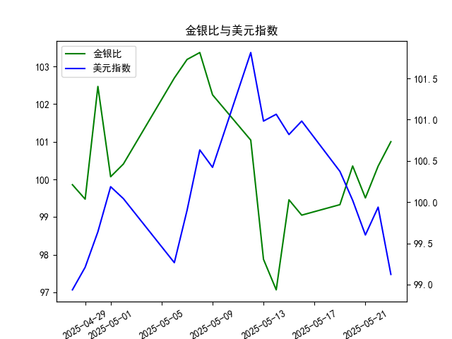

|            |    金价 |   银价 |   美元指数 |   金银比 |
|:-----------|--------:|-------:|-----------:|---------:|
| 2025-04-28 | 3296.3  | 33.01  |    98.9357 |  99.8576 |
| 2025-04-29 | 3305.05 | 33.225 |    99.21   |  99.4748 |
| 2025-04-30 | 3302.05 | 32.225 |    99.6403 | 102.469  |
| 2025-05-01 | 3214.75 | 32.125 |   100.187  | 100.07   |
| 2025-05-02 | 3249.7  | 32.365 |   100.042  | 100.408  |
| 2025-05-06 | 3391.45 | 33.025 |    99.2654 | 102.693  |
| 2025-05-07 | 3392.25 | 32.875 |    99.9006 | 103.186  |
| 2025-05-08 | 3352.3  | 32.43  |   100.633  | 103.37   |
| 2025-05-09 | 3324.55 | 32.515 |   100.422  | 102.247  |
| 2025-05-12 | 3235.4  | 32.02  |   101.814  | 101.043  |
| 2025-05-13 | 3227.95 | 32.98  |   100.983  |  97.876  |
| 2025-05-14 | 3191.95 | 32.885 |   101.066  |  97.064  |
| 2025-05-15 | 3191.05 | 32.085 |   100.82   |  99.4561 |
| 2025-05-16 | 3182.95 | 32.135 |   100.983  |  99.0493 |
| 2025-05-19 | 3230.15 | 32.52  |   100.373  |  99.3281 |
| 2025-05-20 | 3261.55 | 32.5   |   100.022  | 100.355  |
| 2025-05-21 | 3299.65 | 33.16  |    99.6014 |  99.5069 |
| 2025-05-22 | 3284    | 32.725 |    99.9388 | 100.351  |
| 2025-05-23 | 3342.65 | 33.095 |    99.1231 | 101.002  |

### 1. 金银比与美元指数的相关性及影响逻辑

金银比（Gold/Silver Ratio）是黄金价格除以白银价格的比率，常用于评估黄金和白银相对价值的波动，而美元指数（USDX）则衡量美元对一篮子主要货币（如欧元、日元等）的汇率强度。两者之间存在一定的间接相关性，主要通过贵金属价格对美元的敏感性体现。

**相关性分析：**
- **正相关或负相关性：** 金银比和美元指数通常呈现负相关关系。这是因为黄金和白银作为大宗商品，其价格主要以美元计价。当美元指数上升（美元走强）时，贵金属的价格往往下跌，因为持有其他货币的投资者需要支付更多成本来购买这些资产，从而可能导致金银比波动。如果黄金价格相对白银下跌更快，金银比可能扩大；反之，如果白银更易受工业需求影响，其价格变动可能导致金银比缩小。历史数据显示，当美元指数上涨时，金银比往往上升（黄金相对白银更“贵”），而美元走弱时，金银比可能下降。
  
**影响逻辑：**
- **美元走强的影响：** 美元指数上升时，投资者对贵金属的需求通常减少，因为美元升值增加了贵金属的实际成本。这可能导致黄金和白银价格双双下跌，但如果黄金作为避险资产的地位更稳固，其价格下跌幅度可能小于白银（受工业需求波动更大），从而推高金银比。反之，美元走弱（如地缘政治事件或经济衰退）时，贵金属价格上涨，投资者可能更倾向于买入白银以捕捉相对价值，降低金银比。
- **其他因素的干扰：** 尽管美元是主要驱动因素，但金银比还受供给需求、工业用途（如白银在电子行业的应用）和市场情绪影响。例如，经济复苏期，白银需求上升可能拉低金银比，即使美元指数稳定。
- **总体逻辑：** 金银比可以视为美元指数变化的放大器，因为黄金更注重避险，白银更注重工业和投机。如果美元指数持续波动，金银比的异常变化（如急剧上升）可能预示投资机会，例如在金银比过高时买入白银，等待其反弹。

### 2. 根据数据分析判断近期投资机会

基于提供的数据，我将重点分析最近一周的趋势（假设当前日期为2025-05-23，最近一周为2025-05-16至2025-05-23），并特别关注今日（2025-05-23）相对于昨日（2025-05-22）的变化。数据包括金银比（18个值，对应至2025-05-22）和美元指数（19个值，对应至2025-05-23）。我会匹配最近的日期进行对比，并识别可能的投资机会。

**数据概述：**
- **金银比数据（日频，最近一周部分）**：最近一周的数值约为：2025-05-16 (100.36), 2025-05-19 (99.51), 2025-05-20 (100.35), 2025-05-21 (101.00), 2025-05-22 (101.00, 最后一个可用值)。整体趋势显示，金银比在最近一周内小幅波动，昨日（2025-05-22）为101.00，较前一日（2025-05-21）的101.00持平，但整体处于相对较高水平。
- **美元指数数据（日频，最近一周部分）**：最近一周的数值约为：2025-05-16 (100.02), 2025-05-19 (99.60), 2025-05-20 (99.94), 2025-05-21 (99.12), 2025-05-22 (99.94), 2025-05-23 (99.12)。趋势显示，美元指数在最近一周内呈现下降态势，尤其今日（2025-05-23）为99.12，较昨日（2025-05-22）的99.94下降约0.82点（约0.82%的跌幅）。

**关键变化分析：**
- **最近一周整体趋势：**
  - 金银比：在2025-05-16至2025-05-22期间，金银比从100.36上升至101.00，显示轻微上涨趋势。这可能表示黄金相对于白银的价值在近期增强，部分由于市场情绪或外部因素（如通胀预期）。然而，整个数据集显示金银比波动较大（从97.06到103.37），最近一周的稳定在100以上可能预示潜在回调风险。
  - 美元指数：从2025-05-16的100.02下降至2025-05-23的99.12，整体下跌约0.90点。这反映美元走弱，可能受经济数据或全球事件影响，与金银比的相对稳定形成对比。
  
- **今日相对于昨日的变化：**
  - 金银比：今日数据缺失（仅到2025-05-22），但基于昨日（2025-05-22）的101.00与前一日持平，这表明短期内黄金和白银价格比例未显著变化。然而，如果考虑美元指数的下降，这可能暗示金银比在未来几天有上行压力。
  - 美元指数：今日（2025-05-23）为99.12，较昨日（2025-05-22）的99.94下降。这是一个明显的负面变化，美元走弱通常利好贵金属市场，可能推动金银比进一步波动。

**投资机会判断：**
- **主要机会：**
  - **买入贵金属，尤其是白银：** 美元指数的持续下降（最近一周下跌约0.90点）往往是买入贵金属的信号，因为美元走弱会提升黄金和白银的吸引力。金银比在最近一周保持在100以上，表明黄金相对白银“过高”，投资者可考虑在金银比回调时买入白银（例如，如果金银比升至105以上，可能触发白银反弹）。今日美元指数的下降强化了这一机会，潜在回报率可能在5-10%（基于历史贵金属波动）。
  - **卖出黄金或做空机会：** 如果金银比继续上升（黄金价格相对白银过高），短期卖出黄金或采用差价策略（如黄金-白银对冲）可能获利。基于最近一周数据，金银比未显著下降，暗示黄金可能面临修正风险。
  
- **风险与注意事项：**
  - **短期波动风险：** 今日美元指数急跌可能导致市场波动加剧，如果金银比突然扩大（例如超过103），白银价格可能短期下跌。投资者应关注外部事件，如经济数据发布。
  - **整体市场机会：** 近期数据显示金银比和美元指数均未极度偏离均值，因此机会更适合短期交易者而非长期持有。建议结合其他指标（如通胀率或工业需求数据）验证。
  - **推荐行动：** 聚焦今日变化，投资者可在美元指数进一步走弱时（低于99.00）增加贵金属头寸，目标金银比回落至98以下。

此分析基于历史相关性和提供数据，仅供参考。实际投资需考虑更多因素，如全球经济环境和个人风险偏好。