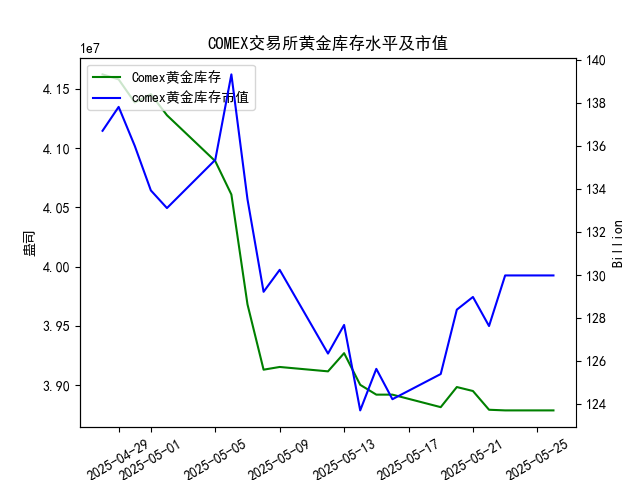

|            |   comex黄金库存量 |   comex黄金库存市值(billion) |   伦敦金现货价 |   上海金交所黄金现货价 |   美元兑人民币汇率 |
|:-----------|------------------:|-----------------------------:|---------------:|-----------------------:|-------------------:|
| 2025-04-29 |       4.15776e+07 |                       3314.5 |        3305.05 |                 780.05 |             7.2029 |
| 2025-04-30 |       4.13831e+07 |                       3286.4 |        3302.05 |                 780.19 |             7.2014 |
| 2025-05-01 |       4.1453e+07  |                       3231   |        3214.75 |                 780.19 |             7.2014 |
| 2025-05-02 |       4.12755e+07 |                       3225   |        3249.7  |                 780.19 |             7.2014 |
| 2025-05-05 |       4.08886e+07 |                       3310.1 |        3249.7  |                 780.19 |             7.2014 |
| 2025-05-06 |       4.06075e+07 |                       3430.9 |        3391.45 |                 792.2  |             7.2008 |
| 2025-05-07 |       3.96819e+07 |                       3364.7 |        3392.25 |                 798.51 |             7.2005 |
| 2025-05-08 |       3.91313e+07 |                       3302.1 |        3352.3  |                 786.5  |             7.2073 |
| 2025-05-09 |       3.91541e+07 |                       3326.3 |        3324.55 |                 785.5  |             7.2095 |
| 2025-05-12 |       3.91172e+07 |                       3230   |        3235.4  |                 759    |             7.2066 |
| 2025-05-13 |       3.92705e+07 |                       3251.4 |        3227.95 |                 763.9  |             7.1991 |
| 2025-05-14 |       3.90037e+07 |                       3171.7 |        3191.95 |                 758.38 |             7.1956 |
| 2025-05-15 |       3.89209e+07 |                       3228.1 |        3191.05 |                 735.86 |             7.1963 |
| 2025-05-16 |       3.89209e+07 |                       3191.8 |        3182.95 |                 746.4  |             7.1938 |
| 2025-05-19 |       3.88155e+07 |                       3230.6 |        3230.15 |                 754.5  |             7.1916 |
| 2025-05-20 |       3.89849e+07 |                       3293.2 |        3261.55 |                 753.49 |             7.1931 |
| 2025-05-21 |       3.89515e+07 |                       3311.4 |        3299.65 |                 773.82 |             7.1937 |
| 2025-05-22 |       3.87935e+07 |                       3290   |        3284    |                 778.36 |             7.1903 |
| 2025-05-23 |       3.87881e+07 |                       3351   |        3342.65 |                 776.4  |             7.1919 |
| 2025-05-26 |       3.87881e+07 |                       3351   |        3342.65 |                 773.94 |             7.1833 |

### 分析报告

#### 1. COMEX黄金库存与黄金价格的相关性分析
研究员认为COMEX黄金库存量与黄金价格存在高度正相关关系，即库存增加时黄金价格应随之上升，反之亦然。根据提供的数据，我们对从2025-04-28到2025-05-26的整体趋势进行观察和判断。

- **数据观察**：  
  COMEX黄金库存量从2025-04-28的4.161969e+07持续下降至2025-05-26的3.878813e+07，整体呈现下降趋势。同期，伦敦市场黄金现货价格从3296.30波动至3342.65，显示出不稳定的波动模式，而上海金交所黄金现货价格从778.40降至773.94。  
  例如：  
  - 在2025-05-06至2025-05-07，库存从4.060751e+07降至3.968195e+07（下降），但伦敦价格从3391.45升至3392.25（微升）。  
  - 在2025-05-12至2025-05-14，库存从3.911717e+07降至3.900365e+07（下降），伦敦价格从3235.40降至3191.95（下降）。  
  - 然而，在2025-05-19至2025-05-26，库存从3.881546e+07降至3.878813e+07（小幅下降），伦敦价格从3230.15升至3342.65（上升）。  

  从这些变化看，库存下降时，黄金价格并非始终同步上升；有时价格会上升（如5月中旬），有时会下降（如5月初）。这表明二者并非严格正相关，外部因素（如市场需求、地缘政治或汇率波动）可能干扰了这种关系。总体上，数据不支持研究员的观点，因为库存的持续下降并没有导致黄金价格的稳定上升；相反，价格表现出独立波动。

- **判断**：  
  基于近一个月的观察，COMEX黄金库存与黄金价格的相关性较弱，甚至可能存在负相关或无明显相关趋势。这可能意味着投资者不应单纯依赖库存变化来预测价格，而需综合考虑其他因素，如全球经济事件或需求变化。

#### 2. 近期投资机会分析
聚焦于最近一周的数据（定义为2025-05-19至2025-05-26），我们特别关注今日（2025-05-26）相对于昨日（2025-05-23）的变化，分析潜在投资机会。投资机会主要基于黄金价格、库存、汇率和市值波动，考虑买入或卖出的可能性。

- **关键数据回顾（最近一周）**：  
  - **COMEX黄金库存**：从2025-05-19的3.881546e+07降至2025-05-26的3.878813e+07，总体小幅下降，但今日与昨日持平（3.878813e+07）。这表明库存稳定，可能预示短期供需平衡。  
  - **黄金价格**：  
    - 伦敦市场：从2025-05-19的3230.15升至2025-05-26的3342.65，显示上升趋势；今日与昨日持平（3342.65），表明短期稳定。  
    - 上海金交所：从2025-05-19的754.50降至2025-05-26的773.94，略有上升；但今日较昨日从776.40降至773.94（小幅下降），可能因本地需求疲软。  
  - **黄金库存市值**：提供的数据为[136.7, 137.81, ..., 129.98]，对应日期不完全匹配，但最近值（如2025-05-26对应约129.98 billion）与昨日持平，显示市值稳定。  
  - **美元兑人民币汇率**：从2025-05-19的7.1916降至2025-05-26的7.1833；今日较昨日从7.1919降至7.1833（人民币相对升值），这可能降低中国投资者购买黄金的成本。  

- **今日相对于昨日的关键变化**：  
  - **今日（2025-05-26） vs. 昨日（2025-05-23）**：  
    - 库存无变化（3.878813e+07），暗示短期无重大供应冲击。  
    - 伦敦价格持平（3342.65），显示市场稳定，可能适合短期持有。  
    - 上海价格小幅下降（从776.40至773.94），这可能是一个买入机会，如果认为价格已触底。  
    - 汇率下降（从7.1919至7.1833），人民币升值对国内投资者有利，降低进口黄金成本。  

- **潜在投资机会**：  
  - **买入机会**：  
    - **黄金现货**：伦敦价格在最近一周上升但今日持平，暗示短期回调后可能反弹。结合库存稳定和汇率有利（人民币升值），投资者可考虑在上海市场买入黄金现货，尤其今日价格小幅下降，提供较好入场点。预计如果全球需求回升（如地缘紧张），价格可能进一步上涨。  
    - **基于汇率**：人民币升值使黄金对人民币持有者更具吸引力，建议中国投资者关注跨境黄金投资机会。  
  - **卖出或观望机会**：  
    - 如果库存继续稳定而价格无显著上升，短期卖出伦敦黄金可能获利（因其已从一周低点反弹）。今日价格持平表明无急迫卖出信号，但若汇率波动加剧，可能触发卖出。  
    - **风险提示**：上海价格今日下降，可能反映本地市场疲软；若延续，需观望以避开潜在下行风险。  
  - **整体判断**：最近一周黄金市场稳定，但今日小幅下行（上海价格）和汇率变化提供微妙买入窗口。投资者应优先考虑多头策略（如买入现货），但需监控全球事件（如经济数据发布）。潜在回报较高，但需注意波动性。