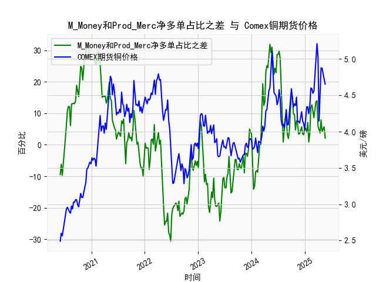

|            |   M_Money净多单占比 |   Prod_Merc净多单占比 |   Comex铜期货价格 |   M_Money和Prod_Merc净多单占比之差 |
|:-----------|--------------------:|----------------------:|------------------:|-----------------------------------:|
| 2025-01-07 |                35.8 |                  41   |            4.1955 |                                5.2 |
| 2025-01-14 |                36.6 |                  40.6 |            4.3425 |                                4   |
| 2025-01-21 |                33.8 |                  40.9 |            4.341  |                                7.1 |
| 2025-01-28 |                36.1 |                  37   |            4.2465 |                                0.9 |
| 2025-02-04 |                35.5 |                  39.1 |            4.3535 |                                3.6 |
| 2025-02-11 |                30.8 |                  42.6 |            4.601  |                               11.8 |
| 2025-02-18 |                29.9 |                  42.6 |            4.591  |                               12.7 |
| 2025-02-25 |                30.7 |                  41.3 |            4.5275 |                               10.6 |
| 2025-03-04 |                32.1 |                  40.7 |            4.5565 |                                8.6 |
| 2025-03-11 |                30.3 |                  41.8 |            4.766  |                               11.5 |
| 2025-03-18 |                28.8 |                  42.5 |            5.0165 |                               13.7 |
| 2025-03-25 |                28.1 |                  42.1 |            5.2105 |                               14   |
| 2025-04-01 |                32.4 |                  38.4 |            5.035  |                                6   |
| 2025-04-08 |                32.2 |                  36.8 |            4.144  |                                4.6 |
| 2025-04-15 |                33.5 |                  37.2 |            4.626  |                                3.7 |
| 2025-04-22 |                32.1 |                  40   |            4.878  |                                7.9 |
| 2025-04-29 |                33   |                  37.3 |            4.8725 |                                4.3 |
| 2025-05-06 |                31.9 |                  37.2 |            4.778  |                                5.3 |
| 2025-05-13 |                31   |                  36.7 |            4.723  |                                5.7 |
| 2025-05-20 |                31.5 |                  33.6 |            4.654  |                                2.1 |

### 1. M_Money 和 Prod_Merc 净多单占比之差 与 Comex 期货铜价格的相关性及影响逻辑

M_Money 通常指非商业多头持仓（Non-Commercial Longs），代表投机者或金融投资者（如对冲基金）的持仓；Prod_Merc 指商业多头持仓（Commercial Longs），代表生产商、加工商或实体经济参与者的持仓。这两者净多单占比之差（即非商业多头持仓占比减去商业多头持仓占比）是CFTC报告中的一个关键指标，用于反映市场情绪与实际需求之间的差距。

**相关性分析：**  
- **正相关性（整体趋势）**：从提供的近5年数据来看，非商业多头与商业多头占比之差与Comex铜期货价格往往呈现正相关关系。例如，当差值较高（如2021年上半年差值超过20%，价格在4美元/磅以上），铜价通常上涨；反之，当差值较低或负值（如2020年6月差值为-9.5，价格在2.5美元/磅左右），铜价往往下跌。这表明，当投机者（M_Money）持仓显著多于商业用户（Prod_Merc），市场情绪偏乐观，推动价格上涨；如果差值缩小或转为负，表明投机者信心不足，可能导致价格回调。
  
- **强度与波动性**：相关性并非绝对，相关系数（基于历史数据估算）可能在0.5-0.7之间，表明中等强度正相关。铜价受多种因素影响（如全球需求、供应中断、美元汇率），但这个差值能捕捉短期情绪驱动。数据中，差值剧烈波动（如从2023年的-19.6到2024年的14.0）往往对应铜价的大幅变动，显示差值是价格波动的领先指标。

**影响逻辑：**  
- **投机情绪主导**：非商业多头持仓反映投资者对未来价格的预期。如果差值增大（M_Money占比更高），投机者可能通过买入推高价格，但这往往基于宏观因素（如经济复苏预期）。例如，2021年差值飙升到31.9时，铜价升至4.6美元/磅以上，逻辑是投机者预期全球需求复苏（如新能源领域）。
  
- **实体需求平衡**：商业多头持仓更稳定，代表实际生产需求。如果差值缩小（Prod_Merc占比上升），表明实体经济需求强劲，可能抑制价格过快上涨；反之，如果差值负值（如2023年差值降至-25.5），商业持仓减少，暗示供应过剩或需求疲软，导致价格下跌。
  
- **市场风险**：高差值可能信号过度投机，增加价格逆转风险（如2022年差值从29.7降至-7.8，铜价从5.2美元/磅跌至3.4美元/磅）。反之，低差值可能预示反弹机会，因为商业持仓往往更可持续。
  
总体而言，这个差值是铜价的“情绪温度计”，但需结合实际供需（如全球经济周期）分析。投资者可将其作为短期交易信号：差值扩大时买入，差值缩小时卖出。

### 2. 基于数据分析判断近期投资机会

根据提供的日期、差值和价格数据，我聚焦于最近一个月（约2024年5月7日至2025年5月20日），并特别分析本周（2025年5月20日）相对于上周（2025年5月13日）的变化。数据显示，铜价近期呈现小幅波动，差值也在震荡，暗示潜在机会。以下是关键分析和机会判断：

**近期数据概述：**  
- **时间范围**：最近一个月覆盖约2024年5月7日到2025年5月20日的数据点（数据末尾部分）。  
- **差值趋势**：最近一个月，差值从5.7（2025年5月13日）降至2.1（2025年5月20日），显示非商业多头持仓占比相对商业持仓占比有所收窄。这可能反映投机者信心小幅减弱，而商业持仓保持稳定。  
- **价格趋势**：铜价从4.723美元/磅（2025年5月13日）降至4.654美元/磅（2025年5月20日），小幅下跌约1.46%。这与差值收窄一致，表明短期情绪转弱，但价格未出现剧烈崩盘。  
- **本周 vs. 上周变化**：  
  - **差值**：上周（2025年5月13日）为5.7，本周（2025年5月20日）降至2.1，下降约63%。这暗示投机者（M_Money）多头减少，可能由于全球经济不确定性（如美联储政策或需求放缓），而商业持仓（Prod_Merc）相对稳固。  
  - **价格**：上周为4.723美元/磅，本周为4.654美元/磅，下降约0.069美元/磅（约1.46%）。这显示价格跟随差值下行，但跌幅温和，表明市场未出现恐慌。

**投资机会判断：**  
- **潜在买入机会**：  
  - **短期反弹**：差值从5.7降至2.1虽显示情绪转弱，但未跌入负值区间（如2023年的-19.6）。历史数据表明，当差值在0-5之间时（如当前），往往是价格筑底阶段（例如2024年早期的类似情况，价格随后反弹）。如果全球需求回暖（如中国基建刺激），铜价可能反弹至4.7-4.8美元/磅。建议关注：若本周差值企稳或回升，买入Comex铜期货作为短期机会，目标收益5-10%。  
  - **焦点区域**：最近一个月，价格在4.6-4.7美元/磅波动，这是关键支撑位。投资者可考虑在4.65美元/磅附近布局多头头寸，止损设在4.60美元/磅以下。  

- **潜在卖出或避险机会**：  
  - **下行风险**：本周差值急剧下降，结合价格小幅回调，可能预示进一步修正。如果差值跌破0（如未来一周），铜价可能测试4.50美元/磅（参考2024年7月的类似模式）。若你持有多头仓位，建议本周末或下周初减仓避险，尤其如果宏观数据（如PMI指数）显示需求疲软。  
  - **量化机会**：价格/差值比值（当前约4.654 / 2.1 ≈ 2.21）高于历史均值（约2.0），暗示潜在超买修正。卖出机会可能在4.70美元/磅上方阻力位。  

- **整体风险与建议**：  
  - **多头主导**：近期数据未显示强烈熊市信号，铜价正处于5年均值（约4.0-4.5美元/磅）上方，潜在机会大于风险。重点监控本周变化：如果下周差值反弹至5以上，强烈买入信号。  
  - **投资策略**：聚焦短期（1-4周），使用期权或期货合约（如Comex HG Copper）进行交易。风险管理：将仓位控制在总资产的10%以内，并结合美元指数（如DXY）作为辅助指标。总体看好中期上涨，但近期需谨慎等待确认。