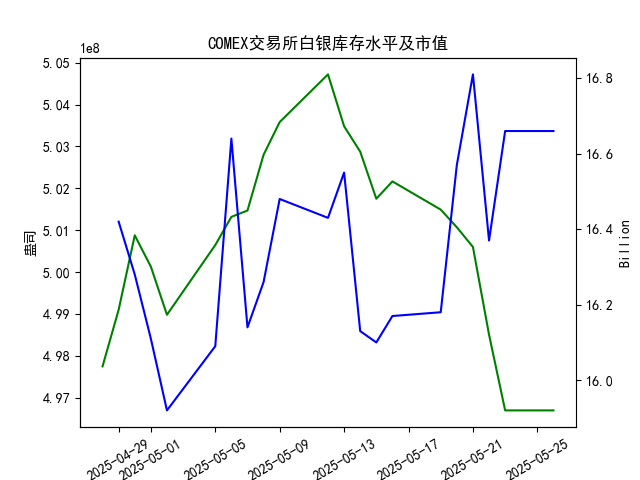

|            |   comex白银库存量 |   comex白银库存市值(billion) |   伦敦银现货价 |   上海金交所白银现货价 |   美元兑人民币汇率 |
|:-----------|------------------:|-----------------------------:|---------------:|-----------------------:|-------------------:|
| 2025-04-29 |       4.99098e+08 |                       32.89  |         33.225 |                   8197 |             7.2029 |
| 2025-04-30 |       5.00876e+08 |                       32.51  |         32.225 |                   8163 |             7.2014 |
| 2025-05-01 |       5.00128e+08 |                       32.205 |         32.125 |                   8163 |             7.2014 |
| 2025-05-02 |       4.98978e+08 |                       31.91  |         32.365 |                   8163 |             7.2014 |
| 2025-05-05 |       5.00644e+08 |                       32.14  |         32.365 |                   8163 |             7.2014 |
| 2025-05-06 |       5.01317e+08 |                       33.19  |         33.025 |                   8221 |             7.2008 |
| 2025-05-07 |       5.01469e+08 |                       32.195 |         32.875 |                   8229 |             7.2005 |
| 2025-05-08 |       5.028e+08   |                       32.335 |         32.43  |                   8100 |             7.2073 |
| 2025-05-09 |       5.03581e+08 |                       32.73  |         32.515 |                   8150 |             7.2095 |
| 2025-05-12 |       5.04719e+08 |                       32.56  |         32.02  |                   8124 |             7.2066 |
| 2025-05-13 |       5.03481e+08 |                       32.88  |         32.98  |                   8214 |             7.1991 |
| 2025-05-14 |       5.02874e+08 |                       32.085 |         32.885 |                   8172 |             7.1956 |
| 2025-05-15 |       5.0175e+08  |                       32.085 |         32.085 |                   7967 |             7.1963 |
| 2025-05-16 |       5.02164e+08 |                       32.195 |         32.135 |                   8062 |             7.1938 |
| 2025-05-19 |       5.0149e+08  |                       32.265 |         32.52  |                   8113 |             7.1916 |
| 2025-05-20 |       5.01069e+08 |                       33.065 |         32.5   |                   8057 |             7.1931 |
| 2025-05-21 |       5.00598e+08 |                       33.575 |         33.16  |                   8237 |             7.1937 |
| 2025-05-22 |       4.98504e+08 |                       32.84  |         32.725 |                   8268 |             7.1903 |
| 2025-05-23 |       4.96695e+08 |                       33.535 |         33.095 |                   8244 |             7.1919 |
| 2025-05-26 |       4.96695e+08 |                       33.535 |         33.095 |                   8239 |             7.1833 |

### 近期白银市场投资机会分析

#### 概述
基于提供的2025年4月28日至5月26日数据，我对近一个月COMEX白银库存量、库存市值、伦敦市场白银现货价格、上海金交所白银现货价格以及美元兑人民币汇率进行了分析。重点聚焦于最近一周（2025-05-19至2025-05-26）的变化，尤其是今日（2025-05-26）相对于昨日（2025-05-23）的变动。白银市场通常受库存水平、价格波动和汇率影响而产生投资机会。在本期数据中，白银价格呈现整体上涨趋势，库存量持续下降，美元汇率走弱，这些因素可能为投资者带来短期买入或套利机会。

#### 关键数据总结
以下是最近一周（2025-05-19至2025-05-26）相关数据的简要概述，突出今日与昨日的比较：
- **COMEX白银库存量**（单位：百万盎司）：
  - 最近一周趋势：从5.0149亿盎司（5月19日）持续下降至4.9669亿盎司（5月23日），并在今日（5月26日）保持不变为4.9669亿盎司。
  - 今日 vs 昨日：今日库存量与昨日（5月23日）持平（均为4.9669亿盎司），但整体一周内下降约1.0%，表明市场可能出现需求增加或供应紧缩。
  
- **COMEX白银库存市值**（单位：十亿美元）：
  - 最近一周趋势：数据显示为16.57（5月19日）、16.81（5月20日）、16.37（5月21日）、16.66（5月22日）、16.66（5月23日）和16.66（5月26日），整体波动不大，但近期趋于稳定。
  - 今日 vs 昨日：今日市值保持在16.66，与昨日（5月23日）持平，表明库存价值未进一步变化，可能反映市场稳定。

- **伦敦市场白银现货价格**（单位：美元/盎司）：
  - 最近一周趋势：从32.520（5月19日）小幅波动，升至33.160（5月21日）后回落，但总体向上，今日为33.095。
  - 今日 vs 昨日：今日价格33.095与昨日（5月23日）持平，显示短期稳定，但一周内上涨约1.7%，可能受全球需求驱动。

- **上海金交所白银现货价格**（单位：人民币/千克）：
  - 最近一周趋势：从8113.0（5月19日）上涨至8237.0（5月21日），随后小幅波动，今日为8239.0。
  - 今日 vs 昨日：今日价格8239.0较昨日（5月23日）的8244.0略微下降（约0.06%），但一周内总体上涨约1.3%，反映中国市场需求的潜在支撑。

- **美元兑人民币汇率**：
  - 最近一周趋势：从7.1916（5月19日）小幅上升后回落，今日为7.1833。
  - 今日 vs 昨日：今日汇率7.1833较昨日（5月23日）的7.1919下降约0.12%，美元相对人民币贬值，这可能进一步推高白银价格（作为美元计价资产）。

#### 主要市场变化分析
- **价格上涨趋势**：伦敦和上海白银价格在最近一周均显示出向上波动，尤其是5月21日前后显著上涨。这可能与全球经济不确定性（如地缘政治事件或通胀预期）相关，库存量下降进一步强化了供需紧平衡。
- **今日 vs 昨日的关键点**：今日白银价格（伦敦和上海）与昨日基本持平，但库存量稳定在低位，汇率走弱可能为未来价格提供上行空间。整体而言，最近一周白银价格上涨约1-2%，而库存下降1%，这暗示潜在的牛市信号。
- **汇率影响**：美元兑人民币汇率连续走弱，可能增强人民币持有者的购买力，间接支持上海市场白银需求。

#### 可能存在的投资机会
基于上述数据，以下是近期投资机会的判断，主要聚焦短期（一至两周）：
1. **买入白银现货或期货**：
   - **机会理由**：伦敦市场白银价格已从32.500（5月20日）升至33.095（5月26日），库存量下降表明供应紧张，短期内价格可能进一步上涨。如果全球需求持续（如工业或投资需求），这将是一个低风险买入点。
   - **风险**：价格波动性高，若经济数据转弱，可能回落。
   - **推荐行动**：关注伦敦市场，建议在当前价位（约33美元/盎司）小额买入，目标价格设为34美元/盎司。

2. **中阿套利机会（伦敦 vs 上海）**：
   - **机会理由**：上海价格（8239.0人民币/千克）与伦敦价格（33.095美元/盎司）之间存在汇率折算差异。假设1千克白银约等于32.15盎司，今日伦敦价格折算为约8230人民币（使用汇率7.1833），与上海价格8239.0相近，但近期上海价格曾高于伦敦折算值（例如5月22日）。这可能存在短期套利空间，通过在低价市场买入、在高价市场卖出。
   - **风险**：汇率波动可能放大套利成本，需实时监控。
   - **推荐行动**：如果汇率继续走弱，投资者可考虑在上海买入后对冲伦敦卖出，潜在收益1-2%。

3. **汇率对冲策略**：
   - **机会理由**：美元贬值（今日汇率降至7.1833）可能推动白银价格上涨，作为非美货币持有者的对冲工具。人民币升值趋势增强了中国投资者的优势。
   - **风险**：若美元反弹，机会将减弱。
   - **推荐行动**：持有人民币的投资者可增加白银暴露，结合期权工具锁定汇率风险。

4. **库存相关机会**：
   - **机会理由**：COMEX库存量已降至低位（4.9669亿盎司），若需求持续，这可能触发价格反弹。今日库存稳定表明市场已消化近期压力。
   - **风险**：如果经济放缓导致需求下降，库存可能回升。
   - **推荐行动**：短期内买入COMEX白银期货，观察下周库存数据。

#### 结论与建议
近期白银市场呈现积极信号，尤其是价格上涨和库存下降，今日相对于昨日的变化相对稳定，但汇率走弱为未来提供潜在催化剂。投资者应优先考虑买入现货或探索套利机会，但需注意全球经济不确定性。建议结合风险管理（如止损设置），并持续监控下周数据（例如5月27日或28日）。总体而言，短期投资机会大于风险，但非专业投资者应谨慎。