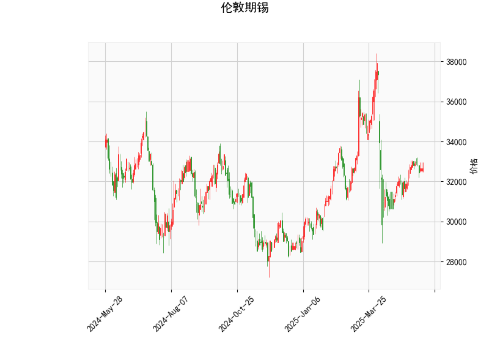

### 伦敦期锡技术分析结果解读

#### 1. 技术指标分析
以下是对提供的伦敦期锡技术分析结果进行的详细解读，这些指标共同反映了市场的当前状态和潜在趋势。整体来看，市场呈现出中性偏看涨的信号，但需结合其他因素（如基本面或全球经济事件）进行综合评估。

- **当前价（32665.0）**：  
  当前价格位于布林带中间带（33114.6）附近，表明价格处于相对稳定的区间内。距离上轨（36992.29）仍有较大空间，距离下轨（29236.91）也已拉开，显示短期内价格波动可能温和，但如果突破上轨，可能触发上行趋势。

- **RSI（52.2867）**：  
  RSI（相对强弱指数）处于52左右的中性区域（通常30以下为超卖，70以上为超买）。这表明市场目前没有明显的超买或超卖信号，价格走势较为平衡。近期RSI稳定在中位，暗示锡价可能继续横盘整理或缓慢积累动能。

- **MACD指标**：  
  - MACD线（86.2579）高于信号线（16.0710），且MACD直方图（70.1869）为正值，这是一个看涨信号。MACD直方图的正值表示短期移动平均线向上穿越长期移动平均线，暗示多头势头增强。  
  - 然而，MACD值的绝对水平相对温和，表明看涨动能尚不强劲。如果MACD直方图继续扩大，可能确认上行趋势；反之，如果回落至负值，则可能转为看跌。

- **布林带指标**：  
  - 上轨（36992.29）、中轨（33114.6）和下轨（29236.91）显示当前价格在中轨附近波动，表明市场处于波动区间内。布林带的宽度（上轨与下轨之差）显示波动性适中，没有极端扩张，这通常预示短期内可能维持震荡。如果价格向上突破上轨，可能出现强势上涨；如果跌破下轨，则可能进入修正阶段。

- **K线形态**：  
  该指标为空（[]），表示当前未观察到明显的K线形态（如吞没、锤头等）。这可能意味着市场缺乏强烈的短期信号，需关注未来K线的演变以捕捉潜在反转或延续。

总体评估：  
从技术面看，MACD的看涨信号是当前最积极的因素，但RSI的中性和布林带的稳定位置表明市场尚未进入强势趋势。锡价可能在短期内保持震荡，等待进一步催化剂（如全球需求变化或库存数据）来推动方向。

#### 2. 近期可能存在的投资或套利机会和策略
基于上述技术分析，以伦敦期锡为焦点，我对近期机会进行了判断。锡作为工业金属，受全球经济复苏、电动汽车需求和库存水平影响较大。以下分析假设市场环境稳定，并结合技术指标提出策略。请注意，投资涉及风险，建议结合基本面分析和风险管理措施。

##### 可能的投资机会：
- **看涨机会**：  
  MACD的正直方图和价格在中轨附近暗示潜在的上行空间。如果全球经济数据（如制造业PMI）转强或锡需求增加，价格可能向上测试上轨（36992.29）。当前价位相对合理，适合逢低布局多头头寸，尤其若RSI维持在中性水平，避免超买风险。

- **套利机会**：  
  伦敦期锡与上海期锡（SHFE）或LME其他金属（如铜或锌）存在跨市场或跨品种套利潜力。例如：  
  - **跨期套利**：如果伦敦期锡与上海期锡价差扩大（目前伦敦价为32665.0，假设上海价为参考），可考虑在价差异常时进行反向操作（如伦敦多头、上海空头）。需监控汇率和运费影响。  
  - **跨品种套利**：锡与铜的相关性较高（均受工业需求驱动）。如果锡价相对铜价被低估（基于历史相关系数），可构建锡多头与铜空头的组合策略。近期MACD看涨可能放大此类机会，但需警惕全球供应链风险。

- **风险与潜在下行**：  
  如果RSI升至70以上或价格跌破中轨，市场可能转为超买修正或下行测试下轨（29236.91），提供逢高卖出或空头机会。当前中性信号下，下行风险较低，但需防范地缘政治事件（如贸易摩擦）导致的波动。

##### 投资策略建议：
- **趋势跟踪策略**：  
  鉴于MACD看涨，建议在价格企稳中轨以上时买入多头头寸，设置止损于下轨（29236.91）附近。目标位可设在上轨（36992.29）或RSI突破60时获利了结。这适合中短期投资者，预计持有1-3周。

- **均值回归策略**：  
  价格在中轨附近，适合波动率较低的环境。投资者可等待价格偏离中轨（如跌向下轨）时买入，预期回归中轨。结合RSI，避免在超买区入场。

- **套利策略**：  
  - 对于跨市场套利，监控LME和SHFE价差。如果差价超出历史均值（例如，基于过去6个月数据），可建立无风险或低风险头寸。  
  - 风险管理：使用限价订单和头寸大小控制（例如，不超过总资金的10%），并在MACD信号弱化时平仓。

总体策略提醒：  
短期内，投资机会以多头为主，但市场震荡可能导致假突破。建议结合成交量和新闻事件（如中国需求数据）验证信号。风险厌恶者可优先选择期权或期货套期保值工具。新策略应从小额测试开始，关注整体大宗商品市场动态。