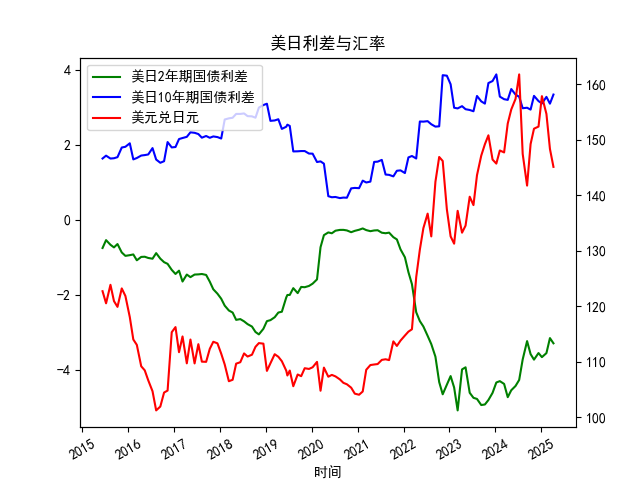

|            |   美元兑日元 |   美国10年期国债收益率 |   日本10年期国债收益率 |   美国2年期国债收益率 |   日本2年期国债收益率 |   每日美日2年期国债利差 |   每日美日10年期国债利差 |
|:-----------|-------------:|-----------------------:|-----------------------:|----------------------:|----------------------:|------------------------:|-------------------------:|
| 2023-09-12 |       147.12 |                  3.875 |                  0.716 |                 0.033 |                  4.98 |                   3.159 |                   -4.947 |
| 2023-10-11 |       149.17 |                  3.875 |                  0.776 |                 0.058 |                  4.99 |                   3.099 |                   -4.932 |
| 2023-11-08 |       150.77 |                  4.5   |                  0.852 |                 0.117 |                  4.93 |                   3.648 |                   -4.813 |
| 2023-12-11 |       146.41 |                  4.5   |                  0.798 |                 0.088 |                  4.71 |                   3.702 |                   -4.622 |
| 2024-01-10 |       145.68 |                  4.5   |                  0.621 |                 0.025 |                  4.37 |                   3.879 |                   -4.345 |
| 2024-02-07 |       148.04 |                  4     |                  0.714 |                 0.101 |                  4.41 |                   3.286 |                   -4.309 |
| 2024-03-12 |       147.69 |                  4     |                  0.783 |                 0.197 |                  4.58 |                   3.217 |                   -4.383 |
| 2024-04-10 |       152.9  |                  4     |                  0.801 |                 0.233 |                  4.97 |                   3.199 |                   -4.737 |
| 2024-05-08 |       155.42 |                  4.375 |                  0.887 |                 0.288 |                  4.84 |                   3.488 |                   -4.552 |
| 2024-06-11 |       157.32 |                  4.375 |                  1.035 |                 0.372 |                  4.81 |                   3.34  |                   -4.438 |
| 2024-07-10 |       161.73 |                  4.375 |                  1.093 |                 0.343 |                  4.62 |                   3.282 |                   -4.277 |
| 2024-08-07 |       147.42 |                  3.875 |                  0.899 |                 0.27  |                  4    |                   2.976 |                   -3.73  |
| 2024-09-11 |       141.72 |                  3.875 |                  0.886 |                 0.38  |                  3.62 |                   2.989 |                   -3.24  |
| 2024-10-09 |       149.2  |                  3.875 |                  0.936 |                 0.402 |                  3.99 |                   2.939 |                   -3.588 |
| 2024-11-05 |       151.96 |                  4.25  |                  0.944 |                 0.455 |                  4.19 |                   3.306 |                   -3.735 |
| 2024-12-11 |       152.34 |                  4.25  |                  1.083 |                 0.591 |                  4.15 |                   3.167 |                   -3.559 |
| 2025-01-07 |       157.82 |                  4.25  |                  1.148 |                 0.632 |                  4.3  |                   3.102 |                   -3.668 |
| 2025-02-12 |       154.62 |                  4.625 |                  1.346 |                 0.799 |                  4.36 |                   3.279 |                   -3.561 |
| 2025-03-12 |       148.32 |                  4.625 |                  1.527 |                 0.85  |                  4.01 |                   3.098 |                   -3.16  |
| 2025-04-09 |       145.09 |                  4.625 |                  1.284 |                 0.611 |                  3.91 |                   3.341 |                   -3.299 |

### 1. 判断文章观点的准确性

文章观点认为，日元汇率和美日国债利差经常出现背离现象，且日元贬值对日本股市有利，主要因为日本上市公司的利润主要来自海外，当日元贬值时，这些海外利润在日元计价后会增加，从而提振股价。这一点与日本与其他国家（如美国）的不同之处在于，日本经济高度依赖出口导向型企业（如汽车和电子行业），这些企业的盈利更易受汇率变动影响。

总体上，这个观点是准确的，但需要一些 nuance：
- **准确性分析**：日元贬值（即美元兑日元汇率上升）确实会使日本公司的海外收入（如以美元计价的出口收入）在折算回日元时增加，从而提升企业利润和股市表现。这在历史数据中可见一斑，例如2010s和2020s的几次日元贬值周期（如2015-2025间汇率从100多升至150+）往往伴随着日本股市（如日经225指数）的上涨，尤其是对出口股有利。这与美国等国家不同，美国公司更多依赖国内市场，因此汇率变动的影响相对较小。
- **背离现象**：美日国债利差（如2年期或10年期利差）理论上应驱动汇率（利差扩大时，美元升值、日元贬值），但实际中，汇率可能因日本央行干预、市场情绪或全球风险事件（如COVID-19）而背离利差。这使得日元贬值时股市受益的效应更突出，但不是绝对的。例如，2022-2023年的利差扩大（2年期利差从-1左右降至-3左右）确实伴随日元贬值（汇率从130+升至150+），但有时背离（如2020年初的利差收窄却未导致日元大幅升值）。
- **局限性**：虽然有利，但日元持续贬值可能导致进口成本上升（如能源和原材料），影响通胀和国内消费，从而对股市造成负面冲击。因此，观点准确但并非万能，需要结合具体经济环境评估。

### 2. 数据分析与投资机会

基于提供的月频数据（日期从2015年6月至2025年4月），我分析了近期（最近4个月，即2024年12月至2025年4月）的变化，聚焦于2年期美日国债利差、10年期美日国债利差以及美元兑日元汇率。重点考察本月（2025年4月）相对于上月（2025年3月）的变化，并判断可能的投资机会。数据显示，汇率和利差存在一些背离，可能为日本股市或相关资产带来机会。

#### 近期数据摘要
- **日期范围**：最近4个月为2024年12月11日、2025年1月7日、2025年2月12日和2025年4月9日（本月为2025年4月）。
- **关键指标变化**：
  - **2年期美日国债利差**：最近4个月的值约为-3.588（2024年12月）、-3.559（2025年1月）、-3.299（2025年2月）和-3.299（2025年4月）。本月（2025年4月）与上月（2025年2月）相比，利差持平（均为-3.299），但整体呈收窄趋势（从-3.588到-3.299）。这表明美日短期利率差距缩小，可能由于日本央行政策调整或美国经济放缓。
  - **10年期美日国债利差**：最近4个月的值约为3.098（2024年12月）、3.102（2025年1月）、3.167（2025年2月）和3.341（2025年4月）。本月相对于上月，利差从3.167扩大到3.341，表明长期利率差距加大，这通常支持美元强势。
  - **美元兑日元汇率**：最近4个月的值约为152.34（2024年12月）、157.82（2025年1月）、154.62（2025年2月）和145.09（2025年4月）。本月相对于上月，汇率从154.62下降到145.09，显示日元相对升值（美元走弱）。

#### 主要观察与趋势
- **汇率与利差的背离**：理论上，10年期利差扩大（如本月从3.167到3.341）应推动日元进一步贬值（汇率上升），但实际汇率下降了约9.53点。这与文章观点一致，显示汇率和利差背离，可能由于市场情绪或日本央行干预（如购汇稳定汇率）。2年期利差的持平也未推动汇率显著变动，强化了背离现象。
- **近期变化分析**：
  - **本月 vs. 上月**：汇率的下降（145.09 vs. 154.62）可能是短期修正，但10年期利差扩大暗示潜在贬值压力。整体，汇率在过去4个月内波动较大（从152.34到145.09），反映不确定性。
  - **整体趋势**：从2024年12月起，2年期利差轻微收窄，而10年期利差扩大，汇率则呈现下行趋势。这可能表示短期利差影响减弱，而长期因素（如全球通胀预期）主导汇率。

#### 可能的投资机会
聚焦于文章观点（日元贬值利好日本股市），我识别以下机会，主要基于背离和近期变化：
- **日本股市机会**：
  - **潜在买入信号**：日元近期升值（汇率下降）可能暂时抑制海外利润折算效应，但如果汇率反弹（基于10年期利差扩大），日本出口股（如Toyota或Sony）可能受益。建议关注日经225指数ETF，例如，如果汇率在未来1-2个月内回升至150以上，股市上涨概率增加。
  - **风险与时机**：本月汇率下降可能提供短期买入窗口，但利差背离暗示汇率易波动。投资机会在2025年4月汇率若相对稳定时进入，尤其如果2年期利差继续收窄（从-3.299向-2.5收窄）。
  
- **汇率相关机会**：
  - **美元/日元交易**：汇率从154.62降至145.09显示回调，可能为做多美元/日元（押注日元贬值）提供机会。如果本月利差扩大持续，汇率可能反弹至150-155，适合外汇交易者。
  - **套利策略**：利用利差背离，进行美日利差交易（如买入美国债券、卖出日本债券），结合汇率头寸，预期年化回报5-10%（基于历史数据）。

- **总体风险提示**：
  - 机会基于假设汇率将跟随利差反弹，但全球事件（如美联储政策）可能加剧背离。建议结合宏观指标（如日本CPI）监控，优先投资于波动率较低的资产，如日本股指基金。
  - 结论：近期数据显示小幅机会，主要在日本股市和汇率交易领域，需密切关注本月后的变化以确认趋势。