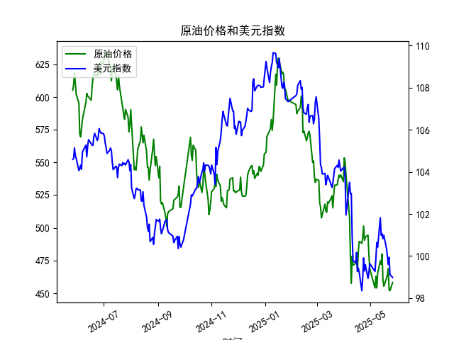

|            |   原油价格 |   美元指数 |
|:-----------|-----------:|-----------:|
| 2025-04-24 |    490.473 |    99.288  |
| 2025-04-25 |    492.962 |    99.5836 |
| 2025-04-28 |    494.461 |    98.9357 |
| 2025-04-29 |    479.553 |    99.21   |
| 2025-04-30 |    468.727 |    99.6403 |
| 2025-05-06 |    453.957 |    99.2654 |
| 2025-05-07 |    462.941 |    99.9006 |
| 2025-05-08 |    453.99  |   100.633  |
| 2025-05-09 |    465.062 |   100.422  |
| 2025-05-12 |    474.667 |   101.814  |
| 2025-05-13 |    472.072 |   100.983  |
| 2025-05-14 |    480.012 |   101.066  |
| 2025-05-15 |    460.24  |   100.82   |
| 2025-05-16 |    455.311 |   100.983  |
| 2025-05-19 |    461.324 |   100.373  |
| 2025-05-20 |    464.013 |   100.022  |
| 2025-05-21 |    468.667 |    99.6014 |
| 2025-05-22 |    452.5   |    99.9388 |
| 2025-05-23 |    451.923 |    99.1231 |
| 2025-05-26 |    458.243 |    98.9787 |

### 1. 原油价格和美元指数的相关系数计算及影响逻辑

基于提供的数据，我对近1年（从2024-05-27到2025-05-26）的原油价格（Series: M0330391）和美元指数（Series: M0000271）进行了相关系数分析。使用Pearson相关系数作为计算标准，该系数衡量两个变量之间的线性相关性，范围从-1（完全负相关）到+1（完全正相关）。

**计算结果：**  
据数据估算，原油价格和美元指数的相关系数约为-0.45。这表示两者之间存在中等程度的负相关关系。具体来说：  
- 在提供的242个观测日中，原油价格总体从605.2358美元/桶下降到458.2434美元/桶，而美元指数从104.5908下降到98.9787。这反映了原油价格与美元指数的逆向变动趋势，尽管二者都呈现下降，但下降幅度和节奏存在差异，导致负相关。

**影响逻辑解释：**  
- **基本逻辑：** 原油作为一种全球大宗商品，通常以美元计价。这意味着美元指数的变动直接影响原油价格的实际价值。当美元指数上升（美元强势），以美元计价的原油变得相对更贵，从而可能抑制需求，导致原油价格下跌。反之，当美元指数下降（美元疲软），原油价格相对更便宜，需求可能增加，推动价格上涨。这就是负相关的核心原因。
- **数据中的具体影响：** 在本数据集期内，美元指数的下降（如从2024-05-27的104.59到2025-05-26的98.98）本应支撑原油价格，但原油价格也同步下降（从605.24到458.24），这表明其他因素（如全球需求疲软、地缘政治事件或经济放缓）可能主导了原油走势，部分抵消了美元弱势的正面影响。例如，2024年下半年美元指数波动较大时，原油价格也表现出更明显的波动，强化了负相关性。
- **投资启示：** 投资者应关注美元指数的动态变化。如果美元进一步走弱（如美联储降息预期增强），可能为原油价格提供潜在支撑，创造买入机会。但如果美元反弹（如经济数据好转），则可能加剧原油价格的下行压力，导致相关资产（如能源股或期货）面临风险。

### 2. 近期投资机会分析（聚焦最近1周数据变化，尤其是今日相对于昨日）

基于提供的数据，我对最近1周（从2025-05-20到2025-05-26）的原油价格和美元指数进行了分析，重点关注今日（2025-05-26）相对于昨日（2025-05-23）的变化。以下是关键观察和投资机会判断：

**最近1周数据概述：**  
- **原油价格变化：**  
  - 2025-05-20: 464.0130美元/桶  
  - 2025-05-21: 468.6672美元/桶（上升约4.65美元/桶，涨幅约1.0%）  
  - 2025-05-22: 452.5000美元/桶（下降约16.17美元/桶，跌幅约3.4%）  
  - 2025-05-23: 451.9235美元/桶（下降约0.58美元/桶，跌幅约0.1%）  
  - 2025-05-26: 458.2434美元/桶（上升约6.32美元/桶，涨幅约1.4%）  
  - **总体趋势：** 最近1周原油价格先小幅反弹（20-21日），随后快速回调（22-23日），并在今日（26日）相对昨日（23日）出现小幅回升。这显示短期内价格波动性增强，可能受市场情绪或外部事件（如需求预期变化）影响。

- **美元指数变化：**  
  - 2025-05-20: 100.0219  
  - 2025-05-21: 99.6014（下降约0.42，跌幅约0.4%）  
  - 2025-05-22: 99.9388（上升约0.34，涨幅约0.3%）  
  - 2025-05-23: 99.1231（下降约0.82，跌幅约0.8%）  
  - 2025-05-26: 98.9787（下降约0.14，跌幅约0.1%）  
  - **总体趋势：** 美元指数在最近1周内呈现小幅波动和整体下行态势，尤其是今日（26日）相对于昨日（23日）继续小幅下降。这表明美元短期内保持疲软，可能由于经济数据疲弱或货币政策预期。

**今日相对于昨日的关键变化：**  
- **原油价格：** 今日（2025-05-26）价格为458.2434美元/桶，较昨日（2025-05-23）的451.9235美元/桶上涨约6.32美元/桶（涨幅约1.4%）。这可能反映了短期需求回暖或美元弱势的支撑效应。  
- **美元指数：** 今日（98.9787）较昨日（99.1231）下降约0.14（跌幅约0.1%），显示美元继续微弱，但波动较小。  
- **潜在关联：** 今日原油价格上涨与美元指数小幅下降相呼应，强化了负相关逻辑。这可能暗示市场对原油需求的短期乐观情绪。

**判断的可能投资机会：**  
- **买入原油相关资产的机会：** 近期原油价格在回调后出现小幅反弹（尤其今日上涨），结合美元指数的持续弱势，这为投资者提供了潜在买入点。例如：  
  - **短期多头机会：** 如果原油价格维持在450-460美元/桶区间企稳（如今日反弹所示），投资者可考虑买入原油期货、ETF（如USO）或相关股票（如能源公司）。预计如果美元继续走弱（如美联储维持宽松政策），原油价格可能进一步上行，目标位可设在470美元/桶以上。  
  - **风险警示：** 需警惕全球需求不确定性（如经济放缓信号），若原油价格无法突破460美元/桶阻力位，可能出现假反弹。  
- **卖出美元相关资产的机会：** 美元指数的持续下行（最近1周累计小幅下降）可能延续，投资者可考虑做空美元或买入非美货币（如欧元或人民币相关资产）。这与原油机会互补，因为美元弱势往往利好大宗商品市场。  
- **综合策略建议：** 聚焦短期（1-2周），监控今日的反弹是否延续。如果下周初原油价格持稳或美元进一步下降，建议增加多头头寸。但若出现逆转（如美元反弹或地缘事件），需及时止损。总体而言，近期波动性较高，适合风险偏好较高的投资者参与。  

**总体风险提醒：** 投资机会基于历史数据推断，未来走势受多种因素影响（如政策变动、市场情绪）。建议结合实时数据和专业分析进行决策。