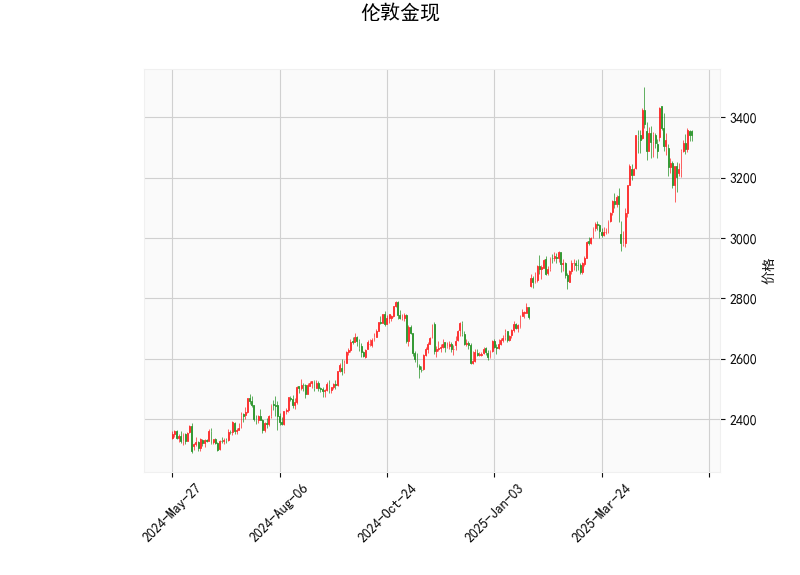

### 伦敦金现的技术分析结果分析

#### 1. 指标详细分析
基于提供的伦敦金现货技术分析数据，以下是对各指标的逐一解读：

- **当前价格（Current Price）**: 当前价位为3342.21。这表明金价处于相对稳定的区间，位于布林带中线（3175.58）之上，但未触及上轨（3485.83），显示价格在短期内可能保持波动但未出现极端偏离。

- **RSI（Relative Strength Index）**: RSI值为56.67，处于中性区域（30-70之间）。这暗示市场目前没有明显的超买或超卖信号，但高于50水平，表明轻微看涨势头，可能吸引短期多头投资者。然而，如果RSI持续上升并接近70，将增加超买风险。

- **MACD（Moving Average Convergence Divergence）**: MACD线（29.80）高于信号线（29.65），且MACD直方图（0.15）为正值。这是一个典型的看涨信号，表明短期内多头动力占优，价格可能继续向上测试阻力位。但直方图值较小，表明多头势头并不强劲，容易逆转。

- **布林带（Bollinger Bands）**: 
  - 上轨（Upper Band）：3485.83
  - 中轨（Middle Band）：3175.58
  - 下轨（Lower Band）：2865.34
  当前价格（3342.21）位于中轨和上轨之间，显示价格在波动区间内向上扩展。这可能表示短期看涨趋势，但接近上轨时需警惕回调风险，因为布林带收窄或扩张往往预示波动性增加。

- **K线形态（CDLMATCHINGLOW）**: 这是一个看跌形态，通常在价格见顶后出现，暗示潜在的逆转信号。结合当前数据，它可能表示多头势头疲软，短期内价格可能向下测试支撑位（如布林带中轨或更低）。这与MACD的看涨信号形成矛盾，提醒投资者注意潜在的卖出压力。

**整体市场解读**: 从指标来看，RSI和MACD显示轻微看涨，暗示短期多头占优，但K线形态的看跌信号和价格接近布林带上轨增加了不确定性。市场可能处于中性偏涨状态，但随时可能出现回调。整体上，这反映了金价的波动性增强，可能受全球经济事件（如通胀数据或地缘政治风险）影响。

#### 2. 近期可能存在的投资或套利机会和策略
基于上述分析，以下是对近期伦敦金现货投资或套利机会的判断。金市受多种外部因素影响（如美元走势、通胀预期），因此策略应以风险管理为先，并结合实时数据调整。

##### 投资机会
- **看涨机会**: RSI和MACD的正向信号表明，如果多头势头持续，价格可能向上测试布林带上轨（3485.83）。潜在机会包括：
  - **短期买入**: 若价格突破当前水平并维持在3400以上，投资者可考虑在支撑位（如布林带中轨3175.58）附近买入，目标指向上轨。适合风险偏好较高的交易者。
  - **回调买入**: 如果K线形态的看跌信号导致短期回调，RSI未跌破50可视为买入点，预计反弹至3500附近。

- **看跌机会**: CDLMATCHINGLOW形态提示潜在逆转，价格可能回落至布林带中轨或下轨（2865.34）。机会包括：
  - **短期卖出**: 若RSI接近70（当前已升至56.67），结合K线信号，投资者可卖出或做空，目标指向3200-3100区间。适合在高点获利的策略。
  - **风险：** 金价作为避险资产，地缘政治事件可能逆转看跌趋势，导致快速反弹。

- **总体风险评估**: 当前市场中性，机会有限但波动性高。投资者应监控全球事件（如美联储政策），避免在高波动期过度暴露。

##### 套利机会和策略
金现货市场套利通常涉及现货与期货、期权或其他资产的价差，但基于给定数据，以下是可行的策略建议：
- **波动率套利**: 价格在布林带中上部波动，暗示潜在高波动期。策略包括：
  - **布林带区间交易**: 在上轨（3485.83）和中轨（3175.58）之间进行买卖。买入时价格接近下限，卖出时接近上限，利用RSI和MACD确认信号。预期收益：通过小幅波动获利，但需设置止损（如2-3%的价格变动）。
  - **跨市场套利**: 若金现货与期货价差扩大（例如，现货高于期货），可考虑现货买入+期货卖出套利。当前MACD正向可能放大价差，目标在短期内收敛。

- **风险对冲策略**: 
  - **结合多头/空头头寸**: 使用MACD交叉作为信号，构建多头头寸（买入现货）并以期权对冲看跌风险（如购买看跌期权）。如果CDLMATCHINGLOW触发，可切换为空头。
  - **资金管理建议**: 分配10-20%的资金用于高风险交易，设置止盈/止损（如价格跌破3300触发卖出）。长期投资者可等待RSI跌破50再入场。

**总体策略建议**: 近期机会以短期交易为主，避免大额头寸。优先选择看涨策略，但密切关注K线形态的逆转信号。建议结合基本面分析（如黄金ETF走势或美元指数），并在模拟环境中测试策略，以降低风险。最终，投资决策应基于个人风险承受能力和实时市场数据。