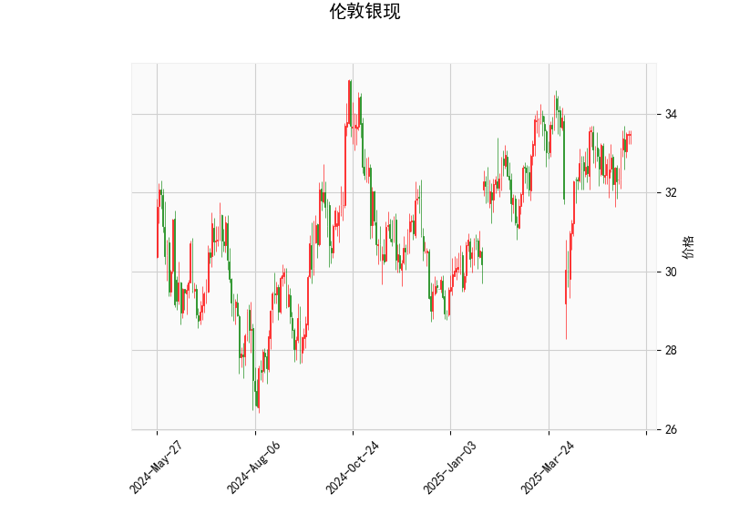

# 伦敦银现技术分析结果分析

## 1. 对技术分析结果的详细解读
以下是对提供的伦敦银现（白银现货市场）技术指标的分析，这些指标基于当前价格和历史数据。整体来看，市场呈现出中性偏看涨的态势，但K线形态显示出较高的不确定性，投资者需谨慎。

### 关键指标概述
- **当前价格**: 33.477  
  当前价格位于布林带的中轨（32.87）和上轨（34.69）之间，表明价格处于相对稳定的区间，但稍高于中轨，暗示潜在的上行压力。如果价格持续向上，可能测试上轨34.69的阻力位。

- **RSI (相对强弱指数)**: 56.99  
  RSI值处于中性区域（30-70），具体来说，接近57，显示市场未出现超买（RSI>70）或超卖（RSI<30）情况。目前的RSI略高于50，表明买方力量稍占上风，但整体动能并不强劲。如果RSI继续上升至60以上，可能增加短期看涨信号；反之，若跌破50，则可能转为看跌。

- **MACD指标**:  
  - MACD线: 0.1818  
  - MACD信号线: 0.0865  
  - MACD柱状图: 0.0953  
  MACD线高于信号线，且柱状图为正值，这是一个典型的看涨信号，表明短期内多头（买方）主导市场。MACD的正向差异（hist值）显示价格可能继续上涨，但幅度有限。如果MACD柱状图开始缩小或转向负值，将是潜在的卖出信号。

- **布林带（Bollinger Bands）**:  
  - 上轨: 34.69  
  - 中轨: 32.87  
  - 下轨: 31.06  
  当前价格（33.477）位于中轨之上，但未触及上轨，显示价格在波动范围内向上移动。这暗示市场波动性适中，但如果价格突破上轨，可能触发进一步上涨；反之，若跌破中轨，将面临下行风险。布林带的收窄或扩张可以作为未来波动预判的依据，目前带宽相对正常。

- **K线形态**: ['CDLDOJI', 'CDLHIGHWAVE', 'CDLLONGLEGGEDDOJI', 'CDLSPINNINGTOP']  
  这些形态主要反映市场的不确定性和犹豫：  
  - **CDLDOJI和CDLLONGLEGGEDDOJI**: 表示买卖力量均衡，市场可能处于十字路口，常预示潜在反转或盘整。如果近期K线持续出现Doji，建议警惕突发逆转。  
  - **CDLHIGHWAVE**: 显示价格波动较大，但方向不明，表明市场情绪不稳定，可能导致短期剧烈波动。  
  - **CDLSPINNINGTOP**: 类似小实体蜡烛，暗示买卖双方胶着，市场缺乏清晰方向。  
  总体上，这些形态强调了当前的犹豫期，投资者应关注后续K线确认信号。

### 整体市场解读
从以上指标来看，伦敦银现显示出**中性偏看涨**的特征：RSI和MACD提供了一些上行动能支持，而布林带的位置也验证了这一趋势。然而，K线形态的犹豫信号增加了不确定性，市场可能面临回调风险。外部因素如全球经济数据、通胀预期或地缘政治事件（如美联储政策）可能放大这些技术信号的影响。短期内，价格可能在32.87-34.69区间内震荡，等待突破确认。

## 2. 近期可能存在的投资或套利机会和策略
基于上述分析，伦敦银现市场存在潜在的投资机会，但需结合风险管理。以下是针对近期可能的投资和套利策略的判断和建议。注意，实际操作应参考实时数据和个人风险承受能力。

### 潜在投资机会
- **看涨机会**:  
  MACD的正向信号和价格在中轨之上表明，如果市场突破上轨（34.69），可能触发短期上涨。预计目标价位可达35.00（假设延续当前趋势）。适合策略包括：  
  - **买入并持有**: 在当前价位附近买入白银现货或相关ETF（如SLV），目标设定在35.00以上。  
  - **时机**: 若RSI保持在50-70区间且K线形态转为强势（如大阳线），可作为入场信号。  

- **回调机会**:  
  K线形态的犹豫（如Doji）暗示可能出现短期回调至中轨（32.87）或下轨（31.06）。这为**逢低买入**提供机会，尤其如果外部事件（如经济数据疲软）引发价格回落。  
  - **潜在收益**: 如果价格从33.477回落至32.87，投资者可获利1-2%的差价。

- **套利机会**:  
  由于白银与黄金或其他大宗商品的相关性较高，存在跨市场套利潜力：  
  - **商品间套利**: 如果白银相对黄金估值偏低（当前白银价格低于历史均值），可考虑白银-黄金配对套利。例如，同时买入白银多头和黄金空头头寸，等待价差收窄。基于当前数据，白银的RSI和MACD信号较黄金更积极，可能在短期内提供正套利空间。  
  - **期现套利**: 若白银期货价格与现货价格出现偏差（例如，期货溢价过高），可通过买入现货并卖出期货来锁定无风险收益。但需监控基差（期货与现货差价），当前现货价33.477若低于期货价，可作为套利起点。  
  - **量化套利**: 使用MACD和布林带的交叉信号进行算法交易，例如，当价格接近上轨时卖出，接近下轨时买入，以捕捉区间波动。

### 推荐策略和风险管理
- **投资策略**:  
  - **多头策略**: 买入现货或期货，设置止盈在35.00，止损在32.00（下轨附近）。适合风险偏好中等的投资者。  
  - **区间交易**: 在32.87-34.69区间内进行高抛低吸，避免大额头寸。  
  - **结合基本面**: 监控全球银矿供应、通胀数据或美联储利率决定，以增强技术信号的可靠性。  

- **套利策略**:  
  - **跨资产套利**: 例如，白银与原油或股指的相关套利。如果白银波动率高于其他资产，可构建多白银空其他资产的组合。  
  - **风险控制**: 限制套利头寸不超过总仓位的20%，并使用对冲工具（如期权）保护潜在损失。  

- **风险提示和注意事项**:  
  - **主要风险**: K线形态的不确定性可能导致假突破，RSI若升至70以上将面临超买回调。全球事件（如地缘冲突）可能加剧波动。  
  - **总体建议**: 采用小额测试性投资，结合技术分析工具（如MT4平台）实时监控。短期内，机会大于风险，但需优先考虑资金安全和多样化配置。  
  - **时间框架**: 关注1-5天的短期走势，避免长期持仓以防市场逆转。

通过这些分析，投资者可以更清晰地把握伦敦银现的市场动态，并制定相应策略。请确保在实际操作前咨询专业顾问。