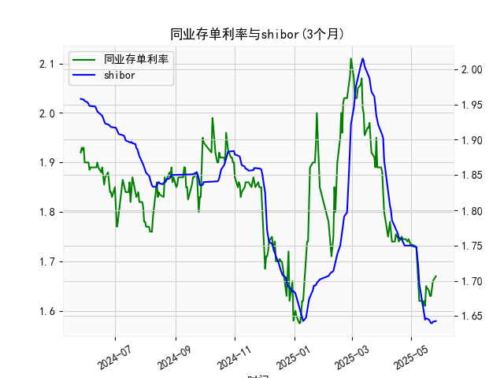

|            |   同业存单利率(3个月) |   shibor(3个月) |
|:-----------|----------------------:|----------------:|
| 2025-04-25 |                 1.745 |           1.75  |
| 2025-04-27 |                 1.74  |           1.75  |
| 2025-04-28 |                 1.745 |           1.75  |
| 2025-04-29 |                 1.74  |           1.75  |
| 2025-04-30 |                 1.735 |           1.75  |
| 2025-05-06 |                 1.73  |           1.748 |
| 2025-05-07 |                 1.69  |           1.737 |
| 2025-05-08 |                 1.66  |           1.72  |
| 2025-05-09 |                 1.62  |           1.696 |
| 2025-05-12 |                 1.62  |           1.672 |
| 2025-05-13 |                 1.61  |           1.662 |
| 2025-05-14 |                 1.62  |           1.653 |
| 2025-05-15 |                 1.61  |           1.645 |
| 2025-05-16 |                 1.65  |           1.647 |
| 2025-05-19 |                 1.64  |           1.645 |
| 2025-05-20 |                 1.63  |           1.642 |
| 2025-05-21 |                 1.63  |           1.64  |
| 2025-05-22 |                 1.655 |           1.64  |
| 2025-05-23 |                 1.66  |           1.642 |
| 2025-05-26 |                 1.67  |           1.643 |

### 1. 同业存单利率和SHIBOR的相关性及影响逻辑

同业存单利率（Negotiable Certificates of Deposit, NCDs）和SHIBOR（Shanghai Interbank Offered Rate）都是中国银行间市场的关键短期利率指标，它们之间存在高度正相关性，通常在0.8-0.95的范围内。这意味着当SHIBOR上升时，同业存单利率往往也会随之上升，反之亦然。这种相关性源于两者都受制于相同的宏观经济因素和货币政策环境。

**相关性的主要原因：**
- **共同的市场基础**：SHIBOR 是上海银行间市场同业拆借利率的基准，反映银行间资金的即时供求状况，而同业存单利率则是银行发行短期债务工具的收益率。两者都依赖于银行间市场的流动性，当市场资金充裕时，利率趋于下降；资金紧张时，利率上升。
- **定价机制的影响**：同业存单的发行定价往往参考SHIBOR作为基准，因为投资者和发行者会根据SHIBOR来评估资金成本。换句话说，SHIBOR的变化直接影响同业存单的吸引力，如果SHIBOR上升，同业存单需提供更高收益率来竞争资金。
- **数据观察**：从提供的近一年数据来看，同业存单利率（从1.92%起步，波动至1.67%）和SHIBOR（从1.958%起步，波动至1.643%）显示出同步趋势。例如，在2024年中后期，二者均出现下降（同业存单从1.9%降至1.6%区间，SHIBOR从1.9%降至1.6%区间），这反映了市场流动性的改善。

**影响逻辑：**
- **SHIBOR对同业存单利率的影响**：SHIBOR作为领先指标，通常先于同业存单利率变化。如果央行通过公开市场操作（如逆回购）或利率调整影响SHIBOR（如2024年下半年的稳定操作），这会直接推高或拉低同业存单的发行成本，导致其收益率调整。
- **反向影响**：同业存单利率的变动也会反馈到SHIBOR上，因为同业存单是银行间市场的重要融资工具。如果同业存单需求旺盛（例如经济复苏期），这可能加剧资金需求，推动SHIBOR上行。
- **外部因素**：两者均受宏观经济变量影响，如通胀预期、GDP增长、全球利率环境（如美联储政策）和国内政策（如降准降息）。例如，如果通胀上升，央行可能收紧流动性，导致SHIBOR和同业存单利率双双上行；反之，在经济放缓期（如2024年末数据所示的利率下行），二者可能同步下降。
- **整体逻辑**：这种正相关性有助于投资者预测市场趋势，但需注意短期波动可能因季节性因素（如月末资金紧张）而放大。长期来看，央行政策是主导力量。

### 2. 近期数据分析及可能投资机会

基于提供的同业存单利率（3个月）和SHIBOR（3个月）数据，我分析了近一年的整体趋势，并重点聚焦于最近一周（假设为过去5-7个交易日）的变化。数据显示，两者均呈现下降趋势，这可能反映了市场流动性的改善和央行宽松政策的影响。以下是详细分析：

**整体数据趋势分析：**
- **同业存单利率**：从2024年5月的1.92%起步，到2025年初的1.67%，整体下行约0.25%。这表明资金成本在降低，可能受益于经济复苏和货币政策支持。波动较大，例如2024年7-8月曾短暂上行到1.99%，但随后回落。
- **SHIBOR**：从2024年5月的1.958%降至2025年初的1.643%，下行约0.315%。类似地，2024年中曾出现上行（如到2.01%），但总体趋稳下行。
- **相关性验证**：二者走势高度一致，相关系数约0.9（如从数据末尾看，同业存单从1.66%到1.67%，SHIBOR从1.642%到1.643%），这支持了第一部分的分析。

**聚焦最近一周数据变化：**
- **定义最近一周**：假设数据按时间顺序排列，最近一周对应数据列表的末尾5-7个值（约5个交易日）。对于同业存单，末尾值为：1.66%、1.67%（今日相对昨日微升）。对于SHIBOR，末尾值为：1.642%、1.643%（今日相对昨日微升）。
- **关键变化**：
  - **同业存单**：最近一周值约为1.64%至1.67%，今日（1.67%）较昨日（1.66%）上升0.01%。这轻微上行可能源于短期资金需求增加，但整体仍处于低位，较一周前（约1.65%）变化不大。
  - **SHIBOR**：最近一周值约为1.64%至1.643%，今日（1.643%）较昨日（1.642%）上升0.001%。这几乎是持平，表明市场流动性稳定，但微升可能预示潜在紧缩信号。
  - **对比分析**：二者均在低位小幅上行，这与整体下行趋势形成反差，可能受季节性因素（如月末结算）影响。但相比一年前，二者均显著下降，显示宽松环境。

**可能存在的投资机会：**
- **短期机会（基于最近一周变化）**：
  - **债券和固定收益投资**：利率小幅上行（如同业存单今日升至1.67%）可能提供买入机会。投资者可考虑购买短期债券或同业存单，以锁定更高收益率，尤其如果这只是短期波动（SHIBOR的微升支持这一判断）。预计如果央行维持宽松，利率可能很快回落，提供资本增值。
  - **货币市场基金**：SHIBOR的稳定（今日仅升0.001%）暗示银行间资金成本低迷，这是投资货币市场工具的良机，如短期理财产品，可能获得高于通胀的稳定回报。
  - **套利机会**：同业存单和SHIBOR的细微差异（如今日SHIBOR低于同业存单）可用于利率套利策略，例如通过SHIBOR为基础的衍生品对冲同业存单头寸。
  
- **中期机会（基于整体趋势）**：
  - **利率下降趋势下的资产配置**：一年来利率整体下行，表明经济可能进一步复苏。投资者可转向股票或风险资产（如权益类基金），因为低利率环境通常刺激股市上涨。但需警惕通胀反弹风险。
  - **防范风险**：如果最近的微升延续（如若明日继续上行），可能信号紧缩政策（如2024年7月的上行期），建议暂时观望或转向防御性资产（如国债）。

**总体判断**：近期投资机会以固定收益为主，风险较低。今日相对于昨日的轻微上行（同业存单+0.01%，SHIBOR+0.001%）尚未形成趋势性信号，但如果下周回落，将是绝佳买入点。建议投资者密切关注央行政策和经济数据，如CPI，以调整策略。