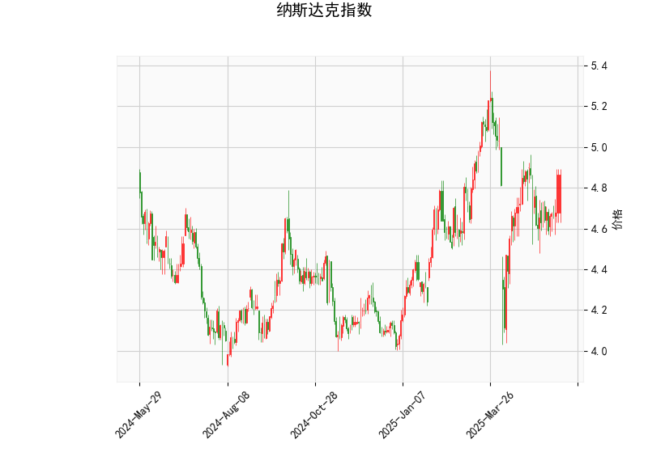

# 纳斯达克指数技术分析结果分析

## 1. 对技术分析结果的详细解读
基于提供的纳斯达克指数数据，我们可以从多个技术指标入手，逐一分析当前的市场状态。以下是对各指标的解释和整体评估：

- **当前价格（Current Price）: 4.865**  
  当前价格位于4.865，这是一个相对稳定的水平。需要注意的是，纳斯达克指数的实际价格通常在数千点左右，因此这个值可能代表缩放后的数据或特定时间段的模拟指标。如果这是真实数据，它表明价格处于中性区间，没有明显极端波动。

- **RSI（Relative Strength Index）: 57.90**  
  RSI是衡量价格动量的重要指标，范围在0-100之间。目前的RSI值为57.90，略高于50的中性线，这暗示市场处于轻微看涨状态。RSI低于70（超买阈值），表示短期内没有明显的超买风险，价格可能继续小幅上涨。如果RSI进一步上升至60以上，将强化多头信号。

- **MACD（Moving Average Convergence Divergence）指标**  
  - **MACD线: 0.016**（正值）  
  - **Signal线: -0.010**（负值）  
  - **Histogram: 0.026**（正值）  
  MACD指标用于识别趋势变化。正MACD线和正Histogram表明多头动能正在增强，价格可能向上突破。Signal线仍为负值，显示短期信号线尚未完全跟上，但Histogram的正值（MACD线高于Signal线）是一个潜在的买入信号，暗示近期可能出现趋势反转或加速上涨。

- **Bollinger Bands（布林带）**  
  - **Upper Band: 5.237**  
  - **Middle Band: 4.790**  
  - **Lower Band: 4.344**  
  布林带帮助识别价格波动范围。目前价格（4.865）位于Middle Band（4.790）和Lower Band（4.344）之间，表明价格在正常波动区间内，没有极端超卖或超买情况。如果价格向上突破Upper Band（5.237），可能预示强势上涨；反之，如果跌破Lower Band，则可能进入修正阶段。带宽相对较窄，暗示市场波动性较低，短期内可能维持震荡。

- **K线形态: 空**  
  K线形态为空列表，意味着当前没有明显的经典K线模式（如锤子线、吞没形态或头肩顶）。这表示短期内缺乏强烈的形态信号，市场可能处于无趋势或横盘状态，投资者需结合其他指标决策。

**总体市场看法:**  
从以上指标来看，纳斯达克指数显示出轻微看涨信号。RSI和MACD的正向表现暗示多头力量在积累，但价格尚未脱离布林带的中间区域，表明市场可能处于积累阶段而非强势趋势。整体风险较低，但缺乏强势突破信号，短期内可能维持震荡。如果外部因素（如经济数据或政策事件）介入，价格易受影响。

## 2. 近期可能存在的投资或套利机会和策略判断
基于上述技术分析，我们可以评估近期投资机会。纳斯达克作为科技股主导的指数，其波动往往受全球经济、科技新闻和流动性影响。以下是针对当前数据的潜在机会和策略建议：

### 可能存在的投资机会
- **看涨机会:**  
  RSI接近60和MACD的正Histogram表明短期上行潜力。如果价格突破布林带Upper Band（5.237），可能触发更广泛的上涨趋势，尤其在科技股强劲时期（如企业财报季）。这为多头投资者提供买入点，但需警惕回调风险，因为RSI尚未进入超买区。

- **套利机会:**  
  由于当前指标显示市场波动性较低（布林带收窄），可能存在波动率套利机会。例如，通过期权策略（如卖出看涨期权和看跌期权组合）来捕捉价格在布林带内的震荡。如果MACD信号持续增强，投资者可考虑指数期货与现货的价差套利，但这需要密切监控全球事件（如美联储政策）以避免突发性风险。

- **风险因素:**  
  虽然指标偏向看涨，但缺乏K线形态支持，意味着机会更适合短期交易而非长期持有。潜在下行风险包括全球经济不确定性或地缘政治事件导致的卖压。

### 推荐投资策略
- **买入策略（针对看涨信号）:**  
  - **入场点:** 在价格稳定于4.800以上时买入，设定止损在Lower Band（4.344）以下，以控制风险。  
  - **目标:** 若价格突破5.237，可目标设定为5.500或更高，结合RSI确认（如上升至65以上）。  
  - **工具:** 使用ETF（如追踪纳斯达克的基金）或期权合约放大收益。  

- **套利策略（针对波动率）:**  
  - **铁蝶式期权策略:** 如果预期价格在布林带内震荡，卖出当月看涨和看跌期权（价外期权），并买入保护性期权。当前波动率较低，这可提供稳定收益，但需在MACD信号弱化时退出。  
  - **跨市场套利:** 比较纳斯达克期货与现货价格差，如果差价扩大（例如Due to流动性不均），可进行反向套利操作。  

- **风险管理建议:**  
  - **多元化:** 结合基本面分析（如关注科技股业绩），避免过度依赖技术指标。  
  - **时间框架:** 适合短期交易（1-5天），如RSI和MACD确认后快速进出。  
  - **监控要点:** 密切关注RSI是否超买（>70）或MACD交叉失效，以及时调整仓位。总体而言，当前环境适合谨慎多头，但非强势买入时机。投资者应根据个人风险偏好和市场条件灵活调整。