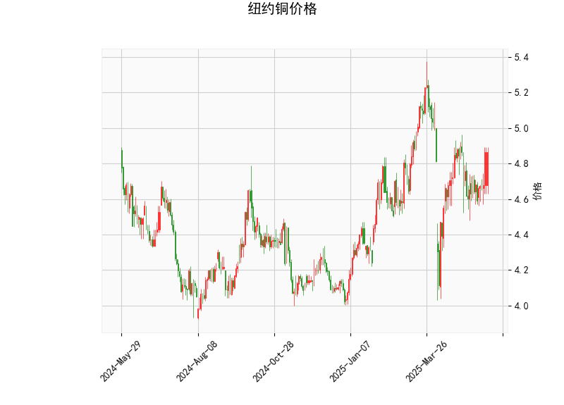

# 纽约铜价格技术分析结果分析

## 1. 对技术分析结果的详细解读
基于提供的纽约铜价格数据，我们可以从多个技术指标角度进行分析。以下是对各指标的逐一评估，以及整体市场信号的总结。

### 关键指标概述
- **当前价格（Current Price）**：当前价格为4.865美元。这表明纽约铜的价格处于相对稳定的区间。具体而言，它位于Bollinger Bands的中轨（4.790）和上轨（5.237）之间，显示价格尚未进入超买或超卖区域，而是维持在中性偏上位置。这可能暗示短期内价格有潜在的上行空间，但也需警惕可能的回调。

- **RSI（Relative Strength Index）**：RSI值为57.90。这是一个中性水平，处于30-70的正常范围之内。具体来说，RSI高于50表明市场存在轻微的强势，但尚未达到70以上的超买阈值。这意味着当前没有明显的超卖反弹机会，但如果RSI继续上升，可能预示着价格进一步走强。

- **MACD（Moving Average Convergence Divergence）**：MACD线值为0.0162，信号线值为-0.0102，直方图值为0.0264。这些数据显示MACD线高于信号线，且直方图为正值，这是一个典型的看涨信号。MACD的正直方图表明短期移动平均线正在上穿长期移动平均线，暗示潜在的买入机会。然而，需要注意如果直方图开始减弱，可能预示着动量减缓。

- **Bollinger Bands（布林带）**：上轨为5.237，中轨为4.790，下轨为4.344。目前价格（4.865）位于中轨上方但未触及上轨，这反映出价格波动处于中等水平。Bollinger Bands的收窄或扩张可以指示波动性变化：价格接近上轨可能意味着上行趋势的延续，但如果突破上轨后回落，则可能出现假突破。整体来看，这显示市场在中性偏多头状态。

- **K线形态**：K线形态为空（[]），即未检测到任何特定蜡烛图模式（如吞没形态或锤头线）。这意味着我们无法从K线图上获取额外的确认信号，分析主要依赖于其他指标。投资者应结合更广泛的K线历史数据来验证趋势。

### 整体市场信号总结
从以上指标来看，纽约铜市场呈现出轻微的看涨倾向。RSI的中性水平和MACD的正直方图共同支持了这一观点，表明短期内价格可能向上测试上Bollinger Band（5.237）。然而，缺乏K线形态的确认信号增加了不确定性，市场可能处于盘整阶段。总体风险中等，如果外部因素（如经济数据或全球铜需求）出现变化，价格波动可能会加剧。

## 2. 近期可能存在的投资或套利机会和策略分析
基于上述技术分析，我们可以推断出潜在的投资机会和策略。以下分析考虑了当前指标的信号，同时强调风险管理。需要注意的是，技术分析仅为参考，实际决策应结合基本面因素（如全球经济形势、铜矿供应和需求动态）。

### 可能的投资机会
- **看涨机会**：MACD的正直方图和价格位于Bollinger Bands中轨上方，暗示短期内可能出现上行趋势。如果价格突破上轨（5.237），这将是一个强有力的买入信号，潜在目标可设在5.50附近（基于历史波动）。RSI尚未进入超买区，也为进一步上涨提供了空间。
  
- **套利机会**：在商品市场，铜与相关资产（如铝或原油）可能存在套利空间。例如，如果纽约铜相对其他金属（如LME铜）出现价格偏差，投资者可以考虑跨市场套利（如在纽约买入、伦敦卖出）。当前数据显示铜价格稳定，但如果全球贸易摩擦加剧，铜作为工业金属的价格可能与大宗商品指数（如CRB指数）产生价差，提供套利入口。

- **潜在风险**：RSI接近60的水平意味着如果市场过热（RSI超过70），可能引发回调。Bollinger Bands的下轨（4.344）是关键支撑位，如果价格跌破此位，可能会触发卖出潮。总体而言，机会多于风险，但需警惕全球经济不确定性（如美联储加息或中国需求放缓）。

### 推荐投资策略
- **多头策略（买入持仓）**：如果MACD直方图继续扩大，建议在当前价格附近买入纽约铜期货或ETF（如CPER）。入场点可设在4.850-4.900区间，目标位为5.200（上Bollinger Band附近）。为管理风险，设置止损在4.400（下Bollinger Band下方），以控制潜在损失在5%以内。这适合短期交易者，预期持有1-4周。

- **观望与加仓策略**：如果RSI稳定在50-60区间，投资者可采取观望策略，等待MACD确认进一步上行后再加仓。同时，结合基本面监控（如铜库存数据或制造业PMI），以避免假突破。

- **套利策略**：针对跨资产套利，投资者可监控纽约铜与LME铜的价差。如果价差扩大到历史平均值以上（例如，0.20美元以上），可进行反向套利（如在价差高时卖出纽约铜、买入LME铜）。这需要较高的专业知识和资金流动性，适合经验丰富的机构投资者。

- **风险控制建议**：无论采用何种策略，都应设定严格的止盈止损规则（如利润达到10%时部分获利了结）。此外， diversifying into相关资产（如黄金作为避险工具）可以降低单一商品风险。总体仓位控制在总投资组合的10-20%以内，以应对市场波动。

总之，近期纽约铜市场存在温和的看涨机会，但需谨慎行事。投资者应实时跟踪指标变化和宏观新闻，以优化策略。建议结合专业咨询进行实际操作。