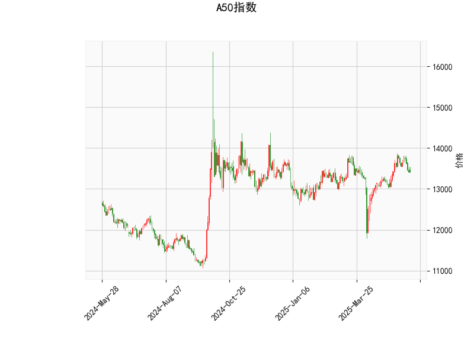

# A50指数的技术分析结果分析

## 1. 对技术分析结果的详细分析
以下是对提供的A50指数技术指标的逐一分析，这些指标 collectively 反映了当前市场的动向。A50指数当前价为13404.0，整体显示出中性偏弱的态势，可能处于盘整或轻微看跌阶段。

- **RSI (Relative Strength Index)**: 当前RSI值为48.96。这是一个中性水平（RSI通常在70以上为超买，30以下为超卖）。RSI略低于50表明市场短期内缺乏强势买盘，投资者可能正处于观望状态，或市场动能开始减弱。这暗示短期内可能出现小幅回调，但尚未进入超卖区。

- **MACD (Moving Average Convergence Divergence)**: MACD线为86.31，信号线为114.81，MACD柱状图（Hist）为-28.49。MACD线低于信号线，且柱状图为负值，这是一个典型的看跌信号，表明短期动量正在转向负面。投资者可能需要警惕潜在的下行压力，因为MACD的交叉往往预示价格可能进一步下跌。

- **Bollinger Bands (布林带)**: 中间带（Middle Band）为13307.13，当前价13404.0略高于中间带，但远低于上带（13983.99）和高于下带（12630.26）。这表示价格处于布林带的中间区域，市场波动性中等，没有极端超买或超卖迹象。如果价格继续接近下带，可能触发支撑测试；反之，如果突破上带，则可能出现反弹。

- **K线形态**: 检测到"CDLMATCHINGLOW"形态，这是一个看跌的反转信号，通常表示市场可能从短期高点回落或出现疲软。结合其他指标，这强化了市场的弱势，可能预示着价格短期内难以向上突破。

总体而言，A50指数的技术面显示出中性偏弱的格局。RSI和Bollinger Bands表明市场未极端，但MACD和K线形态的看跌信号提示潜在下行风险。当前价位于关键支撑位附近，投资者应密切关注价格是否跌破下带（12630.26），这可能加剧卖盘。

## 2. 近期可能存在的投资或套利机会和策略
基于上述分析，A50指数短期内可能存在一些投资机会，但需谨慎对待市场波动。以下是针对近期可能的投资或套利策略的判断，这些策略基于技术指标的信号，并结合风险管理原则。

### 可能的投资机会
- **看跌机会**: MACD的负柱状图和CDLMATCHINGLOW形态暗示短期下行风险。如果价格跌破Bollinger Bands的下带（12630.26），这可能是一个做空或卖出的机会，尤其在RSI进一步降至30以下时。预计下行目标可能在12500附近，适合风险偏好较高的投资者。
  
- **反弹机会**: 如果RSI从当前水平回升至50以上，或价格反弹至中间带上方（13307.13），这可能触发短期多头机会。但需等待MACD柱状图转为正值作为确认信号。

- **套利机会**: A50指数的波动性相对可控（价格在Bollinger Bands内），这适合波动率套利策略。例如，利用期权或期货进行跨市套利（如A50与相关指数的价差交易），如果市场出现短暂盘整（RSI中性时）。然而，当前看跌信号较强，套利需在低波动期操作，避免MACD恶化。

### 推荐策略
- **短期看跌策略**: 
  - **操作**: 在当前价附近卖出或做空A50指数期货，止损设在上带（13983.99）附近。
  - **理由**: MACD和K线形态支持下行，适合短期交易者。
  - **风险控制**: 设定10-15%的止损水平，并监控RSI是否反弹。

- **中性盘整策略**: 
  - **操作**: 采用范围交易，例如在下带（12630.26）附近买入，在中间带（13307.13）附近卖出。
  - **理由**: Bollinger Bands显示价格在带内波动，RSI中性适合低风险操作。
  - **风险控制**: 限制仓位规模，避免MACD信号加剧时亏损。

- **整体风险提示**: 市场不确定性较高，建议结合基本面（如全球经济数据）验证技术信号。长期投资者可等待RSI回升后再布局多头。任何策略均应遵循资金管理原则，如不超过总仓位的20%用于单笔交易。