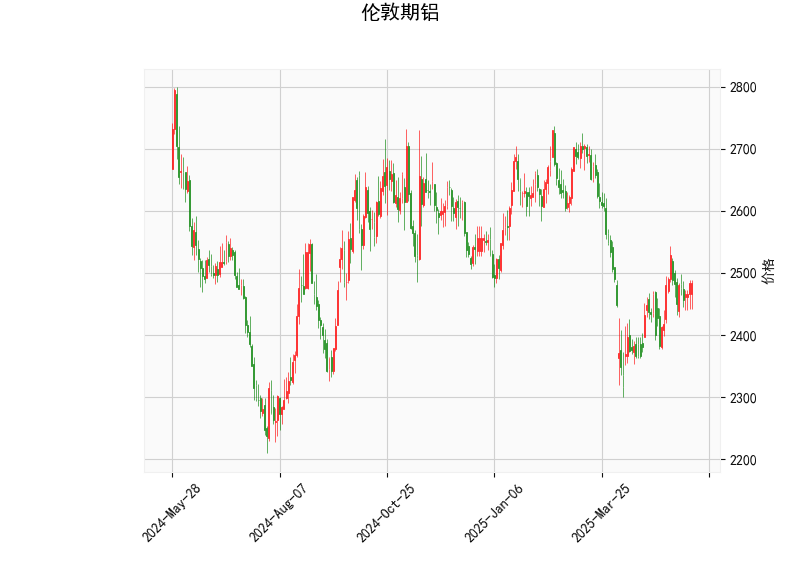

### 伦敦期铝技术分析结果解析

#### 1. 对技术分析结果的详细分析
基于提供的伦敦期铝技术指标数据，我们可以从多个维度对当前市场状况进行评估。以下是对关键指标的逐一解读，以及整体市场信号的总结：

- **当前价格（Current Price）**: 2483.0  
  当前价格处于相对稳定的水平，位于布林带的中间带（Middle Band）附近（2496.12）。这表明铝价近期可能在窄幅区间内震荡，但尚未出现明显的突破或崩盘信号。如果价格向上逼近上带（2720.23），可能暗示潜在的上行趋势；反之，向下接近下带（2272.01）则可能进入超卖区域。

- **RSI（Relative Strength Index）: 53.63**  
  RSI值位于中性区间（30-70之间），具体偏向中上部。这反映出铝价当前没有明显的超买或超卖状况，市场力量较为均衡。RSI高于50表明短期买方力量稍占优势，可能预示着价格小幅上涨的潜力，但尚未达到超买阈值（70以上），因此风险较低。如果RSI继续上升，可能吸引更多多头参与。

- **MACD（Moving Average Convergence Divergence）指标**  
  - MACD线: 5.495  
  - MACD信号线: 1.011  
  - MACD直方图: 4.484  
  MACD线高于信号线，且直方图为正值，这是一个典型的看涨信号。表明短期内多头动能强于空头，价格可能出现向上修正。然而，MACD值的绝对水平不高，意味着上涨势头并非特别强劲。如果MACD直方图继续扩大，可能确认趋势；反之，如果直方图收窄或转为负值，则需警惕回调风险。

- **布林带（Bollinger Bands）指标**  
  - 上带（Upper Band）: 2720.23  
  - 中间带（Middle Band）: 2496.12（通常基于20期简单移动平均线）  
  - 下带（Lower Band）: 2272.01  
  当前价格（2483.0）位于中间带下方，但距离较近，显示价格处于布林带的“常态”波动范围内。布林带整体宽度适中（上带与下带间距约448点），表明市场波动性中等。如果价格突破上带，可能触发强势上涨；如果跌破下带，则可能进入熊市修正。目前的定位暗示潜在的区间震荡，投资者可关注突破点作为进场信号。

- **K线形态**  
  提供的K线形态为空（[]），意味着近期未出现明显的经典形态（如吞没、头肩顶等）。这可能表示市场缺乏强烈的短期方向性，更多依赖其他指标指导决策。

**整体市场观点**:  
从上述指标来看，伦敦期铝当前呈现中性偏看涨的态势。RSI和MACD的组合暗示短期多头占优，但布林带的窄幅波动提醒潜在的区间整理。整体上，铝价可能在2480-2720的范围内波动，外部因素（如全球经济数据、供需动态）将影响其方向。如果无重大负面事件干扰，价格可能小幅上行；否则，需防范回调风险。

#### 2. 近期可能存在的投资或套利机会和策略
基于上述分析，我们可以识别出一些潜在的投资机会和策略。需要强调的是，技术分析仅为参考，实际决策应结合基本面因素、市场情绪和风险管理。以下是针对近期可能性的判断和建议：

- **潜在投资机会**:
  - **看涨机会**: MACD的正直方图和RSI的中性偏上水平表明短期内可能存在买入机会。例如，如果价格向上突破布林上带（2720.23），这可能触发更广泛的上涨趋势。当前铝价受全球工业需求（如电动汽车和建筑行业）支撑，投资者可考虑在2480以上买入，目标设在2600-2720区间。
  - **区间震荡机会**: 价格接近中间带，适合短期交易者进行高抛低吸。如果价格回落至2350-2400（接近下带），可视为低风险买入点；反之，在2550以上减仓以锁定利润。这种策略适用于波动性市场，避免追高。
  - **套利机会**: 对于经验丰富的投资者，可探索跨市场套利，如伦敦期铝与上海期铝的价差套利（如果上海铝价相对偏低）。此外，基于MACD的看涨信号，考虑期货多头套利策略，例如构建多头头寸的同时对冲基础金属篮子（如铜或锌），以捕捉相关资产的联动上涨。但需注意，当前价差不明显，套利窗口可能需等待更显著的波动。

- **推荐策略**:
  - **趋势跟踪策略**: 如果MACD直方图保持正值且RSI未超买，可采用多头策略——在价格站稳2500以上买入，止损设在下带（2270以下）。目标位可设为上带（2720）。这适合中期投资者，预计持有1-3周。
  - **均值回归策略**: 鉴于价格在中带附近，短期交易者可等待价格回落至2450以下时买入，然后在接近中带（2496）时卖出。风险控制关键，通过设置止损（如2-3%的损失阈值）来管理波动。
  - **风险管理建议**: 铝价易受宏观因素影响（如美联储政策或中国需求变化），建议控制仓位（不超过总资金的10-20%），并结合RSI监控超买风险。如果RSI升至65以上，考虑减仓以避开潜在回调。多样化投资，例如结合期权保护多头头寸，也可降低风险。

总体而言，近期伦敦期铝的投资环境较为乐观，但需谨慎对待波动性。建议投资者结合实时数据和新闻监控（如OPEC动态或全球库存报告）来优化策略。最终决策应基于个人风险偏好和专业咨询。