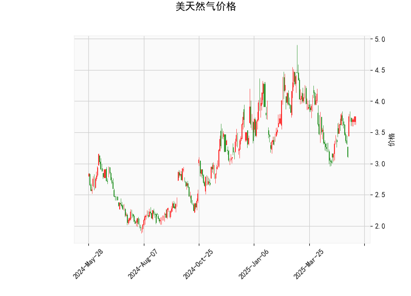

# 美天然气价格的技术分析结果分析

## 1. 对技术分析结果的详细解读
基于提供的美天然气价格数据，我们对各个技术指标进行逐一分析，以评估当前市场态势。当前价格为3.757美元/百万英热单位（MMBtu），整体指标显示出中性偏看涨的信号，但尚未出现强烈的趋势确认。

### 关键指标分析
- **RSI（相对强弱指数）: 56.73**  
  RSI值位于30-70的正常区间内，当前值为56.73，表明市场处于中性状态，没有明显的超买（RSI > 70）或超卖（RSI < 30）信号。RSI略高于50，暗示近期买方力量稍占上风，可能反映出温和的看涨势头。但这并不足以确认强势上涨，需要结合其他指标验证。

- **MACD（移动平均收敛散度）: 0.052（MACD线），0.010（信号线），0.042（直方图）**  
  MACD线（0.052）高于信号线（0.010），且直方图（0.042）为正值，这是一个典型的看涨信号。MACD直方图的正值表示短期移动平均线向上穿越长期移动平均线，暗示价格可能有进一步上涨的动力。然而，MACD值的幅度较小（未大幅扩张），表明上涨势头尚不强劲，需警惕潜在的回调风险。如果MACD线继续远离信号线，可能会强化买入信号。

- **Bollinger Bands（布林带）: 上带4.411，中带3.679，下带2.948**  
  当前价格（3.757）位于中带（3.679）和上带（4.411）之间，接近中带，这反映出价格波动处于正常范围内，没有明显的突破或逆转信号。Bollinger Bands的宽度相对稳定，表明市场波动性适中。如果价格向上突破上带（4.411），可能预示强势上涨；反之，如果跌破下带（2.948），则可能进入超卖区。目前的定位显示中性偏多头，适合观望或轻仓操作。

- **K线形态: 空（[]）**  
  K线形态为空，意味着近期未出现明显的看涨（如锤头线或吞没形态）或看跌（如射击之星）图案。这增加了分析的不确定性，我们主要依赖RSI、MACD和Bollinger Bands等指标进行判断。缺乏K线信号可能表示市场缺乏短期催化剂，需等待进一步的价量确认。

### 总体市场解读
综合以上指标，美天然气价格目前显示出轻微的看涨倾向：RSI和MACD均支持多头观点，而Bollinger Bands保持中性。价格处于相对稳定的区间，但尚未形成强势趋势。外部因素如季节性需求（例如冬季取暖需求增加）、地缘政治事件或全球能源供应变化，可能进一步影响价格走势。投资者应密切关注这些指标的动态变化，例如MACD的交叉或Bollinger Bands的突破，以捕捉潜在信号。

## 2. 近期可能存在的投资或套利机会和策略
基于上述分析，我们判断美天然气市场的近期机会。总体而言，市场偏中性，但轻微看涨信号为短期投资提供了潜在入口。以下是可能的投资或套利机会，以及相应的策略建议。请注意，天然气市场受制于高波动性和外部风险（如天气、政策变化），所有操作应结合风险管理。

### 可能的机会
- **投资机会**  
  - **短期看涨机会**: MACD的正直方图和RSI高于50暗示潜在的上行空间。如果价格向上突破Bollinger Bands上带（4.411），可能触发更强的买盘，带来10-15%的短期涨幅（基于当前价位估算）。这适合活跃投资者在低波动期入场。  
  - **回调买入机会**: 当前价格接近中带，如果出现小幅回调至3.500-3.600区间（RSI未跌破50），这可能是一个低风险买入点，尤其在MACD保持正向的情况下。  
  - **风险警示**: 如果RSI接近70或MACD直方图收窄，可能预示回调，需警惕价格跌向下带（2.948）。

- **套利机会**  
  - **跨市场套利**: 天然气期货与现货或相关商品（如原油）之间可能存在价差。例如，如果美天然气期货价格与欧洲天然气价格（如TTF）出现异常分歧，可以通过跨市场套利获利（如买入美天然气期货，同时卖出欧洲合约）。当前轻微看涨信号可能放大这种机会，但需监控全球供应动态。  
  - **期权套利**: 可以考虑买入看涨期权（Call Option）并卖出看跌期权（Put Option）构建价差策略。如果预期价格向上突破，期权波动率可能增加，提供额外收益。基于Bollinger Bands的窄幅波动，波动率套利（如铁蝶式策略）也值得关注。

### 推荐策略
- **买入策略（适合多头偏好者）**:  
  - **入场点**: 当价格稳定在3.700以上，且MACD直方图扩大时买入。目标位设在4.200-4.500（上带附近）。  
  - **止损设置**: 若价格跌破中带（3.679），立即止损，以控制损失在5-10%。  
  - **持仓管理**: 结合RSI监控，如果RSI超过70，考虑部分获利了结。

- **卖出或套利策略（适合中性或风险厌恶者）**:  
  - **区间交易**: 在Bollinger Bands内进行高抛低吸，例如在3.800以上卖出，在3.500以下买入。  
  - **期权组合**: 构建中性策略，如Straddle（同时买入看涨和看跌期权），以捕捉潜在波动。预计短期内，基于MACD信号的价格波动可提供5-10%的套利空间。  
  - **风险控制**: 分配不超过总资金的10-20%用于天然气投资，结合全球事件（如OPEC动态）调整仓位。

### 总体建议和风险提示
短期内，美天然气市场可能存在小幅上涨机会，投资者可关注MACD和Bollinger Bands的信号进行操作。但市场易受季节性和地缘政治影响（如美国页岩气产量或全球需求变化），可能导致突发波动。建议结合基本面分析（如库存数据），并使用工具如移动止损来管理风险。长期投资者应耐心等待更明确的趋势确认，而短期交易者可小仓位试探。最终，投资决策应基于个人风险承受能力和实时市场数据。