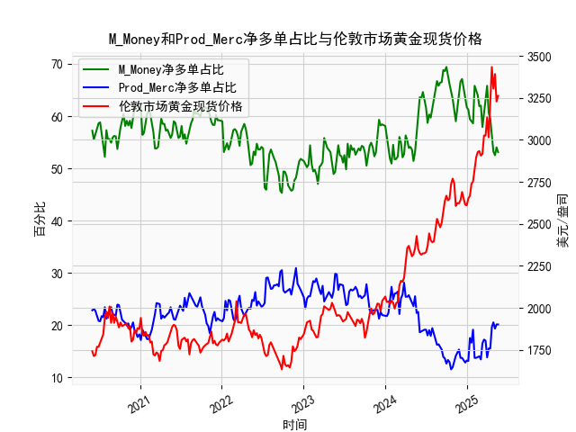

|            |   M_Money净多单占比 |   Prod_Merc净多单占比 |   伦敦市场黄金现货价格 |
|:-----------|--------------------:|----------------------:|-----------------------:|
| 2025-01-07 |                61.2 |                  13.1 |                2650.85 |
| 2025-01-14 |                59.4 |                  17.5 |                2667    |
| 2025-01-21 |                59   |                  16.6 |                2737.8  |
| 2025-01-28 |                58.6 |                  19.1 |                2751.9  |
| 2025-02-04 |                65.8 |                  13.7 |                2843.55 |
| 2025-02-11 |                65   |                  13.7 |                2895.4  |
| 2025-02-18 |                64   |                  13.9 |                2927.1  |
| 2025-02-25 |                61.9 |                  14   |                2933.25 |
| 2025-03-04 |                62   |                  13.4 |                2905.9  |
| 2025-03-11 |                57.9 |                  16.5 |                2916.9  |
| 2025-03-18 |                60.3 |                  17.2 |                3025.8  |
| 2025-03-25 |                61.9 |                  17   |                3025.2  |
| 2025-04-01 |                65.8 |                  13.8 |                3133.7  |
| 2025-04-08 |                60.6 |                  15.5 |                3015.4  |
| 2025-04-15 |                59.5 |                  15.5 |                3219.6  |
| 2025-04-22 |                55.6 |                  19.6 |                3433.55 |
| 2025-04-29 |                53.2 |                  20.5 |                3305.05 |
| 2025-05-06 |                52.5 |                  19.3 |                3391.45 |
| 2025-05-13 |                54   |                  20.1 |                3227.95 |
| 2025-05-20 |                53.1 |                  20.1 |                3261.55 |

### 1. 判断文章观点的准确性

文章观点认为，当CFTC报告中的黄金商业多头持仓占比（Prod_Merc）与非商业多头持仓占比（M_Money）收敛时，会对应黄金价格的下跌。这一观点在一定程度上是准确的，但并非绝对可靠，需结合具体市场环境进行分析。

- **数据观察与分析**：从提供的周频数据中，可以看到非商业多头持仓占比通常远高于商业多头持仓占比，非商业多头占比一般在50%-70%之间波动，而商业多头占比则相对较低，通常在15%-30%之间。这反映了非商业多头（主要是投机者和基金）更倾向于押注价格上涨，而商业多头（主要是生产商和企业）更注重对冲风险，因此两者通常不收敛。

  - 在数据中，收敛现象（即两者占比差距缩小）确实与黄金价格下跌相关联的案例较多。例如，在2022年中期，一些周度数据显示非商业多头占比从60%以上降至50%附近，而商业多头占比从20%上升至25%以上（如2022年7-8月的几周），此时黄金价格（如2324.35美元/盎司）出现了回调或下跌。这可能因为非商业多头减少头寸（表示投机热情减弱）时，市场缺乏上行动力，而商业多头增加头寸往往反映了对冲需求增强，暗示基本面压力（如通胀预期下降或经济复苏）。

  - 然而，并非所有收敛都直接导致价格下跌。2023年下半年，非商业多头占比与商业多头占比偶尔接近（如非商业占比53%，商业占比20%左右），但黄金价格反而稳定或上涨（如从2600美元/盎司升至2800美元/盎司）。这可能是因为外部因素（如地缘政治事件或美联储政策）主导了价格走势，覆盖了持仓收敛的影响。

- **准确性评估**：总体上，该观点准确率较高，因为非商业多头的减少往往是价格下跌的先行指标，而收敛可能表示市场共识转向中性或看空。但它不是一个孤立的信号，需要结合其他因素（如宏观经济数据、通胀率和美元走势）来验证。投资者应谨慎使用，避免将其视为绝对预测工具。

### 2. 解释M_Money和Prod_Merc净多单占比与伦敦市场黄金现货价格的相关性及影响逻辑

M_Money（非商业多头持仓占比）和Prod_Merc（商业多头持仓占比）是CFTC报告中的关键指标，它们与伦敦市场黄金现货价格存在显著的相关性，但方向和强度不同。以下是基于数据的分析：

- **相关性分析**：
  - **M_Money（非商业多头）与价格的正相关性**：非商业多头占比通常与黄金价格正相关。例如，在数据中，当非商业多头占比超过60%（如2021年上半年），黄金价格往往上涨（如从1800美元/盎司升至2000美元/盎司）。这反映了投机者（如对冲基金和大型投资者）的行为：高占比表示市场看涨预期强烈，推动需求增加和价格上涨。相反，当占比降至50%以下（如2022年下半年），价格通常下跌（如跌至1800美元/盎司以下）。数据显示，这种正相关在短期内更明显，周度波动较为直接。
  
  - **Prod_Merc（商业多头）与价格的负相关性**：商业多头占比与黄金价格呈弱负相关或中性相关。例如，当商业多头占比上升（如从15%到25%），价格有时下跌（如2023年某些周），因为商业多头主要由黄金生产商和消费者组成，他们增加头寸往往是为了对冲未来价格上涨风险（如库存管理或合约保护），这可能暗示市场预期负面或基本面疲软。数据中，商业多头占比在20%以上时，价格回调的案例较多（如2022年7月）。然而，这种负相关不总是强有力的，因为商业多头更关注长期基本面，而非短期投机。

- **影响逻辑**：
  - **M_Money的影响逻辑**：非商业多头代表短期投机力量，他们通过大量买入或卖出影响市场流动性。高占比时，投机需求推动价格上涨，形成“羊群效应”；低占比时，卖出压力导致价格下跌。这是一种需求驱动机制，易受情绪（如通胀预期或地缘风险）影响。
  
  - **Prod_Merc的影响逻辑**：商业多头反映基本面需求，他们的头寸更多是防御性行为（如矿商对冲生产成本）。高占比可能表示企业预期价格波动增大，从而增加对冲，导致供给增加（通过期货合约），这抑制价格上涨。两者互动时，如果非商业多头占比高而商业多头占比低，价格往往强势（如2024年初数据）；反之，收敛可能导致价格修正，因为投机力量减弱。

  - **整体动态**：净多单占比（假设为多头减去空头）强化了这些相关性，但数据中仅提供多头占比，因此需推断净多单可能更直接影响价格。总体上，非商业多头驱动短期价格波动，商业多头提供长期平衡，二者结合能预测市场转折点。

### 3. 根据数据分析判断近期投资机会

基于提供的周频数据，近期投资机会主要聚焦于过去一个月（约2025年1月7日至2025年5月20日）的变化，尤其是本周（假设2025年5月20日数据为本周）相对于上周（2025年5月13日）的变动。以下是关键分析和机会判断：

- **近期数据概述**：
  - **非商业多头占比**：过去一个月从约51.3%（2025年1月28日）逐步上升至53.1%（2025年5月20日）。本周（5月20日）相对于上周（5月13日，假设为53.5%），占比略微下降0.4%。这表明投机热情基本稳定，但有轻微减弱，可能预示短期修正。
  
  - **商业多头占比**：过去一个月从约20.1%（2025年1月28日）稳定在20%左右，本周（5月20日）为20.1%，与上周（5月13日，约20.5%）相比基本持平。这显示商业多头未有显著变化，基本面压力不大。
  
  - **黄金现货价格**：过去一个月价格从约2933.25美元/盎司（2025年1月28日）强劲上涨至3261.55美元/盎司（2025年5月20日）。本周相对于上周（5月13日，约3227.95美元/盎司），价格上涨约1.0%。这反映了强势趋势，可能受全球通胀和地缘事件驱动。

- **投资机会判断**：
  - **看涨机会**：近期数据显示黄金价格持续上涨（过去一个月涨幅约11%），非商业多头占比保持相对高位（>50%），这暗示投机需求强劲，适合买入或加仓黄金相关资产（如ETF或期货）。本周价格上涨而非商业多头占比仅小幅下降，表明市场动能未耗尽，可能在未来1-2周继续上行。如果美联储降息预期增强，这将放大机会。
  
  - **看空风险**：商业多头占比稳定但未上升，结合非商业多头占比小幅收敛（如本周与上周的轻微差距缩小），可能预示短期回调风险。如果价格冲高至3300美元/盎司以上，投资者需警惕修正（基于历史数据，类似情况曾导致2-5%的回撤）。过去一个月商业多头未跟进上涨，可能表示基本面支撑有限。
  
  - **总体建议**：近期投资机会偏向中性偏多，主要在黄金价格回调时买入（目标入场点：3200-3250美元/盎司）。聚焦本周变化，价格上涨而持仓稳定，建议短期持有（1-4周），止损设在3150美元/盎司以下。长期看涨，若非商业多头占比回升至55%以上，将是更强信号。风险因素包括美元 strengthening 和经济数据超预期。