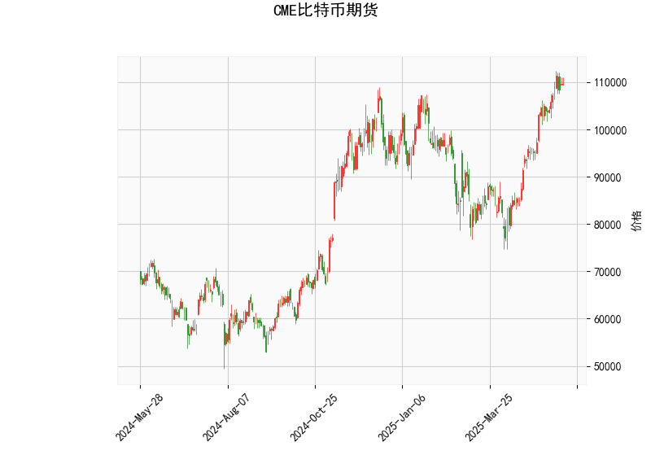

# CME比特币期货技术分析结果分析

## 1. 对技术分析结果的详细解读
基于提供的CME比特币期货数据，我们可以从多个技术指标入手，对当前市场状况进行全面评估。以下是对关键指标的分析：

### 关键指标概述
- **当前价格（Current Price）**: 109715.0  
  当前比特币期货价格处于相对高位，这反映了市场的强势表现，但也需要结合其他指标判断是否已接近顶峰。

- **RSI（Relative Strength Index，相对强弱指数）: 71.94**  
  RSI值超过70通常被视为超买信号，表明市场可能已过度上涨，存在回调风险。目前的71.94值提示短期内价格可能面临修正，尤其是如果买盘减弱。投资者应警惕潜在的卖出压力。

- **MACD（Moving Average Convergence Divergence，移动平均收敛散度）: 4980.74，MACD Signal: 4891.05，MACD Histogram: 89.69**  
  MACD线（4980.74）高于信号线（4891.05），且直方图值为正（89.69），这显示出短期看涨态势，表明多头动力仍在主导市场。然而，直方图值的缩小（较小正值）可能暗示动量正在减弱，潜在逆转信号需要关注。如果MACD线开始回落，将可能转为看跌。

- **Bollinger Bands（布林带）: Upper Band: 111872.74, Middle Band: 91869.82, Lower Band: 71866.90**  
  当前价格（109715.0）已接近上轨（111872.74），这往往表示市场处于高波动期。价格靠近上轨通常是超买的迹象，暗示可能出现均值回归（即价格回落向中轨或下轨移动）。中轨（91869.82）作为20期简单移动平均线，可视为关键支撑位，而下轨（71866.90）则可能在市场回调时提供潜在支撑。

- **K线形态（Candlestick Patterns）: CDLDOJI, CDLGRAVESTONEDOJI, CDLLONGLEGGEDDOJI**  
  这些K线形态均表示市场不确定性和潜在逆转风险：  
  - **CDLDOJI**: 十字星形态，显示买方和卖方力量均衡，可能预示市场犹豫或转折。  
  - **CDLGRAVESTONEDOJI**: 墓碑十字星，通常是看跌信号，表明价格可能从高位回落。  
  - **CDLLONGLEGGEDDOJI**: 长脚十字星，强调市场波动大且方向不明，常预示逆转。  
  整体而言，这些形态强化了短期内市场可能从强势转向修正的观点。

### 整体市场解读
当前技术指标呈现出混合信号：MACD显示看涨动力，但RSI的超买状态、Bollinger Bands的价格接近上轨，以及K线形态的逆转暗示，都指向潜在的回调风险。比特币期货市场往往受全球宏观因素（如流动性、美联储政策）和加密货币情绪影响，因此短期内（1-7天）可能出现震荡或小幅下行。如果价格无法突破上轨（111872.74），则回调至中轨（91869.82）附近的可能性较高。这反映了市场可能从过度乐观转向谨慎。

## 2. 近期可能存在的投资或套利机会和策略判断
基于上述分析，结合比特币期货市场的特性（如高杠杆和波动性），我们来探讨潜在的投资和套利机会。需要强调的是，市场预测存在不确定性，建议结合风险管理（如止损设置）和个人风险承受能力制定策略。

### 可能的机会
- **投资机会**:  
  - **短期回调机会**: RSI超买和K线形态暗示价格可能回落，这为逢低买入提供机会。例如，如果价格跌回中轨（91869.82）附近，MACD的看涨信号可能再次主导，带来反弹空间。  
  - **看涨突破机会**: 如果价格突破上轨（111872.74）并维持，MACD的正向动量可能推动进一步上涨，适合多头策略。  
  - **风险点**: 市场不确定性高，Doji形态可能引发突发性抛售，因此机会更多偏向短期交易而非长期持有。

- **套利机会**:  
  - **跨市场套利**: CME比特币期货价格（109715.0）可能与现货市场（如Coinbase或Binance）或其它期货交易所（如OKEx）存在价差。如果期货价格高于现货（常见于市场预期上涨时），投资者可考虑“卖出期货、买入现货”的反向套利策略。反之，如果价差扩大到异常水平（如超过5-10%），则可利用这一无风险机会。  
  - **波动率套利**: Bollinger Bands显示高波动期，投资者可通过期权策略（如买入看跌期权）对冲风险，或在价格震荡时进行期货与期权的价差套利。  
  - **季节性或事件驱动机会**: 比特币市场常受事件影响（如美联储会议或机构投资新闻），当前技术面弱点可能放大这些事件的作用，提供短期套利窗口。

### 推荐策略
- **投资策略**:  
  - **保守策略**: 短期内（1-3天）采用“观望+小仓位买入”的方法。如果价格回落至95000-100000区间（中轨附近），可考虑建多头仓位，但设置止损在下轨（71866.90）下方。同时，结合RSI回落至60以下作为进场信号。  
  - **激进策略**: 基于MACD看涨，立即小仓位做多期货，但如果RSI超过75或出现更多Doji形态，及时止盈。目标位可设在上轨上方（115000左右）。  
  - **风险管理建议**: 始终使用1:2的风险回报比（例如，止损5%，目标盈利10%），并监控全球新闻以避免突发事件。

- **套利策略**:  
  - **基础套利**: 监控CME期货与现货价差。如果价差扩大（例如，期货溢价超过现货5%），执行“期货卖出+现货买入+期货交割”的套利组合，锁定无风险收益。预计持有期为1-5天。  
  - **期权结合策略**: 利用Bollinger Bands的波动性，买入看跌期权（针对潜在回调）的同时持有期货多头，以对冲风险。这可降低整体波动，适合经验丰富的投资者。  
  - **整体建议**: 套利机会更适合机构投资者，需使用自动化工具监控价差。短期内，事件驱动的套利（如比特币ETF新闻）可能更频繁出现。

### 总体风险提醒
比特币市场高度波动，技术分析仅为参考。近期机会以短期为主，但全球经济不确定性（如通胀数据）可能放大风险。建议投资者结合基本面分析（如比特币网络数据）和资金管理，避免过度杠杆。最终策略应根据实时市场调整。