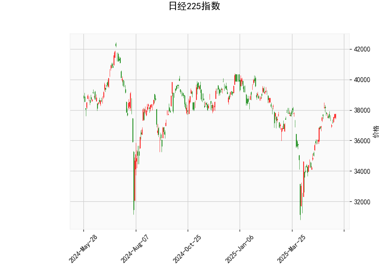

### 日经225指数的技术分析结果分析

#### 1. 整体市场状况概述
日经225指数当前价格为37724.11点，基于提供的指标，我们可以观察到市场处于相对中性的状态，但存在一些潜在的看跌信号。RSI指标显示价格可能接近超买区域，而MACD指标的负直方图暗示短期回调风险。Bollinger Bands显示价格在中线上方，波动较为稳定，但K线形态为空，缺乏明显的图形信号。这表明短期内市场可能维持震荡，但需警惕潜在的下行压力。

#### 2. 关键技术指标分析
- **RSI (Relative Strength Index)**: 当前值为60.36。这是一个中性水平（RSI通常在30-70范围内被视为中性）。RSI高于50表明买方力量占优，但接近70的阈值（超买区域），暗示市场可能已积累一定涨幅。如果RSI继续上升，可能预示短期回调风险；反之，如果回落至50以下，则可能出现买入机会。
  
- **MACD (Moving Average Convergence Divergence)**: MACD线为469.91，信号线为481.34，柱状图（MACD Hist）为-11.43。这是一个看跌信号，因为MACD线低于信号线，且柱状图为负值。MACD的负直方图通常表示短期动量减弱，价格可能出现回调或修正。如果MACD线进一步远离信号线，卖出压力可能会加大；反之，如果MACD线上穿信号线，则可能转为看涨。

- **Bollinger Bands**: 上轨为39603.22，中轨为36253.99，下轨为32904.77。目前价格37724.11位于中轨上方但未触及上轨，表明价格处于正常波动范围内。Bollinger Bands的宽度显示市场波动性适中。如果价格接近上轨（39603.22），可能面临阻力位测试；如果跌破中轨，则可能向下轨靠拢，增加下行风险。

- **K线形态**: 该数组为空，表示近期未出现明显的K线形态（如锤头线、吞没形态等）。这可能意味着市场缺乏强烈的多空信号，价格走势更依赖其他指标的指引。

总体而言，RSI显示买方主导但有超买风险，MACD的看跌信号与Bollinger Bands的中性位置相结合，暗示短期市场可能震荡或小幅回调。长期来看，如果外部因素（如经济数据或全球事件）支持，价格仍有向上突破的潜力。

### 近期可能存在的投资或套利机会和策略分析

#### 1. 潜在投资机会判断
基于当前技术指标，日经225指数短期内可能存在回调机会，但整体市场仍处于中性偏多状态。以下是关键判断：
- **短期回调风险较高**：MACD的负直方图和RSI接近超买水平，表明价格可能从当前37724.11点回落至中轨附近（约36254点）。这为短期投资者提供卖出或获利了结的机会。
- **中长期反弹潜力**：如果价格维持在中轨上方，且RSI回落至中性水平，可能会出现逢低买入的机会。Bollinger Bands显示的波动空间较大，暗示在外部刺激（如日本经济复苏或全球股市上涨）下，价格可能向上测试上轨（39603点）。
- **风险因素**：全球经济不确定性（如通胀、地缘政治）可能放大回调幅度，因此投资需谨慎。

#### 2. 可能的投资或套利策略建议
以下策略基于当前指标，旨在捕捉短期机会，同时控制风险。建议结合基本面分析和风险管理（如止损设置）使用。

- **短期卖出策略**：
  - **机会**：MACD负直方图暗示动量减弱，适合在价格接近上轨（39603点）时卖出或做空日经225指数期货。
  - **策略**：如果RSI超过70，考虑卖出现货或买入看跌期权（Put Option）。目标价位设在中轨（36254点）附近，止损设在上轨以上。预计持有期为1-2周，可捕捉5-10%的回调收益。
  - **风险控制**：监控MACD是否反转；若RSI回落至50以下，及时平仓。

- **套利策略（基于衍生品）**：
  - **跨市套利机会**：日经225指数与全球股市（如美国道琼斯或欧洲STOXX 50）相关性高。如果日经225回调而全球市场强势，可进行指数期货套利。例如，卖出日经225期货，同时买入相关全球指数期货，锁定价差。
  - **期权套利策略**：利用Bollinger Bands的波动性，构建牛市价差（Bull Spread）或熊市价差（Bear Spread）。例如，买入短期看跌期权（针对回调）和卖出更短期限的看涨期权，预计从MACD负直方图中获利。潜在收益：如果价格回落至下轨（32905点），期权价差可达10-15%。
  - **波动率套利**：Bollinger Bands显示波动性适中，如果市场波动率上升（e.g., 受日本央行政策影响），可使用straddle策略（同时买入看涨和看跌期权），以捕捉剧烈波动。

- **综合风险管理建议**：
  - **总体策略**：采取“观望为主，短线为主”的方法。等待MACD金叉（线上穿信号线）确认多头趋势再入场。资金分配上，建议将50%用于观望，30%用于短期卖出，20%用于套利。
  - **潜在收益与风险**：短期卖出策略可能收益5-8%，但若市场意外反弹，损失可控在3-5%。套利策略风险较低，但需关注交易成本和流动性。
  - **时机提示**：若RSI回落至55以下或MACD直方图转正，即可考虑转为多头策略。

总之，近期日经225指数的投资机会以短期回调套利为主，但需警惕全球市场联动效应。投资者应根据个人风险偏好和实时数据调整策略，建议结合专业工具（如交易平台）监控指标变化。