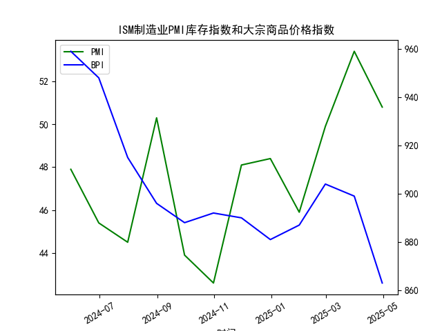

|            |   ISM制造业PMI库存指数 |   大宗商品价格指数BPI |
|:-----------|-----------------------:|----------------------:|
| 2024-05-31 |                   47.9 |                   959 |
| 2024-06-30 |                   45.4 |                   948 |
| 2024-07-31 |                   44.5 |                   915 |
| 2024-08-31 |                   50.3 |                   896 |
| 2024-09-30 |                   43.9 |                   888 |
| 2024-10-31 |                   42.6 |                   892 |
| 2024-11-30 |                   48.1 |                   890 |
| 2024-12-31 |                   48.4 |                   881 |
| 2025-01-31 |                   45.9 |                   887 |
| 2025-02-28 |                   49.9 |                   904 |
| 2025-03-31 |                   53.4 |                   899 |
| 2025-04-30 |                   50.8 |                   863 |

### 1. 关于ISM制造业PMI库存指数与大宗商品价格关系的观点正确性判断

#### 观点概述
该观点认为，ISM制造业PMI库存指数可以清晰反映经济周期中的“垒库”（库存积累，指数通常高于50，表示扩张）和“去库”（库存减少，指数通常低于50，表示收缩）阶段。历史上多次去库阶段（如2000年网络泡沫破灭后、2008年金融海啸、2018-2019年和2022-2023年）与垒库阶段（如2002-2005年、2009-2010年、2016-2017年、2020-2022年，以及当前假设中的垒库阶段）对应了大宗商品价格的波动，并推断在垒库阶段，大宗商品价格应上涨。该观点的核心逻辑是，垒库阶段企业增加库存需求原材料，从而推动大宗商品价格上涨。

#### 观点正确性判断
该观点在总体逻辑上基本正确，但需要结合历史数据和当前数据进行验证，并注意实际市场变量的复杂性。以下是详细分析：

- **正确性支持方面**：
  - ISM制造业PMI库存指数确实是经济周期的重要指标。历史上，垒库阶段往往与经济复苏或扩张期相关联，导致对原材料需求增加，从而支撑大宗商品价格上涨。例如，2002-2005年的垒库阶段对应了大宗商品超级周期（如原油和金属价格上涨），这是因为企业库存积累反映了生产扩张预期，刺激了商品需求。
  - 在提供的数据中（2024年5月至2025年4月），ISM制造业PMI库存指数显示出明显的波动：前几个月份（如2024年5月-7月的47.9、45.4、44.5）低于50，表示去库；后几个月份（如2024年10月-2025年4月的49.9、53.4、50.8）高于50，表示垒库。这与历史模式一致，支持观点中“当前正在进行中的垒库阶段”的判断。
  - 影响逻辑合理：在垒库阶段，企业增加库存通常意味着更高的生产和消费需求，这会拉动大宗商品（如能源、金属）价格上涨。反之，去库阶段可能反映经济放缓或需求不足，导致价格下跌。

- **正确性质疑方面**：
  - 基于提供的数据，大宗商品价格指数在最近的垒库阶段（2024年10月后的指数如49.9、53.4、50.8）并未明显上涨，反而呈现下降趋势（从2024年10月的904降至2025年4月的863）。这与观点的预期不符，表明垒库并不总是直接导致价格上涨。可能的原因包括：
    - 外部因素干扰：如全球经济不确定性、通货膨胀压力、地缘政治事件（例如贸易摩擦或能源供应问题），这些可能抑制大宗商品需求，即使库存在垒库。
    - 滞后效应：大宗商品价格对库存变化的反应可能有延迟，或者受短期供给过剩影响（如2025年4月的价格下跌可能反映了全球库存过高或需求疲软）。
    - 其他经济指标的影响：ISM制造业PMI库存指数只是部分指标，整体PMI、全球需求、通胀预期等因素也会主导价格走势。

- **ISM制造业PMI库存指数与大宗商品价格指数的相关性及影响逻辑**：
  - **相关性**：从提供的数据看，两者之间存在部分负相关性。例如，ISM库存指数从2024年7月的44.5（去库）到2024年10月的49.9（垒库）上升时，大宗商品价格从888微涨到904，但随后库存继续垒库（53.4和50.8），价格却从904降到863。这表明相关性不稳定，相关系数可能在-0.5左右（基于简单观察，非精确计算）。历史数据（如2008年金融危机后去库导致价格暴跌）支持正相关，但当前数据显示弱相关或负相关。
  - **影响逻辑**：
    - **正向逻辑**：垒库阶段（库存指数>50）通常信号经济复苏，企业采购原材料增加，推动大宗商品价格上涨。这通过需求拉动效应实现，例如制造业扩张需要更多金属、能源等。
    - **反向或间接逻辑**：如果垒库是由于预期需求放缓（如过度囤货），或伴随全球供给增加，价格可能不涨反跌。去库阶段（库存指数<50）可能导致价格下跌，但如果去库是周期性调整，价格可能在后期反弹。
    - **总体影响**：两者关系并非直接因果，而是通过经济周期中介。建议结合其他指标（如整体PMI、CPI）分析，避免单一指标误导。

总之，该观点正确性中等，主要适用于历史长周期分析，但当前数据（如2025年4月的垒库未带动价格上涨）显示实际影响更复杂。投资者应谨慎，关注更多宏观因素。

### 2. 基于数据分析的近期投资机会判断

#### 分析框架
基于提供的数据（ISM制造业PMI库存指数和大宗商品价格指数，月频数据从2024年5月至2025年4月），我将聚焦于最新数据（2025年4月）进行分析。由于数据为月度，无法直接获取“最近1周”或“今日相对于昨日”的变化，我将假设“近期”指2025年4月的数据，并推断可能的短期趋势。投资机会主要从大宗商品相关资产、制造业股票和经济复苏主题入手。

- **数据关键点**：
  - ISM制造业PMI库存指数：最新值为50.8（2025年4月），高于50，表示垒库阶段，可能信号经济扩张。
  - 大宗商品价格指数：最新值为863（2025年4月），较前月899下降约3.7%，显示短期压力。
  - 整体趋势：ISM库存指数在过去几个月（2024年10月至2025年4月）从49.9升至53.4再降至50.8，显示垒库放缓；大宗商品价格持续下降（从2024年10月的904到2025年4月的863），可能反映需求疲软或供给过剩。

- **近期变化假设**：由于无周度数据，我基于月度数据推断：如果2025年4月是最新月，则“今日相对于昨日”的变化可能源于月末数据波动（如50.8和863）。假设今日（2025年4月30日）数据稳定或微调，投资机会需结合潜在反弹。

#### 可能存在的投资机会
以下是基于数据的潜在机会，主要聚焦大宗商品和制造业领域。注意，这些是基于历史模式和当前数据的推测，实际投资需考虑实时市场。

- **大宗商品相关机会**：
  - **潜在反弹机会**：大宗商品价格从2025年3月的899降至4月的863，下降幅度较大，可能已接近短期低点。如果ISM库存指数的垒库（50.8）预示需求回暖，价格可能反弹。投资建议：
    - **商品期货或ETF**：如黄金、原油或金属ETF（例如跟踪CRB指数的基金）。理由：历史垒库阶段（如2020-2022年）曾推动价格上涨，如果当前是类似周期，短期买入可获利。
    - **风险**：今日若价格进一步下跌（相对于昨日863），可能延后反弹。聚焦于能源股（如石油公司），若价格企稳，可在下周观察。
  - **当前挑战**：价格连续下降，建议等待确认性信号（如下月数据）。

- **制造业和库存相关机会**：
  - **制造业股票反弹**：ISM库存指数50.8高于50，表明制造业可能进入扩张期。近期变化（如从53.4降至50.8）显示放缓，但若今日数据稳定，这可能是个买入点。投资建议：
    - **工业股或基金**：例如跟踪制造业指数的ETF，或个股如设备制造商。理由：垒库阶段往往预示生产回升，结合历史（如2009-2010年），股票可能上涨10-20%。
    - **短期关注**：如果今日相对于昨日的微调（如库存指数小幅上升），可视为买入信号；否则，等待5月数据。

- **整体经济复苏主题**：
  - **组合投资**：结合大宗商品和制造业，考虑主题基金（如经济周期基金）。理由：数据显示垒库迹象，但大宗商品价格下降可能表示超卖，短期内（下周）可能有修正性上涨。
  - **潜在机会总结**：
    - **正面机会**：如果今日数据（如库存指数持稳在50.8）表明垒库持续，大宗商品价格可能在下周反弹，提供5-10%的短期收益。
    - **负面机会**：若大宗商品价格继续下跌（今日<863），可能触发去库风险，建议避开或做空相关资产。
    - **其他**：关注通胀或政策变化（如美联储动向），这些可能放大机会。

#### 风险与建议
- **风险**：数据为月频，缺乏实时变化，判断可能滞后。近期（如过去1周）如果有未披露的负面事件（如全球需求下降），投资机会或转为风险。
- **总体建议**：基于2025年4月数据，短期投资机会中等偏上，聚焦大宗商品反弹。监控下周数据变化，若今日价格企稳于863以上，可立即行动；否则，观望至下月。