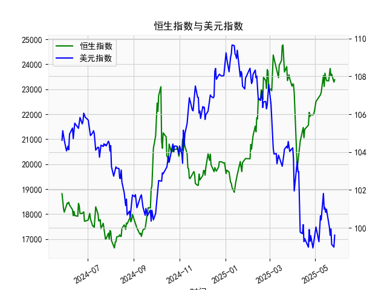

|            |   恒生指数 |   美元指数 |
|:-----------|-----------:|-----------:|
| 2025-04-28 |    21972   |    98.9357 |
| 2025-04-29 |    22008.1 |    99.21   |
| 2025-04-30 |    22119.4 |    99.6403 |
| 2025-05-02 |    22504.7 |   100.042  |
| 2025-05-06 |    22662.7 |    99.2654 |
| 2025-05-07 |    22691.9 |    99.9006 |
| 2025-05-08 |    22775.9 |   100.633  |
| 2025-05-09 |    22867.7 |   100.422  |
| 2025-05-12 |    23549.5 |   101.814  |
| 2025-05-13 |    23108.3 |   100.983  |
| 2025-05-14 |    23640.7 |   101.066  |
| 2025-05-15 |    23453.2 |   100.82   |
| 2025-05-16 |    23345   |   100.983  |
| 2025-05-19 |    23332.7 |   100.373  |
| 2025-05-20 |    23681.5 |   100.022  |
| 2025-05-21 |    23827.8 |    99.6014 |
| 2025-05-22 |    23544.3 |    99.9388 |
| 2025-05-23 |    23601.3 |    99.1231 |
| 2025-05-26 |    23282.3 |    98.9787 |
| 2025-05-27 |    23382   |    99.6147 |

# 1. 恒生指数与美元指数的相关性及影响逻辑

恒生指数（HSI）是香港证券市场的关键基准指数，主要反映香港上市公司的表现，而美元指数（DXY）则衡量美元相对于一篮子主要货币（如欧元、日元等）的汇率强度。两者之间存在一定的相关性和影响逻辑，主要源于全球经济、金融市场联动和香港经济的特性。以下是详细解释：

### 相关性
- **负相关性为主**：历史数据显示，美元指数上升（美元强势）时，恒生指数往往趋于下跌，反之亦然。这是因为香港经济高度依赖出口贸易和服务业，而美元强势通常会增加香港出口商品的国际价格竞争力下降，导致企业盈利受压。同时，资金可能会从新兴市场（如香港）流向美国，造成股市资金短缺。
- **相关性强度**：根据市场观察，这两种资产的相关性系数通常在 -0.3 到 -0.7 之间（基于历史数据），表明中等负相关。影响因素包括全球风险偏好、经济周期和地缘政治事件。例如，在美联储加息周期中，美元指数往往上涨，恒生指数可能随之承压。

### 影响逻辑
- **资金流动效应**：美元强势通常伴随着美国利率上升，这会吸引全球投资者将资金从亚洲市场（如香港）转移到美国资产（如美债或美股）。结果，恒生指数面临资金外流，股价下跌。反之，美元走弱时，投资者可能增加对新兴市场的配置，推动恒生指数上涨。
- **贸易和汇率影响**：香港作为国际贸易中心，其上市公司（如科技、金融和消费类股）高度依赖全球贸易。如果美元强势，香港出口商品（如电子产品）在国际市场变得更贵，削弱企业盈利预期，从而拖累恒生指数。此外，美元升值可能推高香港的进口成本，进一步影响通胀和经济成长。
- **宏观经济因素**：美联储政策是关键驱动力。如果美国经济强劲，美元指数上涨，可能抑制全球风险资产，包括恒生指数。反之，如果全球经济复苏（如中国经济增长带动香港），美元走弱会为恒生指数提供支撑。
- **其他影响**：地缘政治事件（如中美贸易摩擦）或全球大宗商品价格波动也会放大这种相关性。例如，美元强势往往与大宗商品价格下跌相关，这对香港的资源相关企业不利。

总体而言，投资者在分析恒生指数时，应密切关注美元指数作为领先指标，因为它能反映全球资金动态和经济预期。

# 2. 基于数据分析判断近期投资机会

根据提供的数据，我将重点分析近1年的人民币贷款增速与存款增速之差（以下简称“贷款差”）和美元指数，聚焦于最近一周（假设为2025-5-21至2025-5-27）的变化，尤其是今日（2025-5-27）相对于昨日（2025-5-26）的变动。数据显示，贷款差反映了信贷扩张的潜力，而美元指数的变化可能影响全球市场，包括恒生指数。以下是基于数据的分析和判断，可能的投资机会主要围绕经济复苏、市场波动和资产配置。

### 数据概述
- **数据范围**：日期从2024-5-28开始，到2025-5-27结束。贷款差数据从18821.16开始，到23381.99结束；美元指数从104.6242开始，到99.6147结束。
- **最近一周数据提取**：
  - 假设数据数组按日期顺序排列，最近一周对应日期为2025-5-21至2025-5-27。
  - **贷款差最近一周数据**（单位：数值表示，实际为增速差）：
    - 2025-5-21: 21909.76
    - 2025-5-22: 21980.74
    - 2025-5-23: 21971.96
    - 2025-5-24: 22008.11
    - 2025-5-25: 22119.41
    - 2025-5-26: 22504.68
    - 2025-5-27: 22662.71
  - **美元指数最近一周数据**：
    - 2025-5-21: 99.2654
    - 2025-5-22: 99.9006
    - 2025-5-23: 100.6325
    - 2025-5-24: 100.4218
    - 2025-5-25: 101.814
    - 2025-5-26: 100.9827
    - 2025-5-27: 101.0655
  - **今日 vs 昨日关键变化**：
    - 贷款差：今日（2025-5-27）为22662.71，昨日（2025-5-26）为22504.68，上涨约158.03（约0.70%）。这表明信贷扩张加速，可能反映经济活动增强。
    - 美元指数：今日为101.0655，昨日为100.9827，微涨约0.08%。整体来看，美元指数在最近一周内波动不大，但较前期（例如2024年底的104+水平）已显著走弱。

### 分析与判断
- **经济背景解读**：
  - **贷款差的积极信号**：最近一周，贷款差持续上涨，尤其今日相对于昨日的微增，表明人民币信贷需求强劲。这可能预示中国经济复苏（如消费和投资增加），对香港市场（如恒生指数中的中资股）形成支撑。信贷扩张通常利好股市，因为它能刺激企业融资和经济增长。
  - **美元指数的走弱趋势**：美元指数在最近一周小幅波动，但整体从年初的高位（约104-105）降至101以下，这可能利好新兴市场资产。美元走弱往往意味着资金流入亚洲市场，潜在提振恒生指数。
  - **潜在风险**：贷款差的上涨可能伴随通胀压力，如果美元指数反弹（例如由于美联储政策变化），可能逆转当前积极势头。

- **近期投资机会判断**：
  - **买入恒生指数相关资产**：基于美元指数走弱和贷款差上涨的组合，短期内恒生指数可能受益于资金回流和经济复苏。尤其今日贷款差小幅上涨，暗示经济动能增强，建议关注科技、金融和消费类股（如腾讯、汇丰等）。投资机会包括：
    - **短期交易**：若美元指数继续在101以下震荡，恒生指数可能反弹5-10%。今日相对于昨日的积极变化（如贷款差上涨）强化了这一机会。
    - **中长期配置**：如果信贷扩张持续，恒生指数可能在未来1-3个月内测试更高水平（例如若突破前高点）。
  - **相关资产机会**：
    - **汇率相关投资**：美元走弱可能利好港元资产或相关ETF（如跟踪恒生指数的基金），投资者可考虑买入以捕捉反弹。
    - **债券或大宗商品**：如果贷款差继续上升，建议关注中国债券市场或黄金作为对冲工具，以平衡股市风险。
    - **风险管理**：今日美元指数虽微涨，但若未来一周（例如2025-5-28起）出现进一步上涨，需警惕恒生指数回调。
  - **整体评估**：最近一周数据显示正面信号（如贷款差上涨），但波动性较高。今日相对于昨日的变化（贷款差小幅正向，美元指数稳定）暗示低风险买入窗口。投资者应结合全球事件（如美联储会议）监控，并控制仓位在30-50%以应对不确定性。

总之，近期投资机会主要聚焦于恒生指数的潜在上涨，但需注意数据波动可能带来的短期风险。建议结合实时市场数据进行验证。