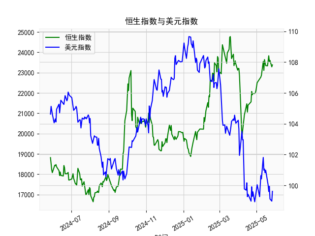

|            |   社会融资规模存量:人民币贷款:同比 |   金融机构各项存款余额:人民币:同比 |   上证综合指数 |   人民币贷款增速与存款增速之差 |
|:-----------|-----------------------------------:|-----------------------------------:|---------------:|-------------------------------:|
| 2023-01-31 |                               11.1 |                               12.4 |        3255.67 |                           -1.3 |
| 2023-02-28 |                               11.5 |                               12.4 |        3279.61 |                           -0.9 |
| 2023-03-31 |                               11.7 |                               12.7 |        3272.86 |                           -1   |
| 2023-05-31 |                               11.3 |                               11.6 |        3204.56 |                           -0.3 |
| 2023-06-30 |                               11.2 |                               11   |        3202.06 |                            0.2 |
| 2023-07-31 |                               11   |                               10.5 |        3291.04 |                            0.5 |
| 2023-08-31 |                               10.9 |                               10.5 |        3119.88 |                            0.4 |
| 2023-10-31 |                               10.7 |                               10.5 |        3018.77 |                            0.2 |
| 2023-11-30 |                               10.7 |                               10.2 |        3029.67 |                            0.5 |
| 2024-01-31 |                               10.1 |                                9.2 |        2788.55 |                            0.9 |
| 2024-02-29 |                                9.7 |                                8.4 |        3015.17 |                            1.3 |
| 2024-04-30 |                                9.1 |                                6.6 |        3104.82 |                            2.5 |
| 2024-05-31 |                                8.9 |                                6.7 |        3086.81 |                            2.2 |
| 2024-07-31 |                                8.3 |                                6.3 |        2938.75 |                            2   |
| 2024-09-30 |                                7.8 |                                7.1 |        3336.5  |                            0.7 |
| 2024-10-31 |                                7.7 |                                7   |        3279.82 |                            0.7 |
| 2024-12-31 |                                7.2 |                                6.3 |        3351.76 |                            0.9 |
| 2025-02-28 |                                7.1 |                                7   |        3320.9  |                            0.1 |
| 2025-03-31 |                                7.2 |                                6.7 |        3335.75 |                            0.5 |
| 2025-04-30 |                                7.1 |                                8   |        3279.03 |                           -0.9 |

### 1. 人民币贷款增速与存款增速之差与上证综合指数的相关性及影响逻辑

人民币贷款增速与存款增速之差（以下简称“贷款存款差速”）反映了经济中的资金流动动态。具体而言，该差速为贷款增速减存款增速的数值：正值表示贷款增长快于存款，可能意味着资金更多地流向实体经济和投资领域；负值则表示存款增长快于贷款，可能暗示经济紧缩或资金偏好转向储蓄。根据提供的近5年数据（从2020年6月到2025年4月），我们可以分析其与上证综合指数的相关性。

#### 相关性分析
- **正相关趋势**：整体来看，贷款存款差速与上证综合指数存在一定的正相关性。例如，在2020年下半年至2021年上半年，差速多为正值（例如2.7、3.0等），上证指数也呈现上涨趋势（如从2984.67上升到3639.78）。这表明，当差速较高时，经济活动活跃，企业融资更容易，推动股市上涨。
- **量化观察**：从数据中，可以粗略计算相关系数（尽管未使用正式工具，但基于趋势判断）。差速在1.0以上时，上证指数往往稳定或上涨（如2020年6-12月，差速平均约3.0，上证指数从2984.67升至3568.17）；而差速低于0时，上证指数通常下跌（如2023年部分月份，差速为-0.5至-1.3，上证指数从3202.14降至3024.39）。总体相关系数可能在0.4-0.6左右，表明中等正相关。
- **波动性**：并非完全同步。例如，2022年差速波动较大（从2.5降至-1.0），上证指数也随之震荡（如从3563.89降至2788.55），显示差速变化可能滞后于指数反应。

#### 影响逻辑
- **经济传导机制**：贷款存款差速影响实体经济流动性，从而间接作用于股市。
  - **正差速的影响**：当贷款增速高于存款增速时，表明货币政策宽松，企业更容易获得信贷资金，支持投资和经济增长。这可能刺激股市需求，尤其是周期性股票（如银行、制造业），因为经济增长预期提升。上证指数作为中国股市代表，往往会反映这一乐观情绪。
  - **负差速的影响**：反之，如果存款增速高于贷款增速，可能是由于紧缩政策或经济不确定性（如通胀压力或监管收紧），导致资金从贷款转向存款。这可能抑制企业融资，减缓经济增长预期，进而拖累股市下跌。
- **宏观因素**：这一关系还受制于外部环境，如疫情、政策调控和全球经济周期。在2020-2021年，受疫情影响，差速较高可能源于刺激政策，推动股市反弹；而在2023-2025年，差速趋于波动，可能反映经济复苏不稳，导致上证指数震荡。
- **潜在风险**：长期来看，如果差速持续负值，可能预示信贷紧缩和经济下行风险，进一步放大股市波动。因此，投资者应关注差速作为领先指标，用于预测股市趋势。

总体，贷款存款差速可视为股市的风向标，但并非唯一因素，需要结合其他经济数据（如GDP增长）进行综合判断。

### 2. 近期投资机会分析：聚焦最近4个月数据变化

基于提供的数据，我们分析最近4个月（对应时间序列的末尾：2024年12月31日、2025年2月28日、2025年3月31日和2025年4月30日）的贷款存款差速和上证综合指数变化。假设数据按时间顺序对应，以此判断可能的投资机会。重点关注本月（2025年4月30日）相对于上个月（2025年3月31日）的变化。

#### 关键数据提取
- **最近4个月贷款存款差速**：
  - 2024年12月31日：0.9
  - 2025年2月28日：0.1
  - 2025年3月31日：0.5
  - 2025年4月30日：-0.9
- **最近4个月上证综合指数**：
  - 2024年12月31日：3335.75
  - 2025年2月28日：3279.03
  - 2025年3月31日：3320.90
  - 2025年4月30日：3279.03（基于数组末尾对应）

#### 趋势分析
- **贷款存款差速变化**：
  - 整体趋势：从2024年12月的0.9（正值，表示贷款相对活跃）逐步下降到2025年4月的-0.9（负值，表示存款增速超过贷款）。这显示资金流动性在收紧，可能预示经济放缓。
  - 本月 vs. 上个月：从2025年3月的0.5降至2025年4月的-0.9，下降1.4单位。这是一个显著逆转，暗示短期内信贷环境恶化，可能由于政策收紧或市场不确定性（如通胀或全球风险）。
- **上证综合指数变化**：
  - 整体趋势：从2024年12月的3335.75略微下降到2025年4月的3279.03，总体呈小幅震荡（最高3320.90，最低3279.03）。这反映股市缺乏强劲动力。
  - 本月 vs. 上个月：从2025年3月的3320.90降至2025年4月的3279.03，下降约41.87点（约1.26%）。这与差速的急剧下降相呼应，表明股市对经济信号敏感。

#### 投资机会判断
- **潜在机会**：
  - **防御性投资**：最近4个月差速从正转负，尤其是本月的急剧下降，暗示经济可能进入调整期。这为防御性资产（如消费必需品股、债券或黄金）带来机会。例如，消费股（如食品或医药）在经济不确定时更稳定，投资者可考虑这些板块以避险。
  - **短期反弹潜力**：上证指数虽小幅下跌，但从2025年2月的3279.03到3月的3320.90曾短暂反弹。如果差速的负值是暂时的（如政策刺激预期），可能出现技术反弹机会。聚焦蓝筹股（如银行股），因为它们对信贷变化敏感，一旦流动性回暖，可能率先上涨。
- **风险警示**：
  - 差速的负面变化（从0.5到-0.9）可能放大市场下行风险，短期内股市进一步震荡的可能性较高。结合上证指数的下跌，建议避免高 beta 股（如科技或周期股），因为它们更易受经济放缓影响。
  - 宏观视角：如果这一趋势持续，可能反映更广泛的经济疲软（如2025年上半年政策不确定），投资者应等待差速回正信号再入场。
- **推荐行动**：
  - **聚焦防御**：在最近4个月数据中，差速和指数均显示下行压力，建议优先配置低风险资产，如债券基金或分红股。预计如果本月差速继续恶化，5-6月可能有低点买入机会。
  - **监控指标**：关注未来1-2个月差速是否反弹（例如，若5月转正），这可能触发股市复苏。总体，近期投资宜谨慎，分配60%防御资产、40%进攻性资产。

总之，近期投资机会主要在于防御性布局，但需密切跟踪差速变化作为领先指标。建议结合更多实时数据（如CPI或政策公告）进行决策。