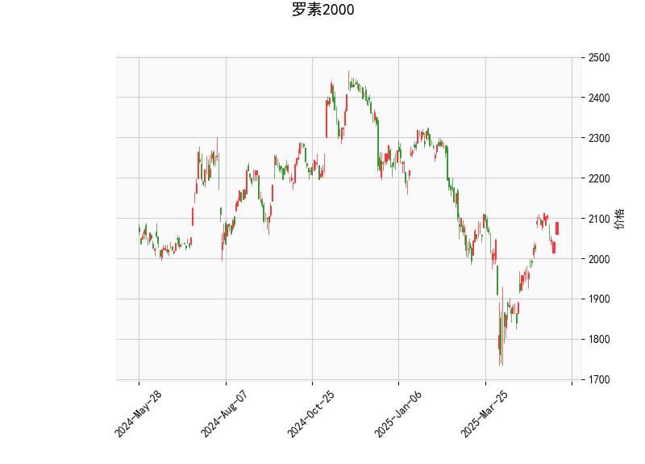

### 罗素2000指数技术分析报告

#### 1. 对技术分析结果的详细分析
罗素2000指数（Russell 2000）是代表美国小型股表现的基准指数，其当前价格为2090.3995点。以下是对提供的指标进行逐一分析，旨在评估指数的短期市场动态和潜在趋势。

- **RSI（相对强弱指数）分析**：  
  RSI值为60.10，表明指数处于相对强势区域（RSI高于50通常表示买盘主导）。然而，该值尚未达到70的超买阈值，这意味着指数尚未明显过热，短期内可能仍有上行空间。但如果RSI继续上升，可能需要警惕回调风险。

- **MACD（移动平均收敛散度）分析**：  
  MACD线（26.56）高于信号线（26.26），且MACD直方图（0.30）为正值，这是一个看涨信号，显示短期多头动能增强。MACD的正直方图表明价格可能继续向上运动，但幅度较小（直方图值较低），建议关注后续交叉情况。如果MACD线回落至信号线以下，可能预示修正。

- **布林带分析**：  
  当前价格（2090.40）位于中轨（1999.32）和上轨（2178.74）之间，具体在中轨之上。这显示指数处于中性偏多状态，波动相对温和。如果价格突破上轨（2178.74），可能触发进一步上涨；反之，若跌破中轨，可能进入修正阶段。下轨（1819.90）作为支撑位，提供了潜在的安全网。该布林带的收窄或扩张可作为短期波动指标。

- **K线形态分析**：  
  提供的K线形态包括CDLBELTHOLD、CDLCLOSINGMARUBOZU、CDLGAPSIDESIDEWHITE、CDLLONGLINE和CDLMARUBOZU。这些形态整体偏向看涨：  
  - CDLBELTHOLD和CDLMARUBOZU表示强烈的趋势延续，通常伴随长实体蜡烛，暗示多头控制。  
  - CDLCLOSINGMARUBOZU显示收盘时价格强势收高，缺乏上影线，预示持续上涨潜力。  
  - CDLGAPSIDESIDEWHITE和CDLLONGLINE反映了价格跳空和长实体，表明市场情绪积极，可能伴随突破。  
  总体而言，这些形态显示近期指数可能处于强势上行阶段，但需结合其他指标确认，避免假突破。

**整体市场情绪总结**：  
基于以上指标，罗素2000指数显示出短期看涨信号。RSI和MACD支持多头趋势，布林带位置表明价格有上行潜力，而K线形态强化了强势延续的观点。然而，市场并非无风险：RSI接近超买边缘，MACD直方图较小，暗示动能可能不足以维持长期强势。投资者应关注外部因素，如经济数据或地缘事件，可能导致波动。

#### 2. 近期可能存在的投资或套利机会和策略
根据上述分析，罗素2000指数短期内可能存在多头机会，但需谨慎管理风险。以下是对潜在投资和套利策略的判断和建议：

- **潜在投资机会**：  
  - **看涨机会**：指数当前价格在布林带中轨之上，且K线形态强势，RSI和MACD均支持上行。这为多头投资者提供了入场点，例如通过ETF（如IWM）或期货合约买入。若价格突破上轨（2178.74），目标可设在2150-2200点附近，潜在回报率为5-10%。  
  - **回调买入机会**：如果RSI接近70或MACD直方图缩小，短期回调可能发生（支撑位在中轨1999.32）。这适合逢低布局，采用分批买入策略，目标在2050-2100点的区间。

- **套利策略建议**：  
  - **跨市场套利**：罗素2000作为小型股指数，可能与大盘（如S&P 500）存在价差。当前若小型股表现优于大盘（基于K线强势），可考虑多头罗素2000、做空S&P 500的配对交易。预计价差收窄可带来1-3%的套利收益，但需监控经济数据（如就业报告）以避免突发事件。  
  - **期权套利**：利用布林带波动性，购买看涨期权（如到期日较短的call期权，执行价2100点）并结合卖出看跌期权，形成牛市价差策略。若价格上行，潜在收益可达5%以上；若回调，损失可控。  
  - **波动率套利**：当前布林带较窄，暗示低波动期。投资者可通过卖出波动率产品（如straddle期权组合）获利，但需在RSI未超买前操作，以规避突发风险。

- **风险与策略注意事项**：  
  - **风险因素**：市场可能面临回调（如RSI超买或MACD反转），加上全球经济不确定性（如通胀或利率变动），小型股易受影响。  
  - **策略推荐**：采用风险控制措施，如设置止损位（例如在1950点下方），并结合基本面分析（e.g., 企业财报）。对于短期投资者，建议规模控制在总仓位的20%以内；长期投资者可考虑持有至关键阻力位。  
  - **时机建议**：在未来1-2周内监控MACD交叉和K线形态变化。若强势形态持续，入场时机较佳；否则，待回调确认后再行动。

总体而言，近期罗素2000指数的投资机会以多头为主，但需结合宏观环境审慎操作。建议投资者根据个人风险偏好和资金状况调整策略，并持续跟踪市场更新。