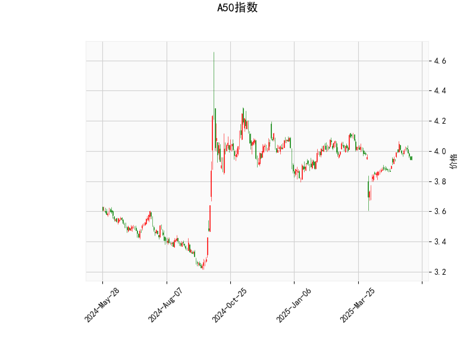

### A50指数技术分析结果详解

#### 1. 对技术分析结果的分析
以下是对A50指数当前技术指标的详细解读，这些指标基于提供的实时数据，包括当前价格、RSI、MACD、布林带以及K线形态。整体来看，A50指数目前处于一个相对中性的状态，但存在潜在的反转信号，需要结合市场环境进一步验证。

- **当前价格（3.946）**：  
  A50指数的当前价格为3.946，位于布林带中轨（3.953）附近。这表明价格处于一个相对稳定的区间，没有明显突破上轨（4.137）或下轨（3.769）。这种位置通常表示市场缺乏强烈方向性，短期内可能维持震荡。如果价格向上突破中轨，可能预示反弹；反之，向下测试下轨则可能加剧下行压力。

- **RSI（47.80）**：  
  相对强弱指数（RSI）处于47.80的水平，低于50但远高于超卖阈值（30）。这显示A50指数当前处于弱势整理阶段，而不是明显的超买或超卖状态。RSI在40-60之间通常被视为中性区间，暗示短期内缺乏强劲的买入或卖出动力。如果RSI跌破40，可能进入超卖区并引发反弹机会；反之，如果回升至50以上，则可能转为多头信号。

- **MACD指标**：  
  MACD线（0.01445）低于信号线（0.01873），MACD直方图（-0.00427）为负值。这是一个典型的看跌信号，表示短期内卖方力量占优，价格可能继续下行。MACD直方图的负值反映了动量减弱，如果直方图进一步扩大负值，空头趋势可能加剧。但如果MACD线向上交叉信号线（即金叉），则可能逆转为多头机会。目前的MACD状态建议投资者保持谨慎，等待交叉信号。

- **布林带**：  
  上轨（4.137）、中轨（3.953）和下轨（3.769）构成了当前的价格波动区间。价格（3.946）紧邻中轨，显示市场处于收敛状态（布林带未显著扩张）。布林带是一种波动率指标，当价格接近上轨时往往是卖出信号，而接近下轨时可能是买入机会。现阶段的窄幅震荡暗示短期内缺乏剧烈波动，但如果布林带开始扩张（如价格突破上轨），则可能预示趋势反转。

- **K线形态（CDLLONGLINE 和 CDLMATCHINGLOW）**：  
  - **CDLLONGLINE**：这表示最近的K线形成了一个长实体蜡烛，可能反映强势的单向运动（如大阳线或大阴线）。如果这是大阳线，它可能暗示短期反弹；但结合其他指标的弱势，它更可能是一个整理后的蓄势阶段。  
  - **CDLMATCHINGLOW**：这是一种双底或匹配低点模式，常被视为潜在的反转信号，表明价格可能在触及支撑后反弹。例如，如果最近的低点与前一个低点匹配，这可能预示底部形成，并吸引多头入场。总体上，这些形态增加了短期反转的可能性，但需结合成交量和后续K线确认。

**总体评估**：A50指数当前技术面显示中性偏弱态势。RSI和布林带表明市场缺乏强烈方向，而MACD的看跌信号与K线形态的潜在反转信号形成矛盾。这可能反映短期震荡格局，投资者应关注价格是否突破关键水平（如布林带中轨）来判断下一步走势。

#### 2. 近期可能存在的投资或套利机会和策略
基于上述分析，A50指数的近期机会主要集中在短期反转或震荡交易上。以下是针对投资和套利的判断与策略建议，风险较高时需结合宏观经济（如中国股市整体表现）和全球风险偏好进行调整。

- **投资机会判断**：  
  - **潜在多头机会**：K线形态（如CDLMATCHINGLOW）暗示可能形成双底反转，尤其如果价格企稳在中轨以上（3.953）。RSI也处于可能反弹的水平，如果未来几天RSI回升至50以上或MACD出现金叉，这将是一个买入信号。预计短期内，如果A50指数突破4.000（接近上轨），可能迎来5-10%的反弹空间。  
  - **潜在空头机会**：MACD直方图的负值和价格在中轨附近弱势，表明下行风险犹存。如果价格跌破下轨（3.769），空头趋势可能加强，导致进一步下跌至3.600-3.700区间。RSI若跌向40以下，将强化卖出信号。  
  - **整体风险**：当前市场中性，机会更多依赖确认信号（如突破布林带）。A50指数作为中国A股的代表，可能受制于政策因素（如经济数据或央行动作），短期内投资机会中等。

- **套利机会和策略**：  
  - **基于技术指标的套利策略**：  
    - **震荡套利**：A50指数当前在布林带中轨附近震荡，适合采用区间套利策略。例如，在价格接近下轨（3.769）时买入，在接近上轨（4.137）时卖出。预计波动率较低，盈利空间有限（1-3%），但风险较小。结合RSI，当RSI在40-50区间时入场，可提高胜率。  
    - **MACD反转套利**：如果MACD直方图从负值转为正值（金叉），可考虑多头套利操作，如买入A50相关ETF或期货合约。反之，如果直方图进一步负值，可布局空头套利（如卖出期货）。这是一种动量套利，目标是捕捉短期反转，止损设在中轨附近。  
    - **K线形态套利**：CDLMATCHINGLOW模式可用于双底套利策略——在确认第二个低点后买入，目标设在上轨（4.137）。若失败，可转为空头套利。风险管理至关重要，建议止损位设在3.700以下。  

  - **具体策略推荐**：  
    - **多头策略**：等待RSI反弹至50以上或价格突破中轨时买入A50指数相关产品（如A50ETF），止盈目标4.100（上轨附近），止损设在3.800。预期持有期1-2周，适合风险偏好中等的投资者。  
    - **空头策略**：若MACD直方图加深负值，考虑卖出期货或做空相关衍生品，止盈目标3.700（下轨以下），止损设在4.000。适合短期交易者。  
    - **中性策略**：采用期权或期货跨式套利（如买入看涨和看跌期权组合），以捕捉潜在波动性扩大。当前布林带收敛暗示波动率低，待K线确认反转后再执行。  
    - **风险控制**：所有策略均应设置严格的止损（如1-2%的损失阈值），并监控外部因素（如中美贸易动态或A股政策）。套利机会更适合经验丰富的投资者，避免高杠杆操作以防市场突发性事件。

总之，A50指数短期内可能存在小幅反转或震荡机会，但需等待技术指标确认。多头策略更具吸引力若K线反转信号生效；否则，空头或中性套利可作为备选。建议结合基本面分析（如经济数据）和风险管理进行实际操作。