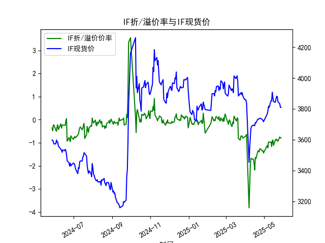
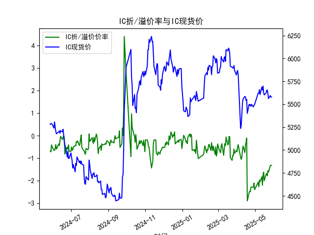
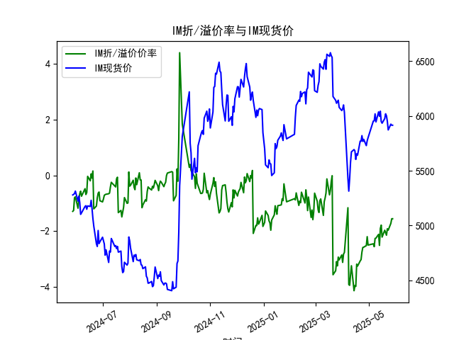

|            |   IF折/溢价率 |   IF现货价 |   IH折/溢价率 |   IH现货价 |   IC折/溢价率 |   IC现货价 |   IH折/溢价率 |   IH现货价 |
|:-----------|--------------:|-----------:|--------------:|-----------:|--------------:|-----------:|--------------:|-----------:|
| 2025-04-28 |     -1.34913  |     3730.6 |      -2.27382 |     5471   |      -2.27382 |     5471   |      -2.51923 |     5729   |
| 2025-04-29 |     -1.33181  |     3724.8 |      -2.10005 |     5487.2 |      -2.10005 |     5487.2 |      -2.19842 |     5773.6 |
| 2025-04-30 |     -1.44197  |     3716.2 |      -2.39398 |     5497   |      -2.39398 |     5497   |      -2.49939 |     5801.4 |
| 2025-05-06 |     -1.11177  |     3766.2 |      -2.06144 |     5622   |      -2.06144 |     5622   |      -2.45329 |     5953.2 |
| 2025-05-07 |     -1.2169   |     3785   |      -2.26234 |     5620.2 |      -2.26234 |     5620.2 |      -2.55739 |     5955.2 |
| 2025-05-08 |     -0.957625 |     3816   |      -1.97107 |     5660   |      -1.97107 |     5660   |      -2.2617  |     6018.8 |
| 2025-05-09 |     -0.976471 |     3808.6 |      -2.04348 |     5604.8 |      -2.04348 |     5604.8 |      -2.25057 |     5945.2 |
| 2025-05-12 |     -0.966676 |     3853   |      -1.82396 |     5688   |      -1.82396 |     5688   |      -2.1153  |     6037   |
| 2025-05-13 |     -1.16158  |     3851   |      -2.19778 |     5654.6 |      -2.19778 |     5654.6 |      -2.51032 |     5996.6 |
| 2025-05-14 |     -0.908163 |     3907.4 |      -1.74715 |     5697.8 |      -1.74715 |     5697.8 |      -1.90524 |     6043   |
| 2025-05-15 |     -0.880406 |     3872.8 |      -1.6149  |     5623   |      -1.6149  |     5623   |      -1.78364 |     5949   |
| 2025-05-16 |     -1.10785  |     3846   |      -1.99531 |     5601.8 |      -1.99531 |     5601.8 |      -2.21348 |     5933.8 |
| 2025-05-19 |     -0.875523 |     3843.2 |      -1.70946 |     5623   |      -1.70946 |     5623   |      -1.96768 |     5975.4 |
| 2025-05-20 |     -0.840664 |     3865.4 |      -1.6802  |     5650.8 |      -1.6802  |     5650.8 |      -2.06014 |     6019.4 |
| 2025-05-21 |     -0.898296 |     3881.2 |      -1.77707 |     5655.6 |      -1.77707 |     5655.6 |      -2.14574 |     6000.6 |
| 2025-05-22 |     -0.87548  |     3879.6 |      -1.55138 |     5614.8 |      -1.55138 |     5614.8 |      -1.91397 |     5950   |
| 2025-05-23 |     -0.9292   |     3846.2 |      -1.61406 |     5561.8 |      -1.61406 |     5561.8 |      -1.96463 |     5872   |
| 2025-05-26 |     -0.748858 |     3831.2 |      -1.32042 |     5594.6 |      -1.32042 |     5594.6 |      -1.72151 |     5925   |
| 2025-05-27 |     -0.786501 |     3809.2 |      -1.31181 |     5578   |      -1.31181 |     5578   |      -1.55547 |     5915   |
| 2025-05-28 |     -0.786501 |     3809.2 |      -1.31181 |     5578   |      -1.31181 |     5578   |      -1.55547 |     5915   |

### 1. 股指期货折/溢价率与现货价的相关性及影响逻辑

股指期货折/溢价率（通常以百分比表示）是指期货合约价格相对于现货指数价格的相对偏差。如果折价率是负值，表示期货价格低于现货价格（折价）；如果是正值，表示期货价格高于现货价格（溢价）。这种关系是金融市场中无套利理论的核心，影响逻辑主要涉及以下几个方面：

- **基本相关性**：  
  折/溢价率与现货价密切相关，因为期货价格应理论上等于现货价加上持有成本（包括无风险利率、股息调整和交易费用）。如果期货折价（负值），可能表明市场预期现货价格将下跌，或持有现货的成本较高（如融资成本上升）。反之，如果溢价，可能反映市场乐观情绪或预期现货价格上涨。数据显示，所有指数（如IF、IH、IC、IM）均呈现负折价率，表明期货整体低于现货，常见于市场风险厌恶期。

- **影响逻辑**：  
  - **市场预期与情绪**：现货价反映当前市场估值，而期货价则体现未来预期。如果现货价上涨但期货折价率扩大（如数据中IH和IC的负值加深），可能表示投资者对未来经济前景谨慎，导致套利机会。  
  - **持有成本因素**：无风险利率上升或股息率变化会放大折价率。例如，在高利率环境下，期货需补偿持有现货的成本，导致折价。如果现货价稳定而折价率缩小（如IF从-0.929%到-0.749%），可能预示市场情绪转暖。  
  - **供需动态**：期货市场的流动性、持仓量和交割压力会影响折/溢价。例如，大量多头平仓可能加剧折价，而现货市场强势（如IM现货价从5872.0上涨）则可能拉近折价率。  
  - **整体影响**：折/溢价率变化往往领先现货价变动，提供交易信号。如果折价率过大（如IH的-1.55%），可能存在套利机会（如买入期货、卖出现货）。长期看，折/溢价率回归零是常态，但短期波动可放大风险。

总之，折/溢价率是现货价的领先指标，负相关性强（折价率负值时现货价可能趋稳或下跌），但需结合市场环境分析。

### 2. 近期投资机会分析

基于提供的数据，我分析了IF、IH、IC和IM四个股指期货的折/溢价率与现货价，重点聚焦最近一周（2025-05-22至2025-05-28）的变化，尤其是今日（2025-05-28）相对于昨日（2025-05-27）的变化。数据显示，所有指数均保持负折价率，表明期货价格持续低于现货，潜在套利机会存在。但整体变化较小，市场可能处于观望状态。以下是详细分析：

- **整体趋势观察**：  
  最近一周，所有指数的折/溢价率均为负值，且现货价小幅波动（例如IF现货价从3879.6降至3809.2）。这反映了市场偏向风险厌恶，可能由于经济不确定性（如全球利率或地缘因素）。今日相对于昨日的变化微乎其微（如IF和IM的折价率保持不变），表明短期无显著新信号。但折价率整体稳定在-0.7%至-1.5%区间，暗示潜在买入期货的套利机会，如果预期现货价回落。

- **具体指数分析**：  

  | 指数 | 最近一周折/溢价率变化（%） | 现货价变化 | 今日 vs 昨日关键变化 | 可能投资机会 |
  |------|-----------------------------|------------|------------------------|-------------|
  | **IF** | 从-0.875 (5/22) 降至-0.929 (5/23)，然后回升至-0.749 (5/26)，并维持-0.787 (5/27-28) | 从3879.6 (5/22) 降至3809.2 (5/28) | 今日折价率-0.787与昨日相同，现货价不变 | 折价率稳定，潜在套利机会：若预期现货进一步下跌，可买入IF期货卖出现货。短期无新驱动，但若折价率缩小，可能转多头。 |
  | **IH** | 从-1.551 (5/22) 降至-1.614 (5/23)，然后回升至-1.320 (5/26)，并维持-1.312 (5/27-28) | 从5614.8 (5/22) 降至5578.0 (5/28) | 今日折价率-1.312与昨日相同，现货价不变 | 折价率较大（约-1.3%），适合套利：买入IH期货对冲现货头寸。今日无变化，但若近期现货企稳，可能有反弹机会。 |
  | **IC** | 与IH类似：从-1.551 (5/22) 降至-1.614 (5/23)，然后回升至-1.320 (5/26)，并维持-1.312 (5/27-28) | 从5614.8 (5/22) 降至5578.0 (5/28) | 今日折价率-1.312与昨日相同，现货价不变 | 类似IH，折价率高企，提供套利空间。注意IC与IH数据一致，可能为相关指数联动。若现货价反弹，折价率缩小可作为买入信号。 |
  | **IM** | 从-1.914 (5/22) 降至-1.965 (5/23)，然后回升至-1.722 (5/26)，并维持-1.555 (5/27-28) | 从5950.0 (5/22) 降至5915.0 (5/28) | 今日折价率-1.555与昨日相同，现货价不变 | 折价率最高（约-1.6%），最具套利潜力：买入IM期货以捕捉现货回落。短期稳定，但若市场情绪好转，折价率可能收窄，提供多头机会。 |

- **判断可能投资机会**：  
  - **主要机会：套利策略**。所有指数的负折价率（尤其是IH、IC和IM超过-1%）表明期货被低估，可通过“买入期货、卖出现货”的跨市套利获利。今日相对于昨日的变化几乎为零，减少了突发风险，但也意味着需等待新催化剂（如经济数据发布）。  
  - **风险提示**：最近一周折价率先扩大后回升，显示市场波动性。若今日无变化，可能短期无趋势，但如果折价率持续缩小（如IF从-0.929%到-0.749%），预示现货反弹机会。  
  - **推荐焦点**：优先关注IM和IH，因其折价率较大且现货价相对稳定。总体上，投资机会中等，适合风险偏好中性的投资者在下周观察数据（如2025-05-29）进一步变化。

