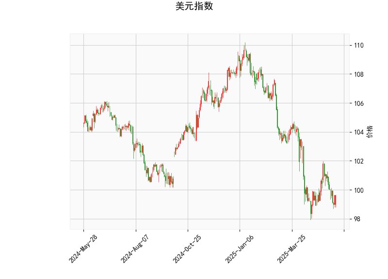

### 美元指数技术分析

基于提供的美元指数技术指标数据，以99.6147为当前价格，我们可以从多个角度进行分析，以评估其短期趋势。

- **RSI（相对强弱指数）分析**：RSI值为44.28，低于50的阈值，这表明美元指数目前处于弱势区域，市场可能已接近超卖状态。如果RSI继续下跌，可能进一步确认弱势；反之，如果RSI反弹至50以上，则可能预示短期反弹。

- **MACD（移动平均收敛散度）分析**：MACD线值为-0.43，低于信号线（-0.43 vs. -0.43），且直方图（MACD Hist）为-0.0043（负值但接近零）。这反映出看跌趋势仍在持续，但动量正在减弱，暗示短期内可能出现反转或修正。如果MACD线向上穿越信号线，将是一个看涨信号。

- **布林带分析**：当前价格99.61位于中轨（101.47）和下轨（97.43）之间，偏向下轨附近。这表示价格处于相对低位，波动率较低。如果价格进一步跌破下轨（97.43），可能触发更强烈的下行压力；反之，如果反弹至中轨以上，将是多头信号。

- **K线形态分析**：检测到的K线形态为“CDLCLOSINGMARUBOZU”（收盘Marubozu），这是一种实体较大的蜡烛形态，通常表示强烈的趋势延续。根据上下文和整体指标（如RSI和MACD的弱势），这很可能是一个阴线形态，意味着近期美元指数有强势下行倾向，但结合MACD的减弱信号，可能预示着趋势即将放缓或反转。

总体而言，美元指数当前呈现弱势格局，短期内可能继续下行或小幅反弹。投资者需关注关键支撑位（如97.43布林带下轨）和外部因素（如美联储政策），以判断是否形成底部。

### A股和港股投资机会分析

美元指数的弱势（RSI低位、MACD负值）通常对新兴市场股票构成利好，因为美元走弱可能促使全球资金流向高增长市场，如A股和港股，从而推动股价上涨。以下是基于这一逻辑，对近期A股和港股可能的投资或套利机会和策略的判断：

- **总体市场环境判断**：
  - 美元指数弱势可能利好A股和港股，因为它往往意味着资金从美元资产（如美股或债券）流出，转向新兴市场。A股作为内需驱动型市场，可能受益于国内经济复苏预期；港股则更受全球资金影响，美元弱势可吸引外资流入。
  - 然而，需要警惕风险：如果美元指数意外反弹（如美联储加息），可能导致资金回流美国市场，对A股和港股造成压力。因此，短期机会以波动性操作为主。

- **潜在投资机会**：
  - **A股机会**：
    - **内需和消费股**：美元弱势可能增强人民币相对强势，支持进口和内需相关行业。推荐关注消费、科技和医疗板块，例如食品饮料（如贵州茅台）或新能源汽车（如比亚迪），这些板块在经济复苏中表现强劲。
    - **成长型股票**：A股中小板或创业板可能迎来反弹机会，尤其是科技股（如芯片或5G相关公司），因为美元弱势可降低融资成本，促进创新投资。
    - **具体机会**：如果上证指数或深证指数突破关键阻力位（如上证3000点），可考虑买入相关ETF（如华夏上证50ETF），目标5-10%的短期涨幅。
    
  - **港股机会**：
    - **中概股和科技股**：港股通下的中概股（如阿里巴巴或腾讯）可能受益于美元弱势带来的外资流入。科技和互联网板块预计有较好表现，尤其是在中美贸易缓和的预期下。
    - **红筹股和国企股**：如中国移动或银行股（例如工商银行），这些股票对全球流动性敏感，美元弱势可推动估值修复。
    - **具体机会**：恒生指数当前若站稳18000点，可布局恒生科技指数ETF，预期短期上涨潜力10%以上。

- **套利机会和策略**：
  - **跨市场套利**：利用港股通机制，进行A股-港股套利。例如，买入A股的科技股（如宁德时代），同时卖出港股同类资产（如小米集团），以捕捉估值差异（A股溢价通常高于港股）。如果美元弱势持续，A股估值可能进一步拉高，套利空间增大。
  - **美元相关套利**：关注中美利差。如果美元指数弱势导致美债收益率下降，可进行债券-股票套利，例如买入A股银行股（受益于低息环境）并卖出美元债券ETF。这类策略适合风险偏好中等的投资者，目标收益5-15%。
  - **具体策略建议**：
    - **短线策略**：采用“逢低买入，设止损”的方式。例如，在美元指数RSI反弹前，买入A股或港股相关基金，止损设在5%损失线。
    - **中线策略**：结合基本面，构建多元化组合，如50%A股消费股 + 50%港股科技股，持仓3-6个月，监控美元指数MACD信号作为退出点。
    - **风险管理**：始终关注宏观事件（如美联储会议），并控制仓位在30-50%以应对美元反弹风险。

总之，美元弱势为A股和港股提供了短期投资窗口，但机会需结合个股基本面和市场情绪评估。建议投资者在操作前进行风险评估，并咨询专业顾问。