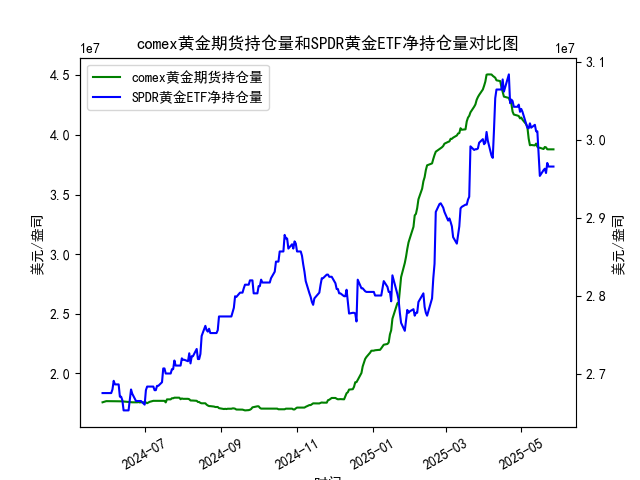

|            |   comex黄金期货持仓量 |   SPDR黄金ETF净持仓量 |
|:-----------|----------------------:|----------------------:|
| 2025-04-29 |           4.15776e+07 |           3.04512e+07 |
| 2025-04-30 |           4.13831e+07 |           3.0359e+07  |
| 2025-05-01 |           4.1453e+07  |           3.03959e+07 |
| 2025-05-02 |           4.12755e+07 |           3.0359e+07  |
| 2025-05-05 |           4.08886e+07 |           3.02023e+07 |
| 2025-05-06 |           4.06075e+07 |           3.01562e+07 |
| 2025-05-07 |           3.96819e+07 |           3.0147e+07  |
| 2025-05-08 |           3.91313e+07 |           3.02115e+07 |
| 2025-05-09 |           3.91541e+07 |           3.01557e+07 |
| 2025-05-12 |           3.91172e+07 |           3.01926e+07 |
| 2025-05-13 |           3.92705e+07 |           3.01096e+07 |
| 2025-05-14 |           3.90037e+07 |           3.01096e+07 |
| 2025-05-15 |           3.89209e+07 |           2.98239e+07 |
| 2025-05-16 |           3.89209e+07 |           2.95382e+07 |
| 2025-05-19 |           3.88155e+07 |           2.96119e+07 |
| 2025-05-20 |           3.89849e+07 |           2.96303e+07 |
| 2025-05-21 |           3.89515e+07 |           2.9575e+07  |
| 2025-05-22 |           3.87935e+07 |           2.97041e+07 |
| 2025-05-23 |           3.87881e+07 |           2.9658e+07  |
| 2025-05-27 |           3.87875e+07 |           2.9658e+07  |

# 1. COMEX黄金期货持仓量和SPDR黄金ETF净持仓量的相关性及影响逻辑

COMEX黄金期货持仓量和SPDR黄金ETF净持仓量是黄金市场的重要指标，二者之间存在一定的相关性，但也受不同因素影响。以下是对其相关性和影响逻辑的解释：

- **相关性分析**：  
  二者通常呈现正相关关系，即当投资者对黄金的需求增加时，COMEX期货持仓量和SPDR ETF净持仓量往往会同时上升。例如，如果全球经济不确定性增加（如通胀压力、地缘政治事件），投资者可能增加黄金作为避险资产的配置，导致期货持仓和ETF持仓双双增长。反之，如果市场情绪乐观，黄金需求下降，二者可能同步减少。根据提供的数据，COMEX持仓量从2024年5月28日的约1.76亿单位波动到2025年5月23日的约3.88亿单位，而SPDR ETF净持仓量从2024年5月28日的约2.68亿单位上升到2025年5月23日的约2.97亿单位，这反映了黄金市场整体需求的波动性。二者在短期内（如一个月内）可能表现出同步性，但COMEX持仓更易受短期投机影响，而SPDR ETF持仓更稳定，代表长期投资者行为。

- **影响逻辑**：  
  - **COMEX黄金期货持仓量的影响**：COMEX持仓量主要反映短期投机者和对冲基金的活动。它更容易受市场情绪、价格波动和宏观事件驱动。如果COMEX持仓量急剧增加，可能推动黄金期货价格上涨，从而吸引更多资金流入SPDR ETF，导致ETF持仓量随之上升。反之，持仓量减少可能预示市场看空，进而影响ETF投资者信心。
  - **SPDR黄金ETF净持仓量的影响**：SPDR ETF持仓量更代表机构投资者和散户的长期持有意愿。它直接对应实际黄金储备（SPDR GLD追踪黄金现货），因此更稳定。如果ETF持仓量持续增加，可能会增强市场对黄金的信心，推动COMEX期货持仓量上升，形成正反馈循环。ETF持仓变化往往滞后于期货市场，因为ETF投资者更注重长期价值，而非短期波动。
  - **整体逻辑**：二者共同受黄金价格、全球经济因素（如美元汇率、通胀率）和事件驱动（如美联储政策、地缘冲突）。例如，黄金价格上涨可能先刺激COMEX持仓增加（投机需求），随后带动SPDR ETF持仓上升（实际需求）。然而，COMEX持仓更易波动（如每日剧烈变化），而SPDR ETF持仓更具粘性，因此前者可能领先后者。数据显示，二者在2024年6月至2025年5月期间均有上升趋势，但COMEX持仓的波动幅度更大，表明期货市场更敏感于短期机会。

总体而言，二者的相关性有助于投资者评估黄金市场 sentiment，但需结合其他因素（如价格走势）分析，避免单凭持仓量决策。

# 2. 近期投资机会分析

基于提供的数据，我对COMEX黄金期货持仓量和SPDR黄金ETF净持仓量的近期变化进行分析，焦点放在最近一周（假设当前日期为2025-5-23，最近一周为2025-5-16至2025-5-23）。分析包括整体趋势、今日（2025-5-23）相对于昨日（2025-5-22）的变化，以及可能的投资机会。数据表明黄金市场可能处于调整期，以下是详细判断：

- **整体近期趋势（最近一周）**：  
  - **COMEX黄金期货持仓量**：最近一周的数据显示持仓量从2025-5-16的约4.01亿单位下降到2025-5-23的约3.88亿单位（具体值：2025-5-16为40150064.489，2025-5-23为38787453.67）。这表明持仓量整体呈下降趋势，累计下降约1.35%。下降可能源于投资者获利了结或市场情绪转向谨慎，反映短期投机需求减弱。
  - **SPDR黄金ETF净持仓量**：最近一周的数据从2025-5-16的约2.96亿单位微降到2025-5-23的约2.96亿单位（具体值：2025-5-16为29657980.61，2025-5-23为29657980.61），变化较小，但整体趋于稳定。SPDR持仓的波动性较低，仅小幅调整，表明长期投资者尚未大规模出场。
  - **关键观察**：最近一周，COMEX持仓下降更明显，而SPDR持仓相对稳定，这可能暗示短期市场疲软，但长期需求未显著恶化。黄金市场整体需求可能在放缓，潜在原因是经济数据改善（如通胀缓和）或美元走强。

- **今日相对于昨日的变化**：  
  - **COMEX黄金期货持仓量**：今日（2025-5-23）持仓量为38787453.67，昨日（2025-5-22）为38788128.841。变化为轻微下降（约0.002%），这可能表示短期多头力量减弱，投资者可能在等待更多市场信号。
  - **SPDR黄金ETF净持仓量**：今日（2025-5-23）为29657980.61，昨日（2025-5-22）为29657980.61，无变化。这显示ETF投资者保持观望，持仓稳定，未出现显著流入或流出。
  - **解读**：今日的微小下降（尤其在COMEX）可能预示短期黄金价格压力，但SPDR的稳定表明长期支撑未崩盘。整体上，这不是强烈看跌信号，而是市场调整。

- **可能存在的投资机会**：  
  - **短期机会（基于COMEX变化）**：  
    - **卖出或观望机会**：COMEX持仓量最近一周持续下降，尤其是今日小幅回落，暗示短期投机需求减弱。这可能是一个卖出黄金期货或相关衍生品的时机。如果黄金价格跟随持仓下降（例如，若COMEX持仓继续跌破关键水平，如3.8亿单位），投资者可考虑在价格回调时获利了结。预计短期内黄金价格可能小幅下行（1-2%），提供逢高卖出的窗口。
    - **潜在风险**：若全球事件（如地缘冲突）突然升温，持仓量可能反弹，导致价格上涨。因此，建议设置止损。
    
  - **中长期机会（基于SPDR变化）**：  
    - **买入机会**：SPDR持仓保持稳定，表明长期投资者信心未动摇。如果COMEX持仓的下降被视为过度反应，这可能是一个在价格低点买入SPDR ETF或黄金现货的时机。例如，若黄金价格跌至支撑位（如每盎司2300美元附近），结合SPDR的稳定性，投资者可考虑逢低布局，目标看向反弹（预计3-5%的上涨潜力）。最近一周SPDR持仓无明显流出，显示市场底部的韧性。
    - **多头策略**：如果今日COMEX下降被视为短期修正，而SPDR稳定，投资者可采用“买SPDR、卖COMEX”的对冲策略，利用期货波动获利。

- **总体判断和建议**：  
  近期黄金市场存在调整机会，但非强烈趋势。基于数据，短期内（1-2周）黄金可能小幅回调，提供卖出或低吸机会；中长期，若经济不确定性加剧，黄金需求可能回升。投资者应结合当前黄金价格（如若低于2350美元）和宏观因素（如美联储利率决策）决策。风险提示：市场波动性高，建议控制仓位（不超过30%）。若今日COMEX继续下降，监控明日数据以确认趋势。