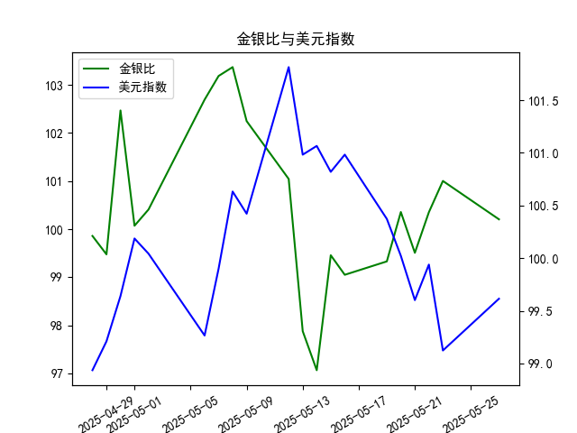

|            |    金价 |   银价 |   美元指数 |   金银比 |
|:-----------|--------:|-------:|-----------:|---------:|
| 2025-04-28 | 3296.3  | 33.01  |    98.9357 |  99.8576 |
| 2025-04-29 | 3305.05 | 33.225 |    99.21   |  99.4748 |
| 2025-04-30 | 3302.05 | 32.225 |    99.6403 | 102.469  |
| 2025-05-01 | 3214.75 | 32.125 |   100.187  | 100.07   |
| 2025-05-02 | 3249.7  | 32.365 |   100.042  | 100.408  |
| 2025-05-06 | 3391.45 | 33.025 |    99.2654 | 102.693  |
| 2025-05-07 | 3392.25 | 32.875 |    99.9006 | 103.186  |
| 2025-05-08 | 3352.3  | 32.43  |   100.633  | 103.37   |
| 2025-05-09 | 3324.55 | 32.515 |   100.422  | 102.247  |
| 2025-05-12 | 3235.4  | 32.02  |   101.814  | 101.043  |
| 2025-05-13 | 3227.95 | 32.98  |   100.983  |  97.876  |
| 2025-05-14 | 3191.95 | 32.885 |   101.066  |  97.064  |
| 2025-05-15 | 3191.05 | 32.085 |   100.82   |  99.4561 |
| 2025-05-16 | 3182.95 | 32.135 |   100.983  |  99.0493 |
| 2025-05-19 | 3230.15 | 32.52  |   100.373  |  99.3281 |
| 2025-05-20 | 3261.55 | 32.5   |   100.022  | 100.355  |
| 2025-05-21 | 3299.65 | 33.16  |    99.6014 |  99.5069 |
| 2025-05-22 | 3284    | 32.725 |    99.9388 | 100.351  |
| 2025-05-23 | 3342.65 | 33.095 |    99.1231 | 101.002  |
| 2025-05-27 | 3296.7  | 32.9   |    99.6147 | 100.204  |

### 1. 金银比与美元指数的相关性及影响逻辑

金银比（Gold-Silver Ratio）是指黄金价格除以白银价格的比率，通常用于衡量黄金相对于白银的价值波动。它反映了投资者对两种贵金属的相对偏好，而美元指数（US Dollar Index）则衡量美元对一篮子主要货币（如欧元、日元等）的汇率变化。两者之间存在一定的相关性，主要源于黄金和白银作为以美元计价的全球性资产，其价格受美元波动的影响。

#### 相关性分析
- **负相关性为主**：金银比与美元指数往往呈现负相关关系。这是因为当美元指数上升（美元强势）时，黄金和白银等贵金属的价格通常下跌（由于以美元定价，强势美元使这些资产对外国投资者更昂贵）。如果黄金价格下跌幅度大于白银，或者白银相对抗跌，金银比可能会上升；反之，如果美元走弱，贵金属价格上涨，金银比可能下降。
- **强度不稳定**：相关性并非绝对，短期内可能因市场情绪、地缘政治事件或经济数据（如通胀、通货膨胀预期）而变化。根据历史数据，金银比与美元指数的负相关系数通常在-0.5到-0.8之间，但这取决于具体时期和外部因素。

#### 影响逻辑
- **美元强势的影响**：当美元指数上涨时，投资者可能转向美元资产（如美股或债券），减少对黄金和白银的需求，导致贵金属价格下跌。如果黄金价格下跌得更快，金银比上升（表示黄金相对白银更便宜）；反之，如果白银下跌更快，金银比下降。这可能创造投资机会，如买入被低估的金属。
- **美元走弱的影响**：美元指数下降时，贵金属往往受益于避险需求或通胀预期，金银比可能波动。如果白银价格上涨幅度更大，金银比下降（表示白银相对黄金更贵），这可能信号银行业绩更好。
- **其他逻辑因素**：金银比还受供需动态影响（如白银在工业用途中更广泛），而美元指数则受美国经济数据（如GDP、利率）和全球风险事件驱动。因此，金银比的变化并非完全由美元决定，而是两者共同受宏观经济环境影响。

总体而言，美元指数是金银比的重要外部驱动因素，投资者可通过监控美元走势来预测金银比的潜在变化。

### 2. 根据数据分析判断近期投资机会

基于提供的数据，我们分析了从2025-4-28到2025-5-27的20个交易日金银比和美元指数的日频数据。重点聚焦于最近一周（定义为2025-5-20到2025-5-27）的变化，尤其是今日（2025-5-27）相对于昨日（2025-5-23）的变动。以下是关键观察和投资机会判断。

#### 数据概述
- **时间序列**：数据覆盖了2025-4-28至2025-5-27，共20个日期。
- **金银比趋势**：整体在100左右波动，最近一周（2025-5-20到2025-5-27）的数据为：100.355 (5-20)，99.507 (5-21)，100.351 (5-22)，101.002 (5-23)，100.204 (5-27)。
- **美元指数趋势**：最近一周的数据为：100.022 (5-20)，99.601 (5-21)，99.939 (5-22)，99.123 (5-23)，99.615 (5-27)。

#### 近期变化分析
- **最近一周整体趋势**：
  - **金银比**：从2025-5-20的100.355开始，波动较为剧烈，5-21短暂下降到99.507（可能表示白银相对强势），随后5-22反弹到100.351，5-23上升到101.002（金银比扩大，暗示黄金相对白银更便宜），并于5-27回落至100.204。这一波动显示金银比在100-101区间震荡，总体趋于稳定但略有下行趋势。
  - **美元指数**：从2025-5-20的100.022开始，逐步下降到5-23的99.123（美元走弱），然后于5-27反弹至99.615（美元小幅回升）。这反映了美元短期内由弱转强的迹象。
  - **今日 vs 昨日**：今日（2025-5-27）金银比为100.204，昨日（2025-5-23）为101.002，下降约0.798点（约0.79%）。与此同时，美元指数从昨日的99.123上升至今日的99.615，上涨约0.492点（约0.50%）。这表明金银比的下降与美元的回升可能相关，美元强势可能开始压制贵金属，但金银比缩小可能预示白银相对表现更好。

- **相关性观察**：
  - 在最近一周，金银比与美元指数呈现负相关趋势（例如，美元在5-23走弱时金银比上升，在5-27回升时金银比下降）。这符合第一部分的逻辑：美元强势可能抑制金银比的进一步上涨。
  - 整体数据中，金银比平均约100.2，美元指数平均约100.0。短期内，金银比的波动幅度（±1-2点）大于美元指数（±0.5-1点），表明金银比更敏感。

#### 投资机会判断
基于上述分析，以下是近期可能的投资机会，主要聚焦贵金属和美元相关资产。建议结合风险管理（如止损设置）和市场情绪进行决策。

- **买入白银的机会**：
  - **理由**：金银比从5-23的101.002下降至5-27的100.204，表明白银相对于黄金的价值正在上升（白银更“贵”）。如果这一趋势持续，可能是白银价格即将反弹的信号，尤其在美元小幅回升的背景下，白银作为工业金属可能受益于经济复苏预期。
  - **潜在机会**：短期内，如果金银比继续低于101，建议考虑买入白银ETF或相关期货。目标价位可设在金银比跌至98以下时入场，止损设在102以上。

- **卖出黄金或观望的机会**：
  - **理由**：金银比的下降暗示黄金相对白银更便宜，但美元指数的回升（从99.123到99.615）可能进一步压制黄金价格。如果美元持续强势，黄金需求可能减弱。
  - **潜在机会**：今日金银比已回落，短期卖出黄金或转为中性仓位（如黄金ETF空头头寸）。如果美元指数突破100，这可能放大黄金下行风险。

- **美元相关机会**：
  - **理由**：美元指数在最近一周由弱转强（5-27上涨），这可能预示美元短期反弹。如果这一趋势延续，投资者可考虑买入美元资产（如USD多头或相关货币对，如USD/EUR）。
  - **潜在机会**：如果美元指数站稳99.6以上，建议买入美元指数期货或相关货币对，但需警惕全球风险事件可能逆转这一趋势。

- **整体风险与建议**：
  - **积极因素**：金银比的近期下降和美元小幅回升可能创造短期套利机会，如金银价差交易（例如，卖出黄金买入白银）。
  - **风险因素**：数据波动性高（金银比在最近一周变化近2%），加上外部不确定性（如经济数据发布），可能导致快速逆转。今日相对于昨日的变化虽小幅有利，但需监控下周数据。
  - **推荐行动**：聚焦短期交易（1-3天），如今日金银比若继续下降，可在5-28或后续交易日跟进。长期投资者应等待更多数据确认趋势。

总之，近期投资机会主要围绕白银的相对强势和美元的潜在反弹，建议优先观察5-27后的数据变化以验证信号。