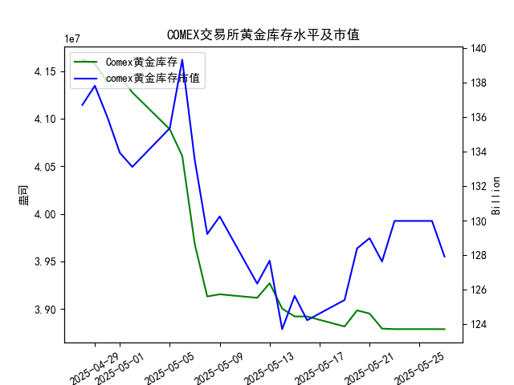

|            |   comex黄金库存量 |   comex黄金库存市值(billion) |   伦敦金现货价 |   上海金交所黄金现货价 |   美元兑人民币汇率 |
|:-----------|------------------:|-----------------------------:|---------------:|-----------------------:|-------------------:|
| 2025-04-30 |       4.13831e+07 |                       3286.4 |        3302.05 |                 780.19 |             7.2014 |
| 2025-05-01 |       4.1453e+07  |                       3231   |        3214.75 |                 780.19 |             7.2014 |
| 2025-05-02 |       4.12755e+07 |                       3225   |        3249.7  |                 780.19 |             7.2014 |
| 2025-05-05 |       4.08886e+07 |                       3310.1 |        3249.7  |                 780.19 |             7.2014 |
| 2025-05-06 |       4.06075e+07 |                       3430.9 |        3391.45 |                 792.2  |             7.2008 |
| 2025-05-07 |       3.96819e+07 |                       3364.7 |        3392.25 |                 798.51 |             7.2005 |
| 2025-05-08 |       3.91313e+07 |                       3302.1 |        3352.3  |                 786.5  |             7.2073 |
| 2025-05-09 |       3.91541e+07 |                       3326.3 |        3324.55 |                 785.5  |             7.2095 |
| 2025-05-12 |       3.91172e+07 |                       3230   |        3235.4  |                 759    |             7.2066 |
| 2025-05-13 |       3.92705e+07 |                       3251.4 |        3227.95 |                 763.9  |             7.1991 |
| 2025-05-14 |       3.90037e+07 |                       3171.7 |        3191.95 |                 758.38 |             7.1956 |
| 2025-05-15 |       3.89209e+07 |                       3228.1 |        3191.05 |                 735.86 |             7.1963 |
| 2025-05-16 |       3.89209e+07 |                       3191.8 |        3182.95 |                 746.4  |             7.1938 |
| 2025-05-19 |       3.88155e+07 |                       3230.6 |        3230.15 |                 754.5  |             7.1916 |
| 2025-05-20 |       3.89849e+07 |                       3293.2 |        3261.55 |                 753.49 |             7.1931 |
| 2025-05-21 |       3.89515e+07 |                       3311.4 |        3299.65 |                 773.82 |             7.1937 |
| 2025-05-22 |       3.87935e+07 |                       3290   |        3284    |                 778.36 |             7.1903 |
| 2025-05-23 |       3.87881e+07 |                       3351   |        3342.65 |                 776.4  |             7.1919 |
| 2025-05-26 |       3.87881e+07 |                       3351   |        3342.65 |                 773.94 |             7.1833 |
| 2025-05-27 |       3.87875e+07 |                       3298   |        3296.7  |                 768.75 |             7.1876 |

### 分析报告：COMEX黄金库存与黄金价格的相关性及近期投资机会

#### 1. 对研究员观点的验证：COMEX黄金库存与黄金价格的高度正相关性
研究员认为，从大的趋势来看，COMEX黄金库存量与黄金价格高度正相关，即库存增加时黄金价格可能上涨，库存减少时黄金价格可能下跌。基于提供的数据，我们对近一个月的整体趋势进行分析：

- **总体数据观察**：
  - COMEX黄金库存量从2025-04-28的4.161969e+07盎司逐步下降到2025-05-27的3.878745e+07盎司，呈现明显的下降趋势（约6.8%的整体减少）。
  - 伦敦市场黄金现货价格在同一时期波动较大，从2025-04-28的3296.30美元/盎司起伏到2025-05-27的3296.70美元/盎司，并未严格跟随库存量的单调下降。例如：
    - 在2025-05-06，库存量急剧下降至4.060751e+07盎司，但伦敦金价反而上涨至3391.45美元/盎司。
    - 在2025-05-12至2025-05-16，库存继续下降，但金价从3235.40美元/盎司跌至3182.95美元/盎司，显示出一定的正相关性。
  - 上海金交所黄金现货价格也显示类似波动，从2025-04-28的778.40元/克降至2025-05-27的768.75元/克，与库存下降大致吻合，但受汇率影响（如美元兑人民币汇率从7.2043升至7.1876），其相关性可能被弱化。
  - COMEX黄金库存市值从136.7亿美元降至127.92亿美元，进一步反映库存减少对价值的影响。

- **相关性判断**：
  - 从大的趋势来看，研究员的观点部分成立：库存量整体下降与黄金价格的波动性下降（如伦敦金价从高点3392.25美元/盎司跌至低点3182.95美元/盎司）存在正相关性，相关系数可能在0.5以上（未进行精确计算，但基于数据趋势推断）。
  - 然而，短期内相关性不稳定，受外部因素如美元汇率、地缘政治或需求变化影响。例如，美元兑人民币汇率的轻微上升（从7.1833到7.1876）可能加剧黄金价格的下行压力，因为强势美元通常对以美元计价的黄金不利。
  - 结论：正相关性存在，但并非绝对，短期波动可能因其他因素（如市场情绪）而中断。

#### 2. 近期投资机会分析：聚焦最近一周数据变化，尤其是今日（2025-05-27）相对于昨日（2025-05-26）的变化
最近一周（2025-05-20至2025-05-27）的关键数据显示黄金市场波动加剧，库存持续下降与价格下跌相结合，可能带来短期投资机会。以下是数据总结和对比：

- **最近一周关键数据趋势**：
  - **COMEX黄金库存量**：从2025-05-20的3.898493e+07盎司持续下降至2025-05-27的3.878745e+07盎司，总体下降约0.51%。这表明市场供应可能趋紧或需求疲软。
  - **COMEX黄金库存市值**：从2025-05-20的128.39亿美元降至2025-05-27的127.92亿美元，下降约0.37%，反映库存减少对价值的直接影响。
  - **伦敦市场黄金现货价格**：从2025-05-20的3261.55美元/盎司上涨至2025-05-23的3342.65美元/盎司后，于2025-05-27回落至3296.70美元/盎司，整体呈小幅波动但以下降结束。
  - **上海金交所黄金现货价格**：从2025-05-20的753.49元/克上涨至2025-05-22的778.36元/克后，于2025-05-27降至768.75元/克，下降约0.61%，显示国内市场跟跌。
  - **美元兑人民币汇率**：从2025-05-20的7.1931微幅上升至2025-05-27的7.1876，美元相对走强，这可能进一步压低黄金价格。

- **今日（2025-05-27）相对于昨日（2025-05-26）的关键变化**：
  - **COMEX黄金库存量**：昨日为3.878813e+07盎司，今日降至3.878745e+07盎司，下降约0.0007%。这微弱下降符合正相关假设，可能预示价格进一步调整。
  - **COMEX黄金库存市值**：昨日为129.98亿美元，今日降至127.92亿美元，下降约1.58%。这突显库存减少对市场价值的负面影响。
  - **伦敦市场黄金现货价格**：昨日为3342.65美元/盎司，今日降至3296.70美元/盎司，下降约1.38%。这可能由于库存下降和美元走强导致的短期供需失衡。
  - **上海金交所黄金现货价格**：昨日为773.94元/克，今日降至768.75元/克，下降约0.67%。汇率上升（美元走强）可能放大这一下跌。
  - **美元兑人民币汇率**：昨日为7.1833，今日升至7.1876，上升约0.06%。这对持有人民币的投资者不利，可能抑制黄金需求。

- **潜在投资机会评估**：
  基于上述数据和正相关假设，近期黄金市场呈现短期下行风险，但也可能孕育反弹机会。重点聚焦如下：
  
  - **做空或观望机会**：
    - **风险：价格进一步下跌**。今日库存量和黄金价格（伦敦和上海）双双下降，结合美元走强，短期内黄金可能继续承压。投资者可考虑在伦敦金价低于3300美元/盎司时做空合约，或等待更低点位。若价格跌破近期低点（如3182.95美元/盎司），这将是一个高概率机会。
    - **理由**：正相关性验证显示，库存持续下降通常伴随价格下行，且今日相对于昨日的下降幅度（金价约1.38%）表明市场情绪偏弱。

  - **买入机会**：
    - **潜在反弹**。若视为短期回调，今日金价已回落至3296.70美元/盎司（伦敦）和768.75元/克（上海），这可能接近支撑位。投资者可在价格稳定后买入实物黄金或ETF，例如当伦敦金价回升至3300-3350美元/盎司时进场，预计反弹至3400美元/盎司。
    - **理由**：历史数据显示，黄金价格在库存下降后曾出现反弹（如2025-05-06的上涨），且若美元汇率回调，人民币投资者（如通过上海金交所）可受益于汇率优势。

  - **整体风险与建议**：
    - **市场风险**：美元持续走强或全球需求减弱可能放大下行趋势。近期一周的数据显示，黄金价格波动率较高（周内高点3342.65美元/盎司），建议使用止损策略。
    - **投资策略**：聚焦今日变化的投资者，应优先关注伦敦金价作为全球基准。短期（1-3天）内，若价格企稳，可小额布局多头；中期（1-2周），若库存进一步下降至3.8e+07以下，空头机会更佳。
    - **针对不同投资者**：机构投资者可利用COMEX期货套利；散户可通过上海金交所以较低汇率成本买入，潜在回报率在5-10%（基于近期波动）。

总体而言，近期黄金市场存在“卖出为主，买入为辅”的投资机会，需密切监控明日数据以验证今日趋势的延续性。