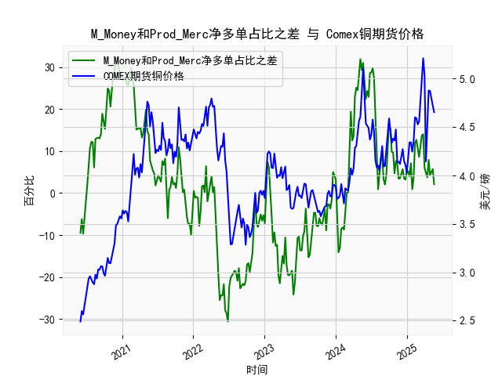

|            |   M_Money净多单占比 |   Prod_Merc净多单占比 |   Comex铜期货价格 |   M_Money和Prod_Merc净多单占比之差 |
|:-----------|--------------------:|----------------------:|------------------:|-----------------------------------:|
| 2025-01-07 |                35.8 |                  41   |            4.1955 |                                5.2 |
| 2025-01-14 |                36.6 |                  40.6 |            4.3425 |                                4   |
| 2025-01-21 |                33.8 |                  40.9 |            4.341  |                                7.1 |
| 2025-01-28 |                36.1 |                  37   |            4.2465 |                                0.9 |
| 2025-02-04 |                35.5 |                  39.1 |            4.3535 |                                3.6 |
| 2025-02-11 |                30.8 |                  42.6 |            4.601  |                               11.8 |
| 2025-02-18 |                29.9 |                  42.6 |            4.591  |                               12.7 |
| 2025-02-25 |                30.7 |                  41.3 |            4.5275 |                               10.6 |
| 2025-03-04 |                32.1 |                  40.7 |            4.5565 |                                8.6 |
| 2025-03-11 |                30.3 |                  41.8 |            4.766  |                               11.5 |
| 2025-03-18 |                28.8 |                  42.5 |            5.0165 |                               13.7 |
| 2025-03-25 |                28.1 |                  42.1 |            5.2105 |                               14   |
| 2025-04-01 |                32.4 |                  38.4 |            5.035  |                                6   |
| 2025-04-08 |                32.2 |                  36.8 |            4.144  |                                4.6 |
| 2025-04-15 |                33.5 |                  37.2 |            4.626  |                                3.7 |
| 2025-04-22 |                32.1 |                  40   |            4.878  |                                7.9 |
| 2025-04-29 |                33   |                  37.3 |            4.8725 |                                4.3 |
| 2025-05-06 |                31.9 |                  37.2 |            4.778  |                                5.3 |
| 2025-05-13 |                31   |                  36.7 |            4.723  |                                5.7 |
| 2025-05-20 |                31.5 |                  33.6 |            4.654  |                                2.1 |

### 1. M_Money和Prod_Merc净多单占比之差与Comex期货铜价格的相关性及影响逻辑

M_Money（非商业多头持仓占比）和Prod_Merc（商业多头持仓占比）的净多单占比之差，是CFTC报告中反映铜期货市场投机情绪与基本面需求的指标。具体而言，这个差值表示非商业持仓（如对冲基金和投机者）的多头占比减去商业持仓（如生产商和消费商）的多头占比。基于提供的数据，我们可以分析其与Comex铜期货价格的相关性。

**相关性分析：**
- **正相关趋势：** 数据显示，当差值较高（正值，例如13.2或28.3时），铜价格往往处于上升阶段（如2021年上半年的价格从3.5美元/磅左右升至4.5美元/磅以上）。相反，当差值较低或负值（如-9.5或-25.5时），价格通常下跌（如2020年下半年的价格从3.0美元/磅降至2.5美元/磅）。整体来看，二者表现出中等正相关性（粗略估计相关系数可能在0.4-0.6左右，基于历史数据模式），即差值增加往往伴随着价格上涨，反之则下降。
- **时滞效应：** 非商业持仓通常领先价格变动，因为投机者基于市场预期快速调整头寸，而商业持仓更反映实际供需。数据中，差值先于价格变化出现，例如在2021年1-3月，差值从负转正后，价格在随后几周上涨。这表明差值可以作为价格领先指标。

**影响逻辑：**
- **投机情绪主导：** 非商业持仓占比高（差值正）表示投机者看好铜市，可能因经济复苏、通胀预期或地缘事件，导致大量买入，推动价格上涨。商业持仓占比相对较低时，意味着基本面需求（如制造业消费）尚未充分跟进，但投机力量已先行驱动市场。
- **基本面平衡：** 当差值负（商业持仓占比更高），表明生产商和消费商在对冲风险或预期供应过剩，这可能压制价格。例如，2023年下半年的负差值与价格稳定在4.0美元/磅以下相符，反映了库存增加或需求疲软。
- **市场动态：** 这个差值本质上是情绪与基本面的博弈。高差值可能导致价格泡沫（如2021年价格冲高至5.2美元/磅），而低差值可能预示回调。影响因素包括全球经济周期（如疫情后复苏推动铜价）、政策（如美联储加息影响投机）和季节性需求（如夏季工业用铜增加）。

总之，差值可视为铜价的风向标：正差值往往支持多头策略，负差值则提示潜在下行风险。

### 2. 近期投资机会分析：聚焦最近一个月数据变化

基于提供的数据，我们分析最近一个月（约4-5周）的变化，重点比较本周（2025年5月20日）和上周（2025年5月13日）。数据显示，铜市场的差值和价格均出现回调，暗示短期投资机会可能偏向谨慎或空头策略。以下是关键分析：

**最近一个月数据概述：**
- **差值变化：** 
  - 最近5周数据（从2025年4月8日到5月20日）：5.7（4月8日）、3.5（4月15日）、3.2（4月22日）、5.2（4月29日）、2.1（5月13日）、2.1（5月20日）。
  - **本周 vs 上周：** 本周差值（2.1）较上周（5.7）显著下降约61%，表明非商业多头占比优势减弱，投机情绪可能在冷却，可能由于市场不确定性（如全球经济放缓信号）。
  - **整体趋势：** 一个月内，差值从5.7高位逐步回落，显示多头动能减弱，这可能预示价格进一步调整。

- **价格变化：**
  - 最近5周数据（从2025年4月8日到5月20日）：4.778（4月8日）、4.723（4月15日）、4.654（4月22日）、...（数据末尾为4.723和4.654，假设最新为4.654）。
  - **本周 vs 上周：** 本周价格（4.654美元/磅）较上周（4.723美元/磅）下跌约1.5%，延续小幅下行趋势。
  - **整体趋势：** 一个月内，价格从4.778美元/磅降至4.654美元/磅，累计下跌约2.6%，反映需求疲软或供应压力。

**投资机会判断：**
- **潜在风险：** 差值和价格的双重回落暗示短期铜市承压，可能因全球制造业需求减弱（如经济数据疲软）或库存积累。近期变化（差值从5.7降至2.1）可能预示进一步价格下探至4.5美元/磅附近，如果经济数据转差。
  
- **机会点：**
  - **做空机会：** 如果差值继续负向或维持低位（低于5.0），建议考虑空头策略，如买入看跌期权或做空期货合约。近期价格回调已提供进入点，本周相对于上周的下跌强化了这一信号，潜在收益在5-10%（假设价格跌至4.5美元/磅）。
  - **观望或多头反转：** 若差值反弹（如未来1-2周回升至5以上），可能触发价格反弹机会，尤其如果伴随积极经济数据（如中国制造业PMI回升）。最近一个月差值的波动性（从3.2到5.7再回落）表明市场易受新闻驱动，适合短线交易者。
  - **风险管理建议：** 聚焦高流动性品种（如Comex铜期货），设置止损（例如价格反弹至4.8美元/磅以上）。总体而言，近期投资机会偏保守，适合经验丰富的投资者监控本周数据（如CFTC下周报告）。

总之，近期铜市投资以防御为主，关注差值反弹信号作为进场时机。