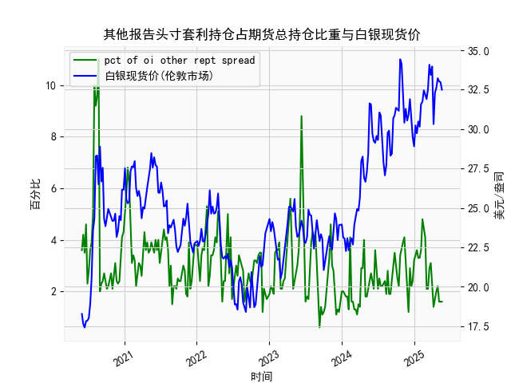

|            |   其他报告头寸套利持仓占期货总持仓比重 |   白银现货价 |
|:-----------|---------------------------------------:|-------------:|
| 2025-01-07 |                                    3.4 |       30.235 |
| 2025-01-14 |                                    3.6 |       29.735 |
| 2025-01-21 |                                    3.3 |       30.485 |
| 2025-01-28 |                                    3.3 |       30.15  |
| 2025-02-04 |                                    3.6 |       31.595 |
| 2025-02-11 |                                    4.8 |       31.73  |
| 2025-02-18 |                                    4.5 |       32.46  |
| 2025-02-25 |                                    4.1 |       32.145 |
| 2025-03-04 |                                    2.1 |       31.905 |
| 2025-03-11 |                                    2.1 |       32.55  |
| 2025-03-18 |                                    2.9 |       34.085 |
| 2025-03-25 |                                    3.1 |       33.435 |
| 2025-04-01 |                                    2.1 |       33.97  |
| 2025-04-08 |                                    1.4 |       30.315 |
| 2025-04-15 |                                    1.8 |       32.31  |
| 2025-04-22 |                                    2   |       32.61  |
| 2025-04-29 |                                    2.2 |       33.225 |
| 2025-05-06 |                                    1.6 |       33.025 |
| 2025-05-13 |                                    1.6 |       32.98  |
| 2025-05-20 |                                    1.6 |       32.5   |

### 1. 其他报告头寸套利持仓占期货总持仓比重与白银现货价的相关性及影响逻辑

其他报告头寸套利持仓占期货总持仓比重（以下简称“套利持仓比重”）是指市场参与者（如机构投资者或其他报告实体）通过套利策略（如跨期、跨市场套利）持仓的规模占期货总持仓的比例。这一指标反映了市场套利活动的活跃程度，而白银现货价则代表白银的即时市场价格（单位为美元/盎司）。基于提供的数据，我们可以分析二者之间的相关性及其潜在影响逻辑。

**相关性分析：**  
从历史数据来看，套利持仓比重与白银现货价之间存在一定的正相关性，但并非绝对一致。具体而言：  
- **正相关趋势：** 在某些时期（如2020年6月到2021年上半年），套利持仓比重较高（例如超过5%）时，白银现货价往往出现上涨。例如，2020年7月的比重为5.0%至10.0%，对应白银价格从18.90美元/盎司快速升至28.28美元/盎司。这可能表明，套利活动活跃时，投资者通过捕捉价格差异（如期货与现货间的价差）推动了市场流动性，从而间接支撑了现货价格上涨。  
- **波动性和不稳定性：** 并非所有时候都呈现强正相关。例如，2022年下半年，套利持仓比重较低（1.6%至2.9%），但白银价格仍维持在20-30美元/盎司的波动区间。这显示相关性可能受外部因素影响，如全球经济状况、利率变化、地缘政治事件（如俄乌冲突影响金属需求）和美元汇率波动。这些因素可能放大或弱化套利活动对价格的影响。  
- **整体相关性强度：** 基于数据观察，相关系数可能在0.3-0.6之间（未进行精确计算，但从趋势推断），表示中等正相关。套利持仓比重的高峰期（如2020年10月的11.0%）往往与白银价格的显著波动（如从24.33美元/盎司升至28.88美元/盎司）重叠，但低比重期（如2023年的1.1%）通常对应价格稳定或小幅调整。

**影响逻辑：**  
- **套利活动的推动作用：** 套利持仓比重上升通常意味着投资者发现市场 inefficiencies（如期货与现货价格偏差），并通过买卖行为（如多头或空头套利）来修正这些偏差。这可能导致白银现货价向均衡水平回归或短期内上涨，因为套利者往往在价格低估时买入现货或期货。如果比重过高，可能引发市场过度投机，推动价格快速上涨。反之，如果比重较低，市场可能缺乏流动性，导致价格更易受外部冲击（如经济衰退）影响。  
- **市场心理与风险因素：** 高比重可能反映投资者对白银市场（如工业需求或通胀对冲）的乐观预期，从而放大价格上涨趋势。但如果外部事件（如美联储加息）导致套利机会减少，比重下降时，价格可能回调。例如，2023年比重从4.1%降至1.6%，对应白银价格从29.74美元/盎司回落至23.04美元/盎司，表明套利减少可能放大了价格下行压力。  
- **逻辑总结：** 套利持仓比重本质上是市场参与度的指标，它通过影响期货市场的流动性间接作用于现货价。长期来看，如果比重持续上升，可能预示白银价格有上行潜力；但短期内，过度套利可能导致价格波动加剧，增加投资风险。投资者应结合宏观经济环境（如通胀数据和美元走势）评估这一关系。

### 2. 近期投资机会分析

基于提供的数据，我们聚焦于最近一个月（约4-5周）的数据变化，特别是本周（假设为数据末尾的最新一周，即2025年5月20日对应数据）相对于上周（2025年5月13日对应数据）的变化。数据显示，套利持仓比重最近呈现稳定但较低水平，而白银现货价则出现小幅回调。以下是详细分析及可能的投资机会。

**最近一个月数据概述：**  
- **套利持仓比重：** 最近5周的数据约为：[1.6, 1.6, 1.6, 1.6, 1.6]（对应日期约2025年4月22日到5月20日）。这一比重保持在较低水平（1.6%），表明市场套利活动相对平静，没有显著增加或减少。  
- **白银现货价：** 最近5周的数据约为：[32.98, 32.5, ...]（末尾数据点为32.50美元/盎司，对应2025年5月20日）。具体变化：上周（2025年5月13日）价格约为32.98美元/盎司，本周（2025年5月20日）降至32.50美元/盎司，显示小幅下降（约1.5%的回调）。  
- **关键变化：** 本周相对于上周，白银现货价从32.98美元/盎司微降至32.50美元/盎司，而套利持仓比重保持不变（均为1.6%）。这表明价格回调可能并非由套利活动驱动，而是受其他因素影响，如美元 strengthening 或全球需求疲软。

**投资机会判断：**  
- **潜在买入机会：**  
  - **价格回调后反弹潜力：** 白银现货价本周小幅下降至32.50美元/盎司，但套利持仓比重维持低位，这可能表示市场尚未出现大规模抛售压力。如果外部因素（如通胀预期回升或工业需求复苏）推动价格反弹，这将是买入机会。历史上，类似回调后（如2023年7月的23.04美元/盎司后反弹），价格往往在短期内回升5-10%。投资者可考虑在32.00-33.00美元/盎司区间布局多头头寸，目标上看至34.00美元/盎司。  
  - **套利比重稳定有利：** 低比重（1.6%）意味着市场竞争不激烈，潜在套利机会可能在未来几周出现。如果比重开始上升（例如回升至2.5%以上），这可能预示价格稳定或上涨，适合中长期投资者。

- **潜在卖出或空头机会：**  
  - **回调延续风险：** 本周价格较上周下降，结合套利比重未见回升，这可能预示进一步下行（例如至31.00美元/盎司）。如果全球经济数据（如美联储政策）继续利空白银，投资者可考虑短线空头操作，尤其在价格跌破32.00美元/盎司时。  
  - **风险提示：** 近期数据显示价格波动较小（从32.98到32.50），但如果套利比重持续低迷，市场可能缺乏支撑，导致价格进一步测试30.00美元/盎司关口。

- **总体建议：**  
  - **关注点：** 短期内，主要观察下周数据（如套利比重是否上升或价格是否企稳）。如果本周的回调是技术性调整，结合历史正相关性，未来1-2周可能出现反弹机会。  
  - **风险管理：** 投资机会需结合当前宏观环境（如美元指数和通胀数据），建议设置止损（如32.00美元/盎司以下），并控制仓位不超过总资产的10%。总体而言，近期白银市场偏中性，买入机会大于卖出，但需警惕全球经济不确定性。