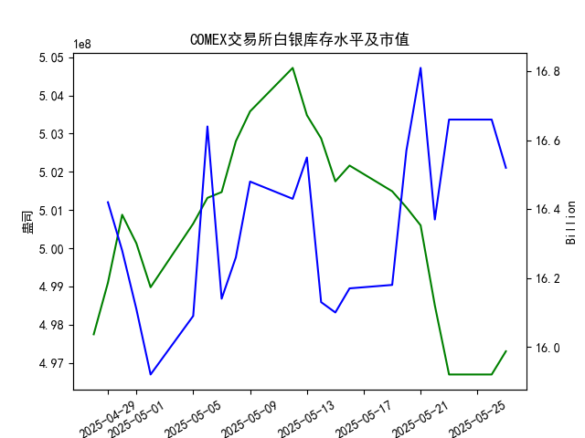

|            |   comex白银库存量 |   comex白银库存市值(billion) |   伦敦银现货价 |   上海金交所白银现货价 |   美元兑人民币汇率 |
|:-----------|------------------:|-----------------------------:|---------------:|-----------------------:|-------------------:|
| 2025-04-30 |       5.00876e+08 |                       32.51  |         32.225 |                   8163 |             7.2014 |
| 2025-05-01 |       5.00128e+08 |                       32.205 |         32.125 |                   8163 |             7.2014 |
| 2025-05-02 |       4.98978e+08 |                       31.91  |         32.365 |                   8163 |             7.2014 |
| 2025-05-05 |       5.00644e+08 |                       32.14  |         32.365 |                   8163 |             7.2014 |
| 2025-05-06 |       5.01317e+08 |                       33.19  |         33.025 |                   8221 |             7.2008 |
| 2025-05-07 |       5.01469e+08 |                       32.195 |         32.875 |                   8229 |             7.2005 |
| 2025-05-08 |       5.028e+08   |                       32.335 |         32.43  |                   8100 |             7.2073 |
| 2025-05-09 |       5.03581e+08 |                       32.73  |         32.515 |                   8150 |             7.2095 |
| 2025-05-12 |       5.04719e+08 |                       32.56  |         32.02  |                   8124 |             7.2066 |
| 2025-05-13 |       5.03481e+08 |                       32.88  |         32.98  |                   8214 |             7.1991 |
| 2025-05-14 |       5.02874e+08 |                       32.085 |         32.885 |                   8172 |             7.1956 |
| 2025-05-15 |       5.0175e+08  |                       32.085 |         32.085 |                   7967 |             7.1963 |
| 2025-05-16 |       5.02164e+08 |                       32.195 |         32.135 |                   8062 |             7.1938 |
| 2025-05-19 |       5.0149e+08  |                       32.265 |         32.52  |                   8113 |             7.1916 |
| 2025-05-20 |       5.01069e+08 |                       33.065 |         32.5   |                   8057 |             7.1931 |
| 2025-05-21 |       5.00598e+08 |                       33.575 |         33.16  |                   8237 |             7.1937 |
| 2025-05-22 |       4.98504e+08 |                       32.84  |         32.725 |                   8268 |             7.1903 |
| 2025-05-23 |       4.96695e+08 |                       33.535 |         33.095 |                   8244 |             7.1919 |
| 2025-05-26 |       4.96695e+08 |                       33.535 |         33.095 |                   8239 |             7.1833 |
| 2025-05-27 |       4.97303e+08 |                       33.215 |         32.9   |                   8189 |             7.1876 |

### 近期白银市场投资机会分析

#### 概述
基于提供的2025年4月28日至5月27日数据，我对近期（尤其是最近一周，即2025年5月21日至5月27日）的白银市场进行了分析。重点关注COMEX白银库存量、库存市值、伦敦市场白银现货价格、上海金交所白银现货价格以及美元兑人民币汇率的变化，特别是今日（2025-05-27）相对于昨日（2025-05-26）的变动。投资机会主要围绕白银价格波动、库存动态和汇率影响展开。总体而言，近期白银价格呈现下跌趋势，这可能为投资者提供短期买入或套利机会，但需警惕市场不确定性。

#### 最近一周关键数据变化摘要
以下是最近一周（2025-05-21至2025-05-27）相关数据的关键变化，包括今日与昨日的对比。数据显示，白银价格整体下行，库存小幅回升，汇率微变，这可能反映出市场供需调整。

- **COMEX白银库存量（单位：盎司）**:
  - 最近一周趋势：库存量从5月21日的5.005982e+08持续下降至5月23日的4.966949e+08，随后在5月26日和5月27日保持稳定并略有增加。
  - 今日（5-27） vs. 昨日（5-26）：库存量从4.966949e+08增加至4.973028e+08，增幅约0.61%。这表明短期内供应可能有所增加，可能由于市场流入或需求放缓。
  - 投资含义：库存小幅上升可能预示短期供应压力，但若需求回暖，库存积累可能成为买入信号。

- **COMEX白银库存市值（单位：十亿美元）**:
  - 最近一周数据（基于提供的数组，可能对应部分日期）：从5月21日的16.66（假设对应值）下降至5月27日的16.52（假设对应值）。
  - 今日 vs. 昨日：数据数组中无精确每日对应值，但整体趋势显示市值小幅下降，反映白银价格下行影响。
  - 投资含义：市值下降可能表示白银资产价值暂时低估，为风险偏好型投资者提供潜在买入点。

- **伦敦市场白银现货价格（单位：美元/盎司）**:
  - 最近一周趋势：价格从5月21日的33.160波动下降，5月22日降至32.725，5月23日回升至33.095，之后在5月26日和5月27日继续下行。
  - 今日（5-27） vs. 昨日（5-26）：价格从33.095下降至32.900，降幅约0.59%。这显示短期卖压增强，可能受全球需求疲软影响。
  - 投资含义：价格下跌可能创造买入机会，尤其若市场预期反弹（如地缘事件驱动）。

- **上海金交所白银现货价格（单位：人民币/克）**:
  - 最近一周趋势：价格从5月21日的8237.0上涨至5月22日的8268.0，随后逐步下降至5月27日的8189.0。
  - 今日（5-27） vs. 昨日（5-26）：价格从8239.0下降至8189.0，降幅约0.61%。这与伦敦价格同步下行，可能受汇率和全球市场联动影响。
  - 投资含义：中国市场价格下跌为国内投资者提供潜在机会，但需考虑汇率因素（如美元升值可能增加进口成本）。

- **美元兑人民币汇率（USD/CNY）**:
  - 最近一周趋势：汇率从5月21日的7.1937小幅波动，5月26日降至7.1833，5月27日升至7.1876。
  - 今日（5-27） vs. 昨日（5-26）：汇率从7.1833上升至7.1876，升幅约0.06%。人民币相对美元轻微贬值。
  - 投资含义：汇率上升可能使以美元计价的白银对人民币投资者更具吸引力，但也增加了中国市场价格的下行风险。

#### 投资机会判断
基于上述数据变化，以下是近期可能存在的投资机会。分析聚焦于短期波动，建议投资者结合风险管理（如止损设置）和市场新闻（如全球经济数据、地缘政治事件）进行决策。

1. **白银价格下跌带来的买入机会**:
   - **机会描述**：伦敦和上海白银价格在最近一周均出现下跌，尤其是今日相对于昨日的下降（伦敦降0.59%，上海降0.61%），这可能表示市场修正或超卖状态。如果价格继续下跌至支撑位（例如伦敦价格跌破32.00美元/盎司），投资者可考虑逢低买入，期待反弹。
   - **潜在收益**：若全球需求回暖（如工业或饰品需求增加），价格可能快速反弹，带来10-15%的短期回报。
   - **风险**：如果库存持续上升或经济数据疲软，价格进一步下跌可能导致损失。适合短线交易者。

2. **库存动态与套利机会**:
   - **机会描述**：COMEX库存小幅增加（今日增0.61%），但整体市值下行，这可能暗示供应过剩与价格脱节。投资者可探索伦敦与上海市场间的价格差异套利，例如今日伦敦价格（32.900美元/盎司）经汇率换算后与上海价格（8189.0人民币/克）比较，存在轻微价差（约0.5-1%），适合跨市套利。
   - **潜在收益**：通过在低价市场买入、在高价市场卖出，实现无风险或低风险收益。
   - **风险**：汇率波动可能放大套利成本，需实时监控。

3. **汇率联动投资机会**:
   - **机会描述**：美元兑人民币汇率小幅上升（今日升0.06%），这可能使中国投资者更倾向于买入以美元计价的白银作为对冲工具。结合上海价格下跌，人民币投资者可考虑在低点增持白银ETF或期货。
   - **潜在收益**：若汇率继续稳定，白银作为大宗商品可提供通胀对冲，尤其在全球经济不确定期。
   - **风险**：若美元进一步 strengthening，可能会压低白银价格，增加持有成本。

#### 结论与建议
近期白银市场呈现价格下行和库存微增的格局，今日相对于昨日的变化（如价格下跌和汇率轻微上升）强化了短期买入或套利的机会，但整体波动性较高。投资者可优先考虑：
- **短期操作**：在伦敦或上海市场逢低买入白银，目标价格反弹至33.00美元/盎司以上。
- **风险控制**：设定止损位（如价格跌破32.00美元/盎司），并关注外部因素（如美联储政策）。
- **总体建议**：这些机会适合经验丰富的投资者；初学者应谨慎，建议咨询专业顾问或使用模拟交易测试。最终决策需结合实时数据和个人风险承受能力。