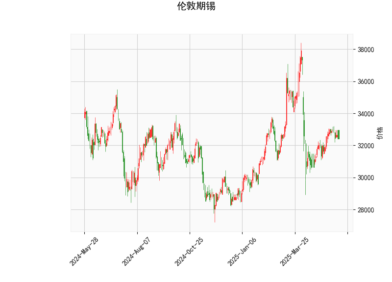

# 伦敦期锡的技术分析结果分析

## 1. 技术指标详细分析
以下是对提供的伦敦期锡技术分析结果进行的全面解读，基于当前价位、动量指标、波动率指标以及K线形态等关键要素。整体来看，这些指标显示出市场可能处于相对中性偏向看涨的阶段，但需注意潜在的反转风险。

### 当前价格与整体市场位置
- **当前价位：32410.0**  
  当前价格位于布林带的中轨（33105.42）和下轨（29222.30）之间，具体处于中轨下方。这表明价格可能在短期内受到下轨（29222.30）的支撑，但尚未触及超卖区域。如果价格进一步下跌，可能测试下轨水平；反之，若反弹至中轨以上，则可能预示短期上行趋势。

### RSI（相对强弱指数）分析
- **RSI值：48.99**  
  RSI处于中性区域（低于50），表示市场尚未出现明显的超卖或超买信号。具体而言，RSI低于50可能暗示轻微的卖方压力，但距离超卖阈值（30）仍有距离。这通常意味着市场动能相对平衡，短期内可能出现横盘整理或小幅反弹。如果RSI升至50以上，将强化看涨信号。

### MACD（移动平均收敛散度）分析
- **MACD线：49.91**  
- **MACD信号线：19.58**  
- **MACD柱状图：30.33**  
  MACD线高于信号线，且柱状图为正值，这是一个典型的看涨信号，表明短期多头动能占优。MACD柱状图的正值（30.33）进一步支持价格可能向上突破。然而，MACD值的整体水平不高，暗示这一看涨势头可能较温和。如果MACD柱状图继续扩大，将增强上行潜力；反之，若柱状图收窄或转为负值，则需警惕反转。

### 布林带分析
- **上轨：36988.53**  
- **中轨：33105.42**  
- **下轨：29222.30**  
  当前价格位于中轨和下轨之间，表明市场波动率处于中等水平。下轨（29222.30）作为潜在支撑位，可能在价格下跌时提供缓冲；上轨（36988.53）则作为阻力位。如果价格突破中轨并向上轨逼近，将是强力看涨信号；反之，若跌破下轨，可能触发进一步下行。布林带的宽度显示出市场波动适中，但如果价格接近下轨，可能会出现“挤压”效应，引发剧烈波动。

### K线形态分析
- **形态列表：CDLBELTHOLD, CDLCLOSINGMARUBOZU, CDLLONGLINE, CDLMARUBOZU, CDLMATCHINGLOW**  
  这些K线形态整体显示出市场可能处于转折或强势阶段：  
  - **CDLBELTHOLD**：表示价格形成了一个强势的蜡烛形态，可能预示趋势延续或反转，常与看涨环境相关。  
  - **CDLCLOSINGMARUBOZU**：这是一种强烈的趋势形态，通常意味着收盘时价格大幅上涨或下跌。这里结合其他形态，可能暗示看涨延续。  
  - **CDLLONGLINE**：显示较大的价格波动，表明市场情绪强烈，可能伴随突破。  
  - **CDLMARUBOZU**：代表极强的趋势信号（如大阳线），建议当前市场有强势多头参与。  
  - **CDLMATCHINGLOW**：这是一种底部信号，暗示价格可能已触及短期低点，并可能反转向上。  
  总体上，这些形态偏向看涨，但需结合其他指标确认，因为它们也可能表示过度波动导致的疲惫。

## 2. 近期投资或套利机会和策略判断
基于上述技术分析，伦敦期锡市场显示出潜在的看涨机会，但风险依然存在。以下是对近期可能投资或套利机会的判断，以及相应的策略建议。需强调，投资决策应结合基本面分析、市场新闻（如全球锡需求和供应动态）及风险管理。

### 可能存在的投资机会
- **看涨机会主导**：  
  MACD的正柱状图、RSI的中性偏上，以及K线形态（如CDLMATCHINGLOW和CDLMARUBOZU） collectively suggest a potential short-term rebound. 当前价格接近布林带下轨，结合这些信号，市场可能从当前水平向上测试中轨（33105.42）或更高。如果全球锡需求（如电子和新能源行业）复苏，这将放大机会。  
  - **潜在风险**：RSI未超买，表明多头动能不强劲；若价格跌破下轨，可能触发进一步回调。  

- **套利机会评估**：  
  套利通常涉及跨市场或跨品种操作（如伦敦期锡与上海期锡的价差）。当前，伦敦期锡的价格（32410.0）处于相对低位，如果与其他市场（如LME vs. SHFE）存在价差扩大（如因运输成本或政策差异），可能出现套利空间。例如，如果伦敦期锡相对于上海期锡出现折价（假设上海价格较高），投资者可考虑买入伦敦期锡并卖出上海期锡期货（反向套利）。然而，基于单一数据，无法精确量化价差；需监控全球市场一致性以捕捉短期套利窗口。

### 推荐投资策略
- **买入策略（看涨偏好）**：  
  - **时机**：如果价格反弹至中轨（33105.42）附近，且MACD柱状图继续扩大，可考虑买入多头头寸。K线形态的强势信号（如CDLCLOSINGMARUBOZU）可作为入场确认。  
  - **目标价位**：上轨（36988.53）作为初步目标；若突破，可瞄准更高水平。  
  - **风险管理**：设定止损在下轨（29222.30）下方5-10%的位置，以防范突发下跌。建议仓位控制在总资金的20-30%以内。  

- **卖出或观望策略（风险控制）**：  
  - **时机**：若RSI跌破40或MACD柱状图转为负值，表明卖方占优，可考虑卖出空头或平仓。K线形态中的CDLLONGLINE可能预示大波动，因此在不确定时宜观望。  
  - **目标**：卖出后，等待价格稳定在下轨以上再重新评估。  

- **套利策略建议**：  
  - **跨市场套利**：监控伦敦期锡与上海期锡的价差。如果价差扩大至历史均值以上（如1-2%的偏差），可采用“买入低价市场，卖出高价市场”的策略。例如，买入伦敦期锡期货并同时卖出上海期锡期货，锁定价差收益。持有期控制在1-5天，以避开波动风险。  
  - **注意事项**：套利需高流动性市场，且考虑交易成本、保证金和税收。当前数据显示潜在机会，但需实时数据验证。  

### 总体建议
近期伦敦期锡的投资机会以短期看涨为主，适合风险偏好中等的投资者。策略应注重多指标确认（如MACD与K线形态结合），并结合宏观因素（如锡矿供应中断或需求复苏）。始终执行严格的风险管理，建议使用模拟交易测试策略，以降低实际损失。市场波动性较高，建议定期复盘指标变化。