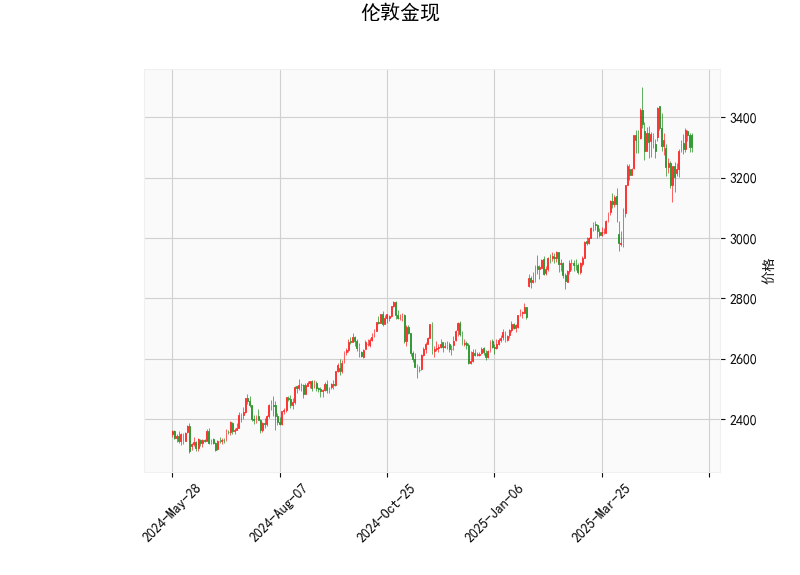

### 1. 对伦敦金现的技术分析结果进行分析

基于提供的伦敦金现（现货黄金）技术分析数据，我们可以从多个指标入手，评估当前市场的技术面状况。以下是对各指标的逐一分析：

- **当前价格（Current Price）**: 当前价格为3300.455。这表明黄金价格处于相对稳定的区间，但需结合其他指标判断其趋势方向。具体而言，价格位于布林带的中轨（3181.91）上方，但未触及上轨（3483.98），显示市场可能在积累动能，但尚未出现显著突破。

- **RSI（Relative Strength Index，相对强弱指数）**: RSI值为52.87，这是一个中性水平（RSI在50以上但未超过70）。这表明黄金市场当前没有明显的超买或超卖信号，价格动量相对平衡。短期内，市场可能保持盘整状态，但如果RSI向上突破60，可能预示着看涨势头。

- **MACD（Moving Average Convergence Divergence，移动平均收敛散度）**: MACD线为24.83，信号线为28.15，柱状图（MACD Hist）为-3.32。这显示MACD线低于信号线，且柱状图为负值，暗示短期内存在看跌的动量。这是一个潜在的卖出信号，表明卖方力量可能正在增强。如果MACD线继续下行，将加剧看跌压力；反之，如果MACD线向上穿越信号线，则可能转为看涨。

- **布林带（Bollinger Bands）**: 上轨为3483.98，中轨为3181.91，下轨为2879.83。当前价格（3300.455）位于中轨和上轨之间，这表明价格处于布林带的中间区域，市场波动性适中。没有明显突破上轨（可能表示强势上涨）或下轨（可能表示强势下跌），这往往预示着盘整格局。如果价格向上下轨靠近，可能触发突破行情。

- **K线形态**: 检测到的形态包括“CDLBELTHOLD”（腰带线形态）和“CDLMATCHINGLOW”（匹配低点形态）。这些均为看涨信号：
  - “CDLBELTHOLD”通常表示市场在强势反弹后形成一个大阳线，暗示买方控制了局面，可能预示短期上行。
  - “CDLMATCHINGLOW”表示价格触及前期低点但未破位，常见于底部反转，表明卖方势头减弱，潜在的买入机会。
  总体上，这些形态支持看涨观点，但需与其他指标（如MACD的看跌信号）结合验证，以避免假突破。

综合分析：当前技术面呈现混合信号。RSI和K线形态偏向中性到看涨，显示潜在的上行潜力；然而，MACD的负向柱状图和布林带的中间位置则提示短期下行风险。整体市场可能处于盘整阶段，等待进一步确认信号。

### 2. 分析判断近期可能存在的投资或套利机会和策略

基于上述分析，伦敦金现近期可能存在一定的投资和套利机会，但需谨慎对待市场分歧（如K线看涨 vs. MACD看跌）。以下是针对可能的场景进行的判断和策略建议：

#### 可能的投资机会：
- **看涨机会**：K线形态（如“CDLBELTHOLD”和“CDLMATCHINGLOW”）暗示潜在底部反转，如果RSI向上突破60，黄金价格可能向上测试布林带上轨（3483.98）。这为多头投资者提供机会，尤其在全球经济不确定性（如通胀或地缘政治事件）下，黄金作为避险资产的需求可能增加。
- **看跌机会**：MACD的负向信号和柱状图下行表明短期回调风险。如果价格跌破中轨（3181.91），可能进一步向下轨（2879.83）靠近，形成卖出点。这适合空头策略，在市场情绪转弱时（如经济数据疲软）。
- **套利机会**：黄金市场波动性适中，适合均值回归策略。例如，价格接近布林带边界时（如向上触及上轨或向下触及下轨），可通过跨期套利（如现货与期货结合）捕捉价差。当前中性RSI也支持盘整中的套利操作。

#### 投资或套利策略建议：
- **多头策略（买入）**：
  - **时机**：等待MACD线向上穿越信号线（金叉）作为入场信号，同时结合K线形态确认。如果价格突破布林带中轨上方，可在3300附近买入。
  - **目标**：目标位设在布林带上轨（3483）附近，止损设在中轨下方（约3180），以控制风险。建议结合基本面（如美联储政策）验证。
  - **风险**：若MACD继续看跌，价格可能回落至2879水平，导致损失。

- **空头策略（卖出）**：
  - **时机**：若RSI未突破60且MACD柱状图持续负值，可在当前价位附近卖出。价格跌破中轨（3181）时加强卖出力度。
  - **目标**：目标位为布林带下轨（2879），止损设在上轨下方（约3480）。这适合短期交易者。
  - **风险**：K线形态的看涨潜力可能导致反弹，需密切监控。

- **套利策略**：
  - **跨品种套利**：利用黄金现货与相关资产（如白银或股指期货）的价差。例如，如果黄金价格与股指反向移动，可在黄金多头的同时做股指空头，捕捉市场相关性偏差。
  - **波动率套利**：在布林带收窄时（当前价格在中轨附近），通过期权策略（如买入看涨期权和看跌期权组合）捕捉潜在突破。预计波动率增加时（如经济数据发布日），这可提供无方向性收益。
  - **风险管理**：所有策略均应设置严格的止损（如1-2%的仓位损失），并结合资金管理（如不超过总仓位的30%）。实时监控新闻事件，以避免突发风险。

总体判断：近期投资机会以盘整行情为主，看涨形态提供潜在上行空间，但MACD的看跌信号增加了不确定性。建议投资者采用结合技术与基本面的多策略组合，并保持灵活性。如果市场出现明确突破信号（如RSI和MACD一致），机会将更明显。风险偏好高的投资者可尝试套利，但需注意黄金市场的流动性风险。