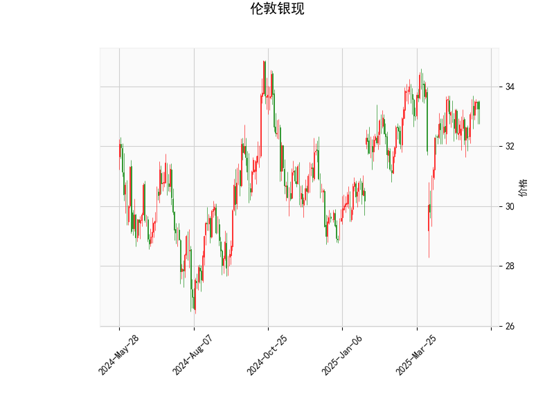

### 伦敦银现技术分析结果解析

#### 1. 对技术分析结果的详细分析
基于提供的伦敦银现数据，我们对关键指标进行逐一解读，以评估当前市场态势。

- **当前价格（Current Price）**: 33.242。这表示伦敦银现货价格处于相对稳定的区间。相比布林带中轨（32.88），价格略高于中轨，暗示短期内可能有向上或向下波动，但未出现极端偏离。

- **RSI（Relative Strength Index）**: 54.25。这是一个中性水平（RSI 范围通常为 0-100，其中 30-70 为中性）。当前值高于 50，表明市场轻微看涨，可能存在买盘力量，但尚未进入超买区域（RSI > 70）。如果RSI继续上升，可能预示短期价格上涨。

- **MACD（Moving Average Convergence Divergence）**: MACD线值为 0.168，高于信号线（0.0998），且直方图（0.0683）为正。这是一个典型的看涨信号，因为MACD线上穿信号线，表明短期移动平均线向上交叉长期移动平均线。投资者可关注这一势头，但需警惕可能的回调，如果直方图开始缩小。

- **布林带（Bollinger Bands）**: 
  - 上轨（Upper Band）：34.69
  - 中轨（Middle Band）：32.88
  - 下轨（Lower Band）：31.07
  当前价格（33.242）位于中轨和上轨之间，显示价格在正常波动范围内。距离上轨较近，可能表示潜在的超买风险；如果价格跌破中轨，则可能测试下轨支持位。布林带的宽度暗示当前市场波动性适中，但如果价格突破上轨（向上），可能触发进一步上涨。

- **K线形态（K线 Pattern）**: 检测到 "CDLMATCHINGLOW" 形态。这是一个经典的看涨反转信号，通常出现在价格见底后，表明买家力量增强，可能即将反弹。结合其他指标，这强化了短期看涨观点，但需确认后续K线是否延续这一模式。

总体而言，技术指标显示伦敦银现处于轻微看涨态势。RSI和MACD的积极信号，加上K线形态的支撑，暗示价格可能向上测试上轨（34.69）。然而，市场中性（RSI 未超买）表明这并非强烈牛市，潜在风险包括回调或外部因素（如全球经济数据）干扰。

#### 2. 近期可能存在的投资或套利机会和策略
基于上述分析，以伦敦银现为中心的投资机会主要聚焦于短期波动。以下是针对近期（1-4 周内）的判断和建议，强调风险管理。

##### 可能的机会
- **投资机会**: 
  - **看涨潜力**: MACD和K线形态的看涨信号表明，银价可能向上突破上轨（34.69），尤其如果全球风险偏好上升（如通胀预期或地缘政治事件推动贵金属需求）。这为多头投资者提供入场机会，例如在33.50附近买入。
  - **套利机会**: 伦敦银现货与相关资产（如COMEX银期货或黄金）的价差可能存在套利空间。如果银价相对黄金或期货出现异常低估（当前价低于历史均值），可考虑跨市场套利。例如，买入现货银并卖出相应期货合约，以锁定价差收益。但需监控基础资产的相关性，目前数据显示银价稳定，套利窗口可能在价格波动加剧时出现。

- **潜在风险和挑战**: 
  - 如果RSI超过70或MACD直方图收窄，市场可能转为超买或回调，导致价格跌向下轨（31.07）。全球经济不确定性（如利率变化）可能放大波动。
  - 套利机会较难捕捉，因为现货市场流动性高，但价差可能短暂。

##### 推荐策略
- **多头投资策略**: 
  - **买入时机**: 在当前价位（33.242）附近入场多头头寸，如果价格突破上轨（34.69）并伴随RSI上升。目标价可设为35.00（基于历史高点）。
  - **风险控制**: 设置止损在下轨以下（31.00以下），以防价格回落。建议仓位控制在总资金的10-20%，并结合RSI监控，避免超买风险。
  - **持有期**: 短期（1-2周），观察MACD是否保持看涨。

- **套利策略**: 
  - **跨资产套利**: 监控银现货与期货的价差。如果现货银相对于期货出现低估（例如，价差扩大超过历史平均），可执行“买入现货银，卖出期货”的套利组合。退出点设在价差回归正常时。
  - **风险管理**: 使用对冲工具（如期权）保护套利头寸，并限制单笔交易规模。适合经验丰富的投资者，因为套利需实时数据支持。

- **整体建议**: 近期策略应以观望为主，等待更多确认信号（如RSI >60或K线进一步看涨）。新手投资者宜从模拟交易起步，避免在高波动期过度杠杆。最终，结合基本面分析（如银需求数据）可提升决策准确性。