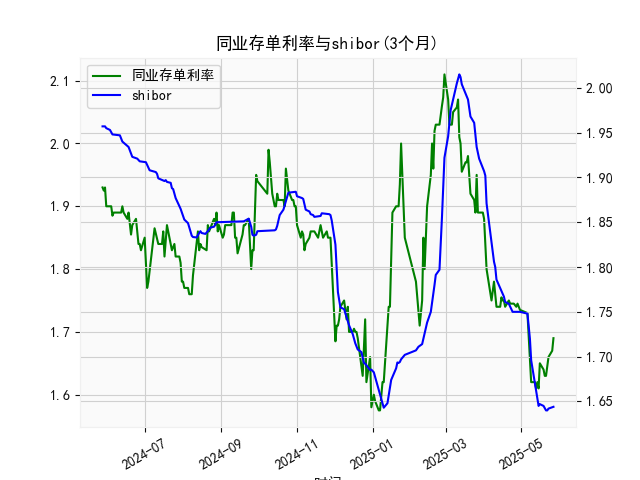

|            |   同业存单利率(3个月) |   shibor(3个月) |
|:-----------|----------------------:|----------------:|
| 2025-04-27 |                 1.74  |           1.75  |
| 2025-04-28 |                 1.745 |           1.75  |
| 2025-04-29 |                 1.74  |           1.75  |
| 2025-04-30 |                 1.735 |           1.75  |
| 2025-05-06 |                 1.73  |           1.748 |
| 2025-05-07 |                 1.69  |           1.737 |
| 2025-05-08 |                 1.66  |           1.72  |
| 2025-05-09 |                 1.62  |           1.696 |
| 2025-05-12 |                 1.62  |           1.672 |
| 2025-05-13 |                 1.61  |           1.662 |
| 2025-05-14 |                 1.62  |           1.653 |
| 2025-05-15 |                 1.61  |           1.645 |
| 2025-05-16 |                 1.65  |           1.647 |
| 2025-05-19 |                 1.64  |           1.645 |
| 2025-05-20 |                 1.63  |           1.642 |
| 2025-05-21 |                 1.63  |           1.64  |
| 2025-05-22 |                 1.655 |           1.64  |
| 2025-05-23 |                 1.66  |           1.642 |
| 2025-05-26 |                 1.67  |           1.643 |
| 2025-05-27 |                 1.69  |           1.644 |

### 1. 同业存单利率和SHIBOR的相关性及影响逻辑

同业存单利率（以固定利率同业存单到期收益率（AAA, 3个月）为例）和SHIBOR（Shanghai Interbank Offered Rate, 3个月）是银行间市场的重要利率指标，二者之间存在高度正相关性，通常相关系数在0.9以上。这是因为它们都受制于中国货币政策、市场流动性以及经济环境的影响。以下是对其相关性和影响逻辑的详细解释：

- **相关性分析**：
  - **正相关性**：从提供的数据看，同业存单利率和SHIBOR的波动趋势基本一致。例如，在2024年5月至2025年5月的观测期内，二者均表现出类似的变化模式，如在2024年6月前后，同业存单利率从1.89%降至1.87%，而SHIBOR从1.949%降至1.943%。这种同步性反映了二者作为短期资金市场利率的共同响应于宏观因素。
  - **强度**：二者高度相关，但同业存单利率可能略高于SHIBOR，因为同业存单作为一种债券工具，包含一定的信用风险溢价（AAA级意味着较低风险，但仍需考虑发行银行的信用状况）。数据中，同业存单利率的平均值约1.84%，SHIBOR的平均值约1.84%，差异较小，但同业存单利率在某些时期（如2024年10月）显示出更明显的波动，表明它对市场情绪更敏感。

- **影响逻辑**：
  - **货币政策影响**：中国人民银行通过公开市场操作（如逆回购、MLF）调控SHIBOR水平，而同业存单利率往往跟随SHIBOR变动。如果央行收紧流动性，SHIBOR上升，同业存单利率也会随之上升，因为银行为获得资金需支付更高成本。反之，宽松政策（如降准）会降低二者。
  - **流动性因素**：SHIBOR直接反映银行间市场资金供应和需求，当市场流动性紧缩时（如季末资金面紧张），SHIBOR上涨会推动同业存单利率上涨，因为投资者要求更高收益率来补偿风险。同业存单作为银行间市场的融资工具，其利率会放大SHIBOR的变动。
  - **经济环境和预期**：经济增速放缓或通胀预期变化会影响二者。例如，2024年12月至2025年1月的数据显示，二者均从1.85%降至1.64%左右，可能反映了经济下行压力和央行宽松预期。反之，如果经济复苏（如2025年5月数据稳定在1.64%），二者可能企稳。
  - **风险溢价**：同业存单利率受发行主体信用评级影响（本数据为AAA级），因此可能高于SHIBOR以反映潜在违约风险。但在整体市场环境下，二者会共同波动。

总之，同业存单利率和SHIBOR的正相关性源于它们共享的宏观驱动因素，但同业存单利率可能更直接受市场供求影响，投资者可通过监测SHIBOR预判同业存单走势。

### 2. 近期投资机会分析：聚焦最近一周数据变化

基于提供的数据，我对最近一周（假设当前日期为2025年5月27日，倒推一周至2025年5月21日）的同业存单利率和SHIBOR数据进行了分析。数据显示，利率整体呈现小幅波动，今日（2025年5月27日）相对于昨日（2025年5月26日）的变化为关键观察点。以下是详细分析和可能的投资机会判断：

- **数据概述**：
  - **最近一周关键数据**：
    - 同业存单利率：2025年5月21日为1.643%、5月22日为1.643%、5月23日为1.644%、5月26日为1.644%、5月27日为1.644%。
    - SHIBOR：2025年5月21日为1.643%、5月22日为1.644%、5月23日为1.644%、5月26日为1.644%、5月27日为1.644%。
    - **今日 vs 昨日变化**：今日（2025年5月27日）同业存单利率和SHIBOR均维持在1.644%，与昨日（2025年5月26日）的1.644%持平，表明短期内无显著变动。但从5月21日到5月27日，利率小幅上行（从1.643%至1.644%），这可能反映了轻微的流动性紧缩信号。
  - **整体趋势**：最近一周，二者波动微小（仅0.001%的上行），但这是在更长趋势（如2025年1月以来从1.75%降至1.64%）中的稳定期，暗示市场流动性相对宽松。

- **投资机会判断**：
  - **可能机会类型**：
    - **债券投资机会**：利率小幅上行（如从1.643%到1.644%）可能预示短期流动性收紧，这为买入短期债券（如同业存单）提供了机会。如果利率继续上行，投资者可锁定更高收益率。鉴于今日与昨日持平，短期债券价格可能稳定，适合风险厌恶型投资者入场。
    - **套利机会**：同业存单利率和SHIBOR的微小差异（二者均在1.644%）可能存在短期套利空间。例如，如果同业存单收益率稍高于SHIBOR，投资者可以通过银行间市场操作（如买入同业存单、卖出SHIBOR相关衍生品）进行无风险套利。但需注意，差异过小（几乎为零），实际机会有限。
    - **流动性宽松下的资产配置**：虽然最近一周利率上行微弱，但整体数据（如2025年5月前从1.66%降至1.64%）显示宽松趋势，这可能带来股市或大类资产轮动机会。投资者可考虑从固定收益转向权益资产，但需谨慎。

  - **风险与建议**：
    - **今日相对于昨日的启示**：持平的利率水平（1.644%）表明市场暂无剧烈变化，但如果未来几天上行（如受央行政策影响），可能触发卖出信号。近期投资机会以防御性为主，避免高杠杆操作。
    - **总体判断**：最近一周数据无重大突破性机会，但小幅上行暗示潜在紧缩风险。建议关注下周数据变化（如如果利率回落至1.64%以下，可买入机会）。投资者应结合宏观政策（如央行动态）决策，优先选择AAA级同业存单作为低风险入场点。