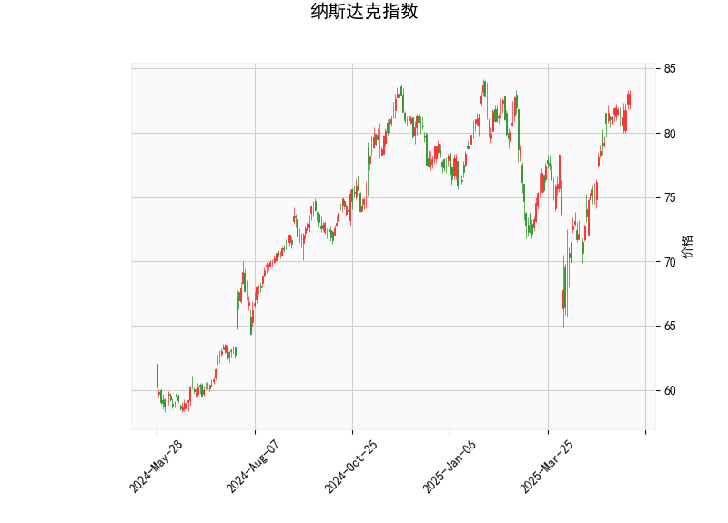

### 纳斯达克指数技术分析结果解读

#### 1. 对技术指标的详细分析
基于提供的纳斯达克指数数据，我们可以从多个技术指标入手进行全面评估。这些指标反映了市场的短期动向，包括动量、趋势强度和潜在反转信号。以下是对各指标的逐一分析：

- **当前价格（Current Price）: 83.06**  
  当前价格位于布林带的中上区域（中轨为76.11，上轨为84.10），表明指数近期处于相对强势的位置。价格接近上轨，这通常暗示市场可能面临上行压力或潜在突破，但也增加了回调风险，因为它离超买区域不远。

- **RSI（Relative Strength Index）: 69.09**  
  RSI值超过70，进入超买区域。这表示市场可能被过度买入，短期内存在修正或回调的风险。RSI高于50的水平通常是看涨信号，但当前值接近70以上，建议投资者警惕潜在的卖出压力，尤其是在缺乏新催化剂的情况下。

- **MACD（Moving Average Convergence Divergence）指标**  
  - MACD线: 1.92  
  - MACD信号线: 1.81  
  - MACD直方图: 0.11  
  MACD线高于信号线，且直方图为正值，这是一个典型的看涨信号，表明短期内多头动能占优。MACD的正直方图显示价格可能继续向上，但差距较小（仅0.11），暗示动量正在减弱。如果直方图开始收窄或转为负值，将是潜在反转的预警。

- **布林带（Bollinger Bands）**  
  - 上轨: 84.10  
  - 中轨: 76.11  
  - 下轨: 68.11  
  当前价格（83.06）接近上轨，这反映了市场的波动性较低且价格处于相对高位。布林带的收窄通常预示着即将出现突破（向上或向下）。如果价格突破上轨（84.10以上），可能引发进一步上涨；反之，如果回落至中轨以下，则可能进入修正阶段。

- **K线形态: CDLGAPSIDESIDEWHITE**  
  这是一种看涨的K线模式，通常称为“Gap Side Side White Lines”，表示价格出现向上间隙（gap）并伴随连续的白实体蜡烛。这暗示短期内买家主导市场，潜在的向上趋势可能延续。但在RSI超买的情况下，这种模式需谨慎对待，可能只是短期反弹而非长期趋势。

总体而言，技术指标呈现混合信号：MACD和K线形态支持看涨，而RSI的超买状态和价格接近布林带上轨增加了回调风险。市场可能处于短期强势，但过度买入可能导致调整。

#### 2. 近期可能存在的投资或套利机会和策略判断
基于上述分析，纳斯达克指数短期内存在潜在的投资机会，但也伴随较高风险。以下是对可能机会的评估，以及相应的投资和套利策略建议。需要强调的是，市场环境受宏观经济、政策和全球事件影响，投资者应结合基本面分析和风险管理进行决策。

- **可能的投资机会**  
  - **看涨机会:** MACD的正直方图和K线形态的看涨信号表明，指数可能在短期内继续上行，尤其是如果突破布林带上轨（84.10）。这为多头投资者提供买入点，例如在科技股主导的纳斯达克中，受益于经济增长或流动性宽松的环境。  
  - **回调机会:** RSI超买提示潜在修正，如果价格回落至中轨（76.11）附近，这可能是逢低买入的良机。回调通常发生在超买后，投资者可利用这一窗口积累头寸。  
  - **套利机会:** 对于指数期货或期权市场，存在跨市套利潜力。例如，利用纳斯达克期货与现货价格的价差进行套利，或通过期权卖出看涨期权（Covered Call）来获利。但当前超买状态增加了波动性，套利需关注隐含波动率。

- **投资策略建议**  
  - **多头策略（Buy and Hold）:** 如果您看好短期趋势，可在当前价位（83.06）附近买入ETF（如QQQ）或相关指数基金。设置止损在下轨（68.11）以下，以防范回调风险。目标位可设在上轨突破后（例如85以上）。这适合风险偏好较高的投资者，但需监控RSI是否回落。  
  - **均值回归策略:** 鉴于RSI超买，考虑等待价格回调至中轨（76-78区间）后再入场。这是一种保守策略，可通过买入看跌期权或短期做空来对冲。预计回调幅度为5-10%，提供低风险买入机会。  
  - **动量交易策略:** 利用MACD信号进行进出场。买入信号触发时（MACD线进一步上扬），可加仓；若直方图转为负值，及时减仓或转向空头。这适合活跃交易者，结合K线形态确认。  
  - **风险管理建议:** 所有策略均应设置止盈止损，例如在价格跌破中轨时止损5-10%。此外，分散投资至其他资产（如债券或大盘股）以降低波动性影响。  

- **套利策略建议**  
  - **期权套利:** 利用当前价格接近上轨的机会，进行牛市价差套利（Bull Call Spread）。例如，买入一个稍低于当前价的看涨期权，并卖出更高行权价的看涨期权，以降低成本并锁定收益。潜在回报在RSI回调前实现。  
  - **期货套利:** 如果纳斯达克期货价格与现货价差扩大（例如由于市场情绪波动），可进行现货-期货套利。买入现货并卖出期货，或反之，但需在低波动期操作以避免损失。  
  - **整体风险警示:** 套利策略适合经验丰富的投资者，因为纳斯达克的波动性较高（如受利率或地缘政治影响）。预计近期机会窗口为1-3周，需实时跟踪指标变化。

总之，近期纳斯达克指数可能迎来短期上行，但超买风险不可忽视。建议投资者优先采用趋势跟踪结合风险控制的策略，避免过度杠杆。如果市场出现新催化剂（如经济数据发布），机会将更明确。始终结合个人风险承受能力和市场动态进行调整。