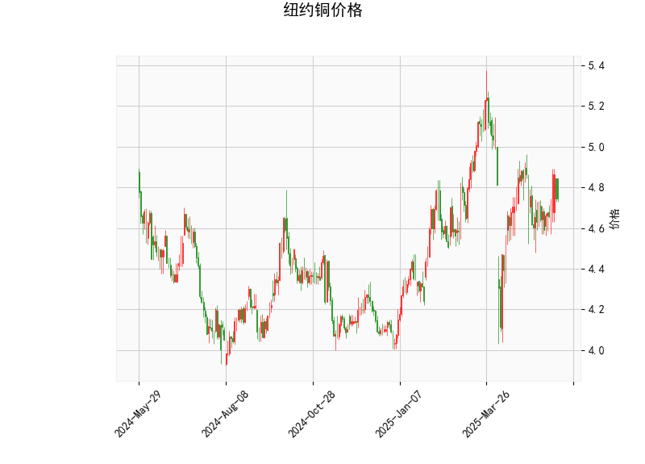

### 纽约铜价格技术分析结果分析

#### 1. 对技术分析结果的详细解读
纽约铜价格的技术分析结果显示出当前市场处于相对稳定的状态，但存在一些潜在的看涨信号。以下是对关键指标的逐一分析：

- **当前价格（4.745）**：当前价格位于布林带的中轨（4.787）附近，略低于中轨。这表明价格处于中性区域，没有明显偏离均值，市场可能正处于盘整阶段。如果价格维持在这一水平，短期波动可能有限，但如果向上突破中轨，可能预示着向上趋势的开始。

- **RSI（51.144）**：RSI值接近50的中性水平，表明市场既不超买也不超卖。这反映了近期买卖力量的平衡，没有强烈的趋势信号。如果RSI向上突破60，可能转为看涨；反之，如果跌破40，可能转为看下。

- **MACD指标**：
  - MACD线（0.00733）高于信号线（-0.00822），且MACD柱状图（0.01555）为正值。这是一个看涨信号，表明短期动量正在增强，价格可能有向上修正的潜力。然而，MACD线的正值幅度较小，表明这一信号还不算强势，需要进一步确认。
  
- **布林带（Bollinger Bands）**：
  - 上轨（5.234）、中轨（4.787）和下轨（4.341）。当前价格位于中轨和下轨之间，显示价格在波动范围内运行，没有极端偏离。这暗示市场波动性较低，可能处于整理期。如果价格向上触及上轨，可能会遇到阻力；反之，向下触及下轨可能提供支撑。

- **K线形态**：
  - **CDLBELTHOLD**：这表示一种强势反转形态，通常在下跌趋势后出现，暗示多头控制了市场，可能预示短期反弹。
  - **CDLLONGLINE**：长线形态显示了较大的实体蜡烛，表明市场有强烈的买卖意愿。目前结合其他指标，可能表示潜在的上行压力。
  - **CDLMATCHINGLOW**：这是一种底部形态，显示价格在相同低点附近反复测试，暗示市场可能已触底并准备反弹。

总体而言，这些指标显示纽约铜价格短期内偏向中性偏看涨。RSI和布林带的中性位置表明市场缺乏强烈趋势，而MACD和K线形态的看涨信号可能预示着潜在的上行机会。但需注意，这些信号相对温和，市场可能需要外部因素（如经济数据或全球需求变化）来确认趋势。

#### 2. 近期可能存在的投资或套利机会和策略判断
基于上述技术分析结果，纽约铜市场短期内可能存在一些投资机会，特别是针对看涨信号的短期交易或套利策略。以下是针对近期（例如未来1-3个月）的判断和建议：

- **可能的投资机会**：
  - **看涨机会**：MACD的正柱状图和K线形态（如CDLBELTHOLD和CDLMATCHINGLOW）暗示价格可能从当前水平反弹。如果全球经济复苏或工业需求增加（如制造业复苏），铜价可能向上测试布林带上轨（5.234）。这为多头投资者提供买入点，尤其是在价格稳定在中轨以上时。
  - **套利机会**：如果纽约铜期货与现货或相关商品（如铝或原油）之间存在价格偏差，可能出现跨市场套利。例如，如果期货价格相对于现货过高，可以考虑卖出期货并买入现货。当前中性RSI和MACD信号可能表示市场无效率，适合量化套利策略，但需监控全球大宗商品市场（如LME铜价）的相关性。

- **潜在风险**：
  - 如果RSI跌破50或价格跌破布林带下轨（4.341），可能转为看跌，增加损失风险。
  - 外部因素如地缘政治事件或经济衰退可能放大波动，需谨慎。

- **推荐策略**：
  - **短期交易策略**：采用MACD交叉作为进场信号。如果MACD线继续向上远离信号线，建议在价格接近中轨（4.787）时买入，目标设在上轨（5.234）。设置止损在下轨（4.341）以下，以控制风险。结合RSI监控，避免在RSI超过70时追涨。
  - **套利策略**：如果发现纽约铜与LME铜价间价差扩大（例如通过统计套利模型），可以进行跨交易所套利，如在纽约买入并在LME卖出。风险管理上，使用期权保护头寸，确保套利窗口不超过1-2周。
  - **整体风险管理建议**：投资者应结合基本面分析（如铜矿供应和需求数据），并控制仓位（如不超过总资金的20%）。对于新手，建议从模拟交易开始，观察MACD和K线形态的确认信号。

总之，近期纽约铜市场可能适合谨慎的看涨投资或套利操作，但需密切跟踪指标变化和宏观环境，以避免潜在逆转。始终强调风险控制，投资决策应基于个人风险偏好。