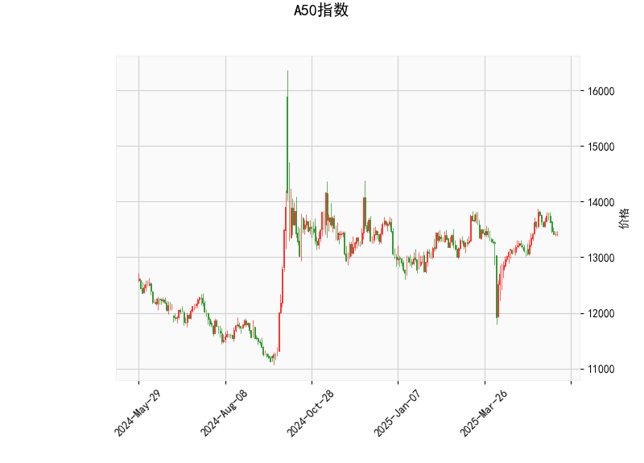

# A50指数技术分析及策略建议

## 一、技术指标分析

### 1. RSI指标（49.29）
当前RSI值处于中性区域（50分界线附近），显示多空力量暂时均衡。但需注意其从超卖区域回升的轨迹可能中断，49.29的读数暗示短期反弹动能不足，存在方向选择可能。

### 2. MACD指标
- 当前MACD（71.76）低于信号线（106.31），柱状图呈现-34.54的负值
- 形成明显"死叉"结构，且绿色柱状持续放大，暗示短期趋势可能延续弱势调整
- 指标绝对值较大（>70）说明波动率处于较高水平

### 3. 布林轨道分析
- 现价（13413）位于中轨（13309）附近
- 上下轨间距达1355点（13987-12631），波动空间较大
- 当前价格接近中轨但未突破，需关注能否站稳13309关键位

### 4. K线形态组合
同时出现四种特殊形态：
- **十字星（CDLDOJI）**：多空博弈激烈
- **长脚十字（CDLLONGLEGGEDDOJI）**：市场方向不明
- **纺锤线（CDLSPINNINGTOP）**：趋势可能反转
- **高浪线（CDLHIGHWAVE）**：极端波动信号

## 二、交易机会与策略

### 短期交易策略
1. **区间震荡策略**（适合日内交易）
   - 买点：12630附近（下轨支撑）
   - 卖点：13980附近（上轨压力）
   - 止损：突破中轨±1%设置追踪止损

2. **趋势突破策略**
   - 向上突破中轨（13309）且站稳，可轻仓试多，目标13980
   - 向下跌破13000整数关口，可考虑短空，目标12630

### 套利机会
1. **跨期套利**（需关注期货合约）
   - 若近月合约较现货贴水扩大至2%以上，可做多近月/做空远月
   - 需监控合约基差和展期成本

2. **波动率套利**
   - 布林带宽度（Band Width）处于扩大周期
   - 可考虑卖出宽跨式期权组合（sell strangle）
   - 需配套delta对冲策略

## 三、风险提示
1. MACD与价格出现底背离（价格未创新低但MACD走低），警惕假突破
2. RSI中性区域易受突发事件冲击，关注中国宏观经济数据发布
3. 高浪线组合警示短期可能出现异常波动，建议仓位控制在10%以内
4. 美联储议息会议等外部因素可能加剧市场波动

（注：以上分析基于历史数据，实际交易需结合实时行情和资金管理策略）