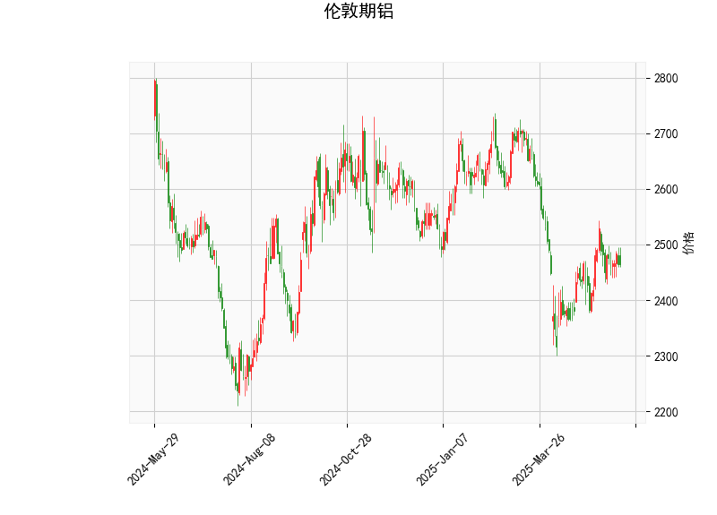

# 伦敦期铝技术分析及策略建议

## 一、技术分析解读

### 1. 价格与布林轨道
- **当前价2465**位于布林中轨（2491）下方，接近布林下轨（2273），显示短期价格处于弱势区域
- 布林带宽达436点（2709-2273），反映市场波动性显著放大
- 中轨（2491）构成关键压力位，若有效突破可能打开上行空间

### 2. RSI指标
- **50.4**的RSI值处于中性区间，多空力量暂时均衡
- 需关注RSI能否站稳50分水岭，若上穿55可能形成多头信号

### 3. MACD指标
- 柱状图**2.34**正值持续扩张，DIF（3.65）上穿DEA（1.31）形成金叉
- 动量指标显示短期反弹动能正在积聚

### 4. K线形态
- **CDLMATCHINGLOW**形态出现在价格低位，传统解读为底部反转信号
- 该形态有效性需结合成交量验证，若配合放量更可信

## 二、投资机会与策略建议

### 短线交易策略
1. **突破交易**：
   - 上破中轨2491可轻仓试多，目标位2600（斐波那契38.2%回撤位），止损2450
   - 下破2430（近期低点）可顺势做空，目标2350，止损2470

2. **区间套利**：
   - 当前价与布林下轨（2273）存在192点空间，可设置分档买入限价单
   - 在2300-2350区间建立多头头寸，反弹至中轨附近分批止盈

### 中线布局策略
1. **动量跟随策略**：
   - 观察MACD柱状图持续扩张情况，若连续3日维持2+正值
   - 配合成交量放大（单日增量20%+）可建立趋势仓位

2. **波动率套利**：
   - 利用布林带宽极端值（当前带宽超过年平均值15%）
   - 当价格触及下轨时卖出看跌期权，收取时间价值衰减收益

### 风险提示
1. 关注LME库存变化（近期增幅超5%可能压制价格）
2. 美元指数与铝价负相关性达-0.82，需同步跟踪美元走势
3. 中国电解铝行业用电政策变化可能引发价格异动

（以上策略需根据实时行情动态调整，建议仓位控制在总资金15%以内）