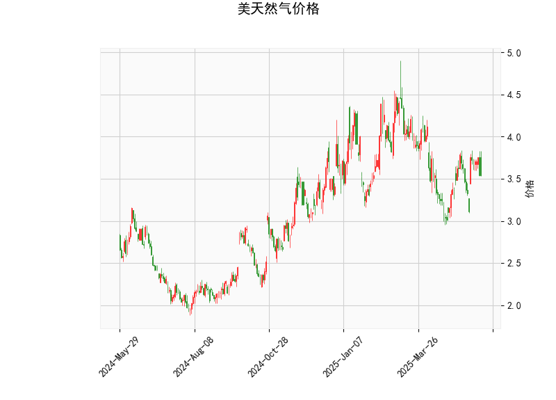

# 美国天然气价格技术分析与策略建议

## 一、技术分析解读

### 1. 价格与布林轨道
- **当前价3.539**处于布林轨道下轨（2.953）与中轨（3.659）之间，靠近下轨支撑位，短期存在超卖反弹可能。但价格持续低于中轨（3.659）表明整体趋势偏弱。
- **布林带宽度（4.365-2.953=1.412）**显示波动率较高，若价格突破中轨可能打开上行空间，反之跌破下轨则可能加速下跌。

### 2. RSI指标
- **RSI 49.24**接近中性区间（50），未进入超买（>70）或超卖（<30）区域，显示多空力量暂时平衡，需结合其他指标判断方向。

### 3. MACD指标
- **MACD线（0.0277）上穿信号线（0.0108）**形成金叉，且**柱状图（0.0168）翻红**，暗示短期动能转向偏多，但绝对值较小表明上涨动力不足，需警惕假突破。

### 4. K线形态
- **CDLCLOSINGMARUBOZU**（光头光脚阳线/阴线）：需结合位置判断。若出现在支撑位（如下轨附近），可能暗示短期止跌。
- **CDLMATCHINGLOW**（匹配低点形态）：典型看涨反转信号，表明空方力量衰竭，多方在相同低点承接。

---

## 二、投资机会与策略

### （一）短期波段交易
1. **看多策略**（风险较高）
   - **入场条件**：价格站稳布林下轨（2.95）且MACD柱持续扩大
   - **目标**：中轨3.66（+3.4%）、上轨4.36（+23.2%）
   - **止损**：跌破前低2.95（-16.6%）
   - **依据**：Matching Low形态+MACD金叉共振

2. **看空策略**（需突破确认）
   - **入场条件**：价格放量跌破2.95
   - **目标**：前低延伸通道（约2.7-2.8）
   - **止损**：重回下轨上方（3.0）

### （二）套利机会
1. **跨期套利**（关注库存变化）
   - 若EIA库存数据低于预期，可做多近月合约+做空远月合约（Contango结构收敛）
   - 当前冬季合约（如NGZ23）通常溢价较高，需监控天气预测

2. **波动率交易**
   - 布林带宽度达1.4美元（占现价40%），可卖出宽跨式期权组合（Sell Strangle），赚取波动率收缩收益

---

## 三、风险提示
1. **基本面扰动**：飓风、极寒天气等突发因素可能引发价格剧烈波动
2. **假突破风险**：MACD信号较弱，需配合成交量放大确认趋势
3. **时间窗口**：Matching Low形态有效性通常为3-5个交易日，需快速决策

> **操作建议**：当前宜轻仓试多（仓位<5%），重点关注3.66中轨突破情况，若48小时内未有效突破则离场观望。保守投资者可等待MACD柱持续3日扩大后再入场。