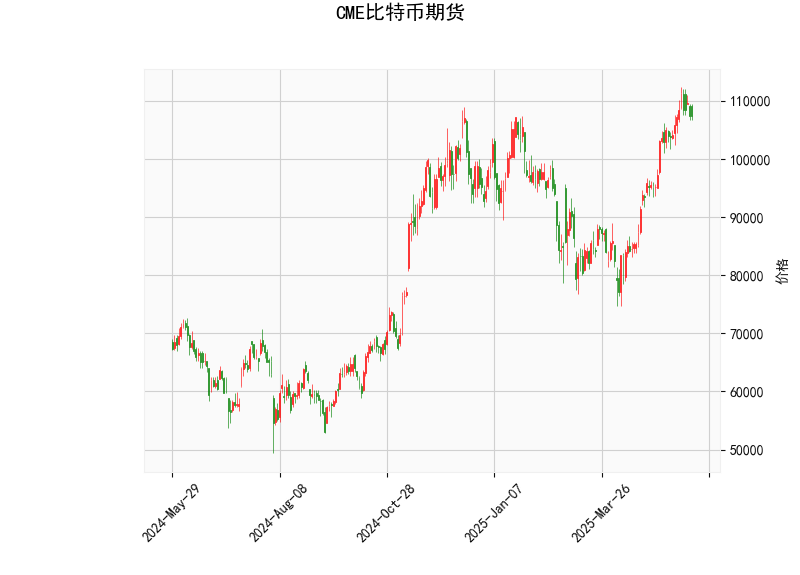

### 技术分析结果解读

#### 1. **关键指标分析**
- **当前价（107,335）与布林带关系**  
  当前价格高于布林带中轨（92,206），接近上轨（112,433），显示短期多头占优，但需警惕上轨附近阻力。若价格突破上轨，可能加速上涨；若回调，中轨（92,206）或成为支撑位。
  
- **RSI（64.36）**  
  接近超买区（70），但尚未确认极端状态。若RSI持续高于70且价格与指标背离，可能预示回调；若价格维持高位震荡，RSI可能钝化。

- **MACD（-272.43柱状图）**  
  MACD线（4512）下穿信号线（4784），柱状图转负，表明短期动能减弱，可能进入调整周期。需关注MACD能否重新金叉修复。

- **K线形态**  
  - **CDLBELTHOLD**：通常为趋势延续信号，需结合位置判断。当前价格高位可能暗示多头暂时占优。  
  - **CDLLONGLINE**：长实体线反映市场单边情绪较强，需确认是否伴随成交量放大。  
  - **CDLMATCHINGLOW**：低位反转形态，但当前价格处于高位，可能预示局部回调后的支撑。

---

### 投资策略与机会

#### 1. **短期趋势策略**
- **看涨场景**：若价格站稳中轨（92,206）并突破上轨（112,433），可轻仓追多，目标看向前高（若存在）或布林带外轨延伸区域，止损设于中轨下方。  
- **看跌场景**：若RSI超买后价格回落，MACD死叉延续，可尝试短空，目标下看中轨（92,206）甚至下轨（71,979），止损设于上轨上方。

#### 2. **波段交易机会**
- **中轨支撑做多**：若价格回踩中轨（92,206）且RSI未跌破50，可布局多单，博弈反弹至上轨。  
- **上轨阻力做空**：价格首次触及上轨（112,433）时，结合RSI超买信号轻仓试空，目标中轨。

#### 3. **套利与风控建议**
- **跨期套利**：若近远月合约价差扩大，可做多近月/做空远月（Contango结构）或反向操作（Backwardation），需结合资金费率分析。  
- **波动率策略**：布林带开口扩大，可卖出波动率（如期权跨式组合），但需防范突破风险。  
- **止损纪律**：单边行情中需严格止损（如跌破中轨或突破上轨后快速回踩）。

---

### 风险提示
- **高波动性**：比特币期货波动剧烈，需控制仓位（建议单笔风险<2%）。  
- **指标钝化风险**：RSI/MACD在强势趋势中可能失效，需结合量价确认。  
- **外部事件**：监管政策、ETF资金流等消息可能引发急涨急跌。