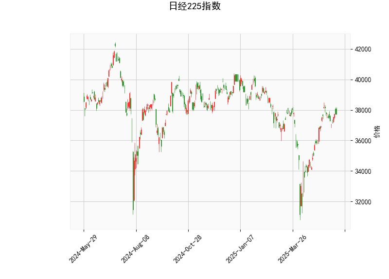

### 日经225指数技术分析结果解读

#### 1. 技术指标分析
- **当前价（37722.4）与布林轨道**：
  - 当前价高于布林中轨（36269.15），但低于上轨（39637.19），显示市场处于**温和上涨趋势**，但尚未触及超买区域。短期可能仍有上行空间，但需警惕上轨附近的阻力。
  - 布林带宽（上轨-下轨=6736）较宽，表明市场波动性较高，需关注价格是否突破关键位。

- **RSI（60.33）**：
  - RSI值略高于中性线（50），但未进入超买区（70），表明市场**买方力量占优但未过热**。若后续RSI突破70，可能触发短期回调风险。

- **MACD（462.28）与信号线（477.50）**：
  - MACD线位于信号线下方（差值-15.22），形成“死叉”，暗示**短期动能偏弱**，可能面临回调压力。但MACD柱绝对值较小，需观察是否持续走弱。

- **K线形态**：
  - **CDLCLOSINGMARUBOZU（光头光脚阳线）**：表明近期买方主导，收盘价接近最高价，短期趋势偏强。
  - **CDLLONGLINE（长实体线）**：显示多空博弈后买方胜出，但需结合位置判断（当前接近布林上轨，可能面临抛压）。
  - **CDLMATCHINGLOW（匹配低点）**：在下跌中出现的支撑信号，但需确认后续是否出现反转。

---

#### 2. 近期投资/套利机会与策略

##### **短期机会（1-3天）**：
1. **区间交易（布林轨道策略）**：
   - **做多**：若价格回踩中轨（36269）附近且RSI未跌破50，可轻仓买入，目标上轨（39637），止损于中轨下方（如36000）。
   - **做空**：若价格触及上轨（39637）且MACD死叉持续扩大，可尝试短空，目标中轨附近，止损于上轨上方。

2. **MACD背离策略**：
   - 当前MACD死叉显示短期弱势，若价格未明显下跌且MACD柱收窄（负值减少），可能形成“底背离”，可布局反弹。

##### **中期机会（1-2周）**：
1. **趋势跟随**：
   - 若价格突破上轨且RSI站稳65以上，可能开启加速上涨，可加仓追多，目标前高（40000心理关口）。
   - 若价格跌破中轨且MACD死叉确认，可能转为下行趋势，目标下轨（32901），但需结合基本面（如日元汇率、日本央行政策）。

2. **事件驱动套利**：
   - 关注日本通胀数据、美联储议息会议等事件。若市场因流动性宽松预期升温，可提前布局日经成分股（如出口企业）。

##### **风险提示**：
- MACD死叉与布林上轨阻力形成共振，需警惕假突破后快速回调。
- K线形态中“匹配低点”需进一步验证支撑有效性，若中轨失守，短期多头需离场。