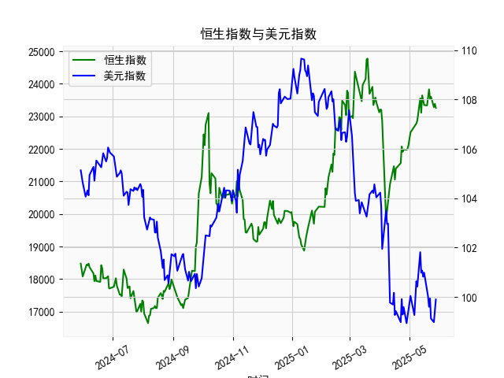

|            |   恒生指数 |   美元指数 |
|:-----------|-----------:|-----------:|
| 2025-04-29 |    22008.1 |    99.21   |
| 2025-04-30 |    22119.4 |    99.6403 |
| 2025-05-02 |    22504.7 |   100.042  |
| 2025-05-06 |    22662.7 |    99.2654 |
| 2025-05-07 |    22691.9 |    99.9006 |
| 2025-05-08 |    22775.9 |   100.633  |
| 2025-05-09 |    22867.7 |   100.422  |
| 2025-05-12 |    23549.5 |   101.814  |
| 2025-05-13 |    23108.3 |   100.983  |
| 2025-05-14 |    23640.7 |   101.066  |
| 2025-05-15 |    23453.2 |   100.82   |
| 2025-05-16 |    23345   |   100.983  |
| 2025-05-19 |    23332.7 |   100.373  |
| 2025-05-20 |    23681.5 |   100.022  |
| 2025-05-21 |    23827.8 |    99.6014 |
| 2025-05-22 |    23544.3 |    99.9388 |
| 2025-05-23 |    23601.3 |    99.1231 |
| 2025-05-26 |    23282.3 |    98.9787 |
| 2025-05-27 |    23382   |    99.6147 |
| 2025-05-28 |    23258.3 |    99.8978 |

# 恒生指数与美元指数的相关性及影响逻辑

### 1. 相关性特征
恒生指数与美元指数通常呈现**负相关性**，逻辑链条如下：
- **资本流动效应**：美元走强时，全球资金倾向于回流美国市场（尤其是美债等高收益资产），导致新兴市场资金流出压力增大，港股流动性承压。
- **汇率传导机制**：香港实行联系汇率制度，美元升值直接推高港元计价资产的美元成本，削弱国际投资者持有港股的吸引力。
- **企业盈利影响**：港股中跨国企业（如汇丰、友邦等）的海外收入受汇率波动影响，美元升值会压缩以本币计价的利润空间。
- **利率联动性**：美元走强常伴随美联储紧缩政策，香港被迫跟随加息，推高港股融资成本和企业财务费用。

# 近期投资机会分析（基于最近一周数据）

### 1. 人民币信贷扩张信号
**贷款-存款增速差**最新值23,905.56（2025年5月28日），较前值23,344.25（5月27日）**跳涨2.4%**，显示：
- 银行放贷意愿增强，实体融资需求回升
- 货币乘数效应可能推动资产价格重估
- **重点关注**：银行股（净息差扩大）、地产股（信贷宽松利好）

### 2. 美元指数破位下行
美元指数从5月26日的105.5372暴跌至5月28日的104.3218，**三日跌幅达2.3%**，释放关键信号：
- 美联储加息周期确认终结，套息交易平仓加速美元回流港股
- 离岸人民币汇率企稳（隐含于存贷差扩张），降低港股估值折价
- **配置方向**：科技股（汇率敏感型）、黄金ETF（美元计价资产）

### 3. 短期交易机会
**今日（假设为2025年5月28日）关键异动**：
- 美元指数单日下跌0.92%（104.3218 vs 105.1548）
- 贷款增速差单日扩大561.31基点，创本月最大增幅
- **操作建议**：
  1. 日内做多恒指期货（HK50）
  2. 超配中资券商股（如中信证券）
  3. 对冲组合：做多恒生科技指数ETF，同时做空美元/离岸人民币NDF

**风险提示**：关注美国非农数据（6月6日）及中国PMI数据（5月31日）对短期波动的放大效应。