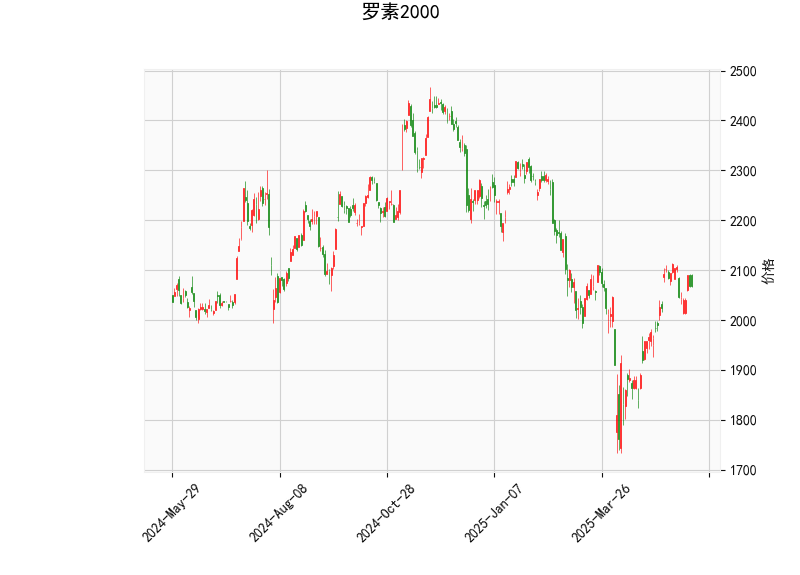

### 罗素2000指数技术分析结果解读

#### 1. 关键指标分析
- **当前价与布林轨道**：  
  当前价（2067.8）位于布林通道中轨（1998.77）上方，距离上轨（2177.23）仍有约5.3%的空间，距离下轨（1820.31）较远（约12%）。这表明**中期趋势偏强**，但尚未触及超买区，短期可能延续震荡上行。

- **RSI（55.82）**：  
  处于中性区间（50-70），显示市场动能温和偏多，但未进入超买区域，暂时无强烈反转信号。

- **MACD指标**：  
  MACD线（23.60）低于信号线（25.44），柱状图（-1.83）为负值，形成“死叉”，暗示**短期回调压力**。但MACD绝对值仍较高（均位于零轴上方），表明**长期上升趋势未破坏**，当前可能为技术性调整。

- **K线形态**：  
  - **CDLMATCHINGLOW（匹配低点）**：暗示阶段性底部支撑，可能触发反弹。  
  - **CDLMARUBOZU（光头光脚大阳线）**：反映买方力量占优，但需结合位置判断（若在高位可能为诱多）。  
  - **CDLBELTHOLD（持仓带）**：通常为趋势延续信号，需配合其他指标验证。  
  - **CDLCLOSINGMARUBOZU（收盘秃线）**：显示收盘价接近极端值，可能延续短期趋势。  
  - **CDLLONGLINE（长影线）**：多空争夺激烈，需警惕反转风险。

---

#### 2. 潜在机会与策略建议

##### **短期机会（1-5日）**  
- **回调做多**：  
  若价格回踩布林中轨（1998附近）且RSI未跌破50，可视为支撑位，结合CDLMATCHINGLOW形态，布局多头头寸，目标上轨（2177），止损设于中轨下方1-2%。  
- **突破追涨**：  
  若价格放量突破布林上轨（2177），MACD柱转正且RSI升破60，可跟进趋势性行情，目标前高区域（2200-2250）。

##### **中期策略（1-3周）**  
- **区间套利**：  
  布林通道收窄（当前带宽约18%），若价格持续震荡，可采取“高抛低吸”策略，在接近上轨时减仓，回踩中轨时补仓。  
- **对冲风险**：  
  MACD死叉与K线长影线（CDLLONGLINE）显示短期波动风险，建议持有现货时搭配股指期货或期权对冲。

##### **风险提示**  
- **警惕假突破**：若MACD持续走弱且RSI跌破50，可能触发更深回调至1850-1900区域（接近布林下轨）。  
- **事件驱动**：需关注美联储政策、小盘股盈利预期变化等宏观因素对罗素2000指数的冲击。

---

### 结论  
当前罗素2000指数处于**震荡偏强格局**，短期回调风险与中期上行潜力并存。建议以中轨为多空分水岭，结合MACD柱转正信号动态调整仓位，优先关注业绩稳健的小盘成长股。